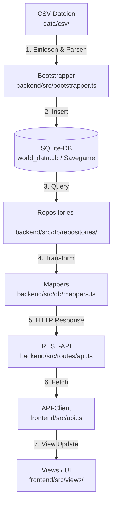

# Velo – Radsport Director

Eine datengetriebene Radsport-Simulation als Monorepo mit Express-Backend, Vite-Frontend, gemeinsamen TypeScript-Verträgen und CSV-basierter Spieldatenbasis.

---

## Technologie-Stack

| Schicht | Technologie | Beschreibung |
| :--- | :--- | :--- |
| **Backend** | Node.js + Express + TypeScript | REST-API & Simulationstransaktionen mit `better-sqlite3` |
| **Frontend** | Vite + Vanilla TypeScript | Modulares, interaktives UI mit Glassmorphism-Design und Live-Renn-Simulation |
| **Gemeinsamer Code** | TypeScript Typen & Konstanten | Gemeinsam genutzte Validierungen, Skill-Gewichtungen und Regelwerke unter `shared/` |
| **Datenbasis** | CSV + SQLite | Stammdaten liegen als CSV-Dateien vor; zur Laufzeit wird eine SQLite-Datenbank verwendet |

---

## Projektstruktur

```text
velo/
├── backend/
│   ├── assets/              # SQLite-Schema und generierte Master-DB (world_data.db)
│   ├── dist/                # Backend-Build-Ausgabe
│   ├── scripts/             # Hilfsskripte fuer Seed- und Datenaufbau
│   ├── src/
│   │   ├── bootstrapper.ts  # Liest CSV-Daten, wendet Schema an, generiert world_data.db
│   │   ├── server.ts        # Express-Startpunkt und Routen-Einbindung
│   │   ├── db/              # Repository- und DB-Zugriffsschicht
│   │   │   ├── DatabaseService.ts # Verwaltet SQLite-Verbindungen & Savegames
│   │   │   ├── GameRepository.ts  # Master-Daten-Abfragen (Teams, Rennen, Ergebnisse)
│   │   │   ├── mappers.ts         # Konvertiert SQLite-Zeilen in Shared TypeScript-Typen
│   │   │   └── repositories/      # Entitätsspezifische Repositories (Rider, Team, Result, GameState)
│   │   ├── editor/          # Hilfsdienste für Datenänderungen (RiderTeamEditorService)
│   │   ├── game/            # Kern-Spiellogik (Verträge, Karrierefortschritt, Formkurven, Newgens)
│   │   ├── routes/          # REST-API-Endpunkte (api.ts)
│   │   └── simulation/      # Rennsimulation (Taktiken, Zwischenwertungen, Stürze, Berechnungen)
│   └── tsconfig.json
├── frontend/
│   ├── dist/                # Frontend-Build-Ausgabe
│   ├── public/              # Statische Assets wie Trikots, Logos
│   ├── src/
│   │   ├── api.ts           # HTTP-Client fuer API-Kommunikation mit dem Backend
│   │   ├── app.ts           # Zentraler App-State und View-Routen-Verteilung
│   │   ├── state.ts         # Globale UI-Zustände, Filter, Formatter und Hilfsfunktionen
│   │   ├── main.ts          # Vite-Einstiegspunkt
│   │   ├── main.css         # Globale UI-Styles und Farbvariablen
│   │   ├── views/           # UI-Ansichten (Dashboard, RiderStats, Live-Rennen, Editor, Standings)
│   │   └── race-sim/        # Live-Renn-Animationen & Echtzeit-Renn-TICKs
│   ├── index.html
│   ├── vite.config.ts
│   └── tsconfig.json
├── shared/
│   ├── skillWeights.ts      # Gemeinsame Skill-Gewichtungen für verschiedene Terrains
│   ├── stageResultRules.ts  # Regeln für Zeitlimits, Punkteverteilung & UCI-Punkte
│   └── types.ts             # Gemeinsame TypeScript-Typen zwischen Backend und Frontend
├── data/
│   ├── csv/                 # CSV-Stammdaten (Fahrer, Teams, Regeln, Newgen-Presets)
│   ├── stages/              # Detaillierte Etappensegmente und Profile (.csv)
│   └── Jersey/              # Jersey-Grafiken der Teams
├── package.json             # Monorepo-Skripte für paralleles Bauen und Starten
└── README.md
```

---

## Der Datenfluss (Data Pipeline)

Das Projekt nutzt einen klaren Fluss der Spieldaten von statischen CSV-Quellen bis zur Darstellung in der Benutzeroberfläche:



### Detaillierter Ablauf:
1. **Import & Bootstrapping**: Der [bootstrapper.ts](backend/src/bootstrapper.ts) liest die CSV-Dateien aus [data/csv/](data/csv) und importiert sie in eine neue SQLite-Datenbank (`world_data.db`).
2. **Datenbank-Struktur**: Die SQLite-Datenbank verwendet das in [schema.sql](backend/assets/schema.sql) definierte Schema.
3. **Savegames**: Beim Start einer neuen Karriere kopiert der `DatabaseService` die `world_data.db` in eine Savegame-Datei. Alle fortlaufenden Änderungen werden in dieser Savegame-Datenbank persistiert.
4. **Datenabfrage (Repository)**: Backend-Klassen wie das `RiderRepository` stellen typisierte Abfragen an die Datenbank.
5. **Datenmapping**: In [mappers.ts](backend/src/db/mappers.ts) werden flache SQL-Zeilen in verschachtelte, typisierte JavaScript-Objektstrukturen überführt.
6. **API-Bereitstellung**: Express-Routen in [api.ts](backend/src/routes/api.ts) stellen JSON-Endpunkte bereit.
7. **Frontend-Anzeige**: Der API-Client in [api.ts](frontend/src/api.ts) holt die Daten ab, speichert sie im globalen State von [state.ts](frontend/src/state.ts) und UI-Views rendern diese in dynamisches HTML.

---

## Refactoring & Restrukturierung (Datenbank- und Routen-Splitting)

Im Zuge eines großen Refactorings wurden die zentralen Module des Backends entkoppelt und modularisiert:
- **GameRepository-Split**: Die ehemals monolithische Klasse `GameRepository` wurde aufgelöst und in modulare, entitätsspezifische Repositories unter `backend/src/db/repositories/` aufgeteilt:
  - `GameStateRepository.ts`: Verwaltet Spielzeitpunkte, Tagesfortschritt und Saisons.
  - `RaceRepository.ts`: Steuert Abfragen zu Rennen, Etappen und dem Ermüdungszustand.
  - `ResultRepository.ts`: Verwaltet Rennergebnisse, Platzierungen und Saisontabellen.
  - `RiderRepository.ts`: Zuständig für Fahrerdaten, Verträge, Formwerte und Mentorenbeziehungen.
  - `TeamRepository.ts`: Lädt Team-Metadaten, Farben und Divisionen.
  - *Hinweis*: Eine reduzierte Version der alten `GameRepository` existiert temporär als Brücke zur Kompatibilität.
- **Routen-Refactoring (`backend/src/routes/api.ts`)**: Die API-Schicht wurde so umgebaut, dass sie anstelle der monolithischen `GameRepository` direkt auf den `DatabaseService` und die neuen, domänenspezifischen Repositories zugreift. Dies verbessert die Wartbarkeit und verhindert Zirkelbezüge.

---

## End-to-End Tracing Beispiele

Um das Refactoring greifbar zu machen, zeigen die folgenden Beispiele, wie spezifische Datenfelder unter welchen Namen durch alle Schichten transportiert werden.

### Beispiel 1: Fahrer-Skills (z.B. Flachland-Fähigkeit `skill_flat` / `flat`)

1. **CSV-Quelle**: In [data/csv/riders.csv](data/csv/riders.csv) existiert eine Spalte `skill_flat`.
2. **Bootstrapper-Seeding**: Die Funktion `seedRiders` liest die Zeile ein und führt ein SQL-Statement aus.
3. **Datenbank (SQLite)**: In der Tabelle `riders` ist das Feld als `skill_flat INTEGER NOT NULL` deklariert.
4. **SQL-Abfrage im Repository**: `RiderRepository` selektiert alle Felder, wodurch `row.skill_flat` erhalten bleibt.
5. **Daten-Transformation (Mappers)**: In [mappers.ts](backend/src/db/mappers.ts) wird `row.skill_flat` der Eigenschaft `skills.flat` auf dem TypeScript-Objekt zugeordnet.
6. **Express API-Endpunkt**: Über die Route `/riders/:id/stats` wird das Objekt als JSON gesendet.
7. **Frontend API & View**: Das Frontend empfängt das Objekt, speichert es im State und [riderStats.ts](frontend/src/views/riderStats.ts) rendert die Werte visuell.

---

### Beispiel 2: Etappenprofile (z.B. Segmente & Details)

1. **CSV-Struktur**: [data/csv/stages.csv](data/csv/stages.csv) verweist auf eine Profildatei unter [data/stages/](data/stages).
2. **Bootstrapper-Analyse**: `readStageScoreSegments()` parst das Detail-Profil, berechnet `stage_score` und kategorisierte Anstiege.
3. **Datenbank**: Metadaten in `stages`, Anstiege in `stage_climb_scores`.
4. **Repository & Mapper**: `mapStage()` in [mappers.ts](backend/src/db/mappers.ts) ruft `summarizeStageProfile()` auf, welches die Detaildatei parst.
5. **REST API**: Der Endpunkt `/api/simulation/realtime/:stageId` gibt das berechnete `stageSummary` zurück.
6. **Frontend Live-Rennen**: [liveRace.ts](frontend/src/views/liveRace.ts) nutzt das Array für die Höhenprofil-Grafik.

---

## Gameplay-Systeme im Detail

Die genaue Funktionsweise der sportlichen Berechnungen und Gameplay-Mechaniken ist in einer separaten Datei ausführlich dokumentiert:
- **[GAMEPLAY_MECHANICS.md](GAMEPLAY_MECHANICS.md)**: Hier findest du detaillierte Beschreibungen, Code-Referenzen und Berechnungen zu:
  - **Mentoren-System**: Wie erfahrene Fahrer jungen Mentees im Rennen temporäre Boni verleihen.
  - **Fatigue-System**: Wie sich Rennermüdung und Regeneration mathematisch berechnen.
  - **Tie-Break & Zeitnahme**: Die 1-Sekunden-Regel im Etappenfinish und die Rangbestimmung per Photo-Finish.
  - **Live-Sim-Logik**: Der Ablauf der Echtzeitsimulation vom Laden des Roster bis zum Speichern der Ergebnisse.

---

## Kernmodule und Backend-Dienste

Das Backend ist in spezialisierte Services unterteilt:

### 1. Datenzugriff & Zustandsschicht (`src/db/`)
* **DatabaseService.ts**: Verwaltet Savegames und SQLite-Verbindungen.
* **mappers.ts**: Zentrale für die Umwandlung von SQL-Zeilen in Domain-Objekte.

### 2. Karriere- & Spiellogik (`src/game/`)
* **RiderDevelopmentService.ts**: Berechnet jährliche Entwicklung der Fahrer.
* **RiderNewgenService.ts**: Erzeugt neue Talente zum Saisonwechsel.
* **ContractService.ts**: Verwaltet Vertragsverlängerungen und -wechsel.
* **GameStateService.ts**: Führt den täglichen Spielablauf (`advanceDay`) aus.

### 3. Rennsimulation (`src/simulation/`)
* **RaceRosterService.ts**: Regelt Starterfelder und KI-Logik.
* **StageScoreCalculator.ts**: Mathematische Modelle zur Schwierigkeitsbewertung.
* **StageResultCommitService.ts**: Verarbeitet Zieleinläufe, Zeitabstände und Punktevergabe.

---

## Entwicklung starten

### Voraussetzungen
* **Node.js** (Version 18 oder neuer)
* **npm**

### Installation und Start
Installiere alle Abhängigkeiten im Stammverzeichnis:

```bash
npm install
```

Starte Backend und Frontend parallel:

```bash
npm run start
# oder alternativ:
npm run dev
```

* **Frontend**: [http://localhost:5173](http://localhost:5173)
* **Backend API**: [http://localhost:3101](http://localhost:3101)

### Wichtige Befehle im Root
* `npm run build`: Kompiliert Backend und Frontend für die Produktion.
* `npm run dev`: Startet beide Server im Watch-Modus.

---

## Hinweise zum Ändern von Daten
* Wenn du Werte in den CSV-Stammdaten oder Etappenprofilen änderst, musst du das **Backend neu starten**, damit die Master-DB (`world_data.db`) neu generiert wird.
* Um eine bestehende Karriere mit den neuen CSV-Stammdaten zu testen, musst du im Spiel eine **neue Karriere erstellen**, da bestehende Savegames ihre Daten in ihrer eigenen SQLite-Datei kapseln.
