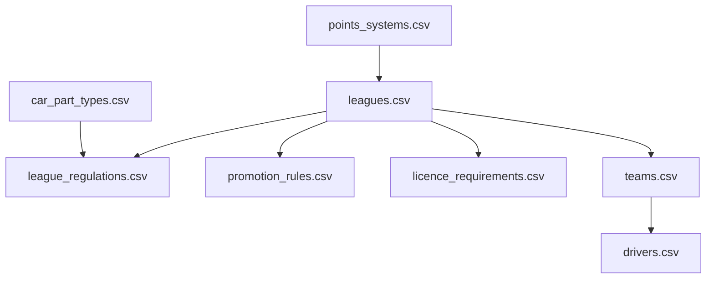
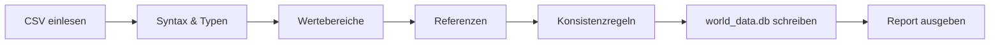

# APEX – Datenmodell M0

**Schema-Vorgabe für die CSV-Stammdaten und die daraus erzeugte `world_data.db`.**

> Bezugsdokument: [KONZEPT_MEHRLIGA_RENNMANAGER.md](KONZEPT_MEHRLIGA_RENNMANAGER.md)
> Status: Schema-Spezifikation. Noch keine Implementierung, noch keine Datenpflege.
> Umfang dieser Runde: die **8 Dateien**, die Meilenstein M0–M2 (Welt, Saison, Auf-/Abstieg) tragen.

---

## Inhalt

1. [Geltungsbereich](#1-geltungsbereich)
2. [Konventionen](#2-konventionen)
3. [ID-Vergabe](#3-id-vergabe)
4. [Dateiübersicht & Ladereihenfolge](#4-dateiübersicht--ladereihenfolge)
5. [`leagues.csv`](#5-leaguescsv)
6. [`league_regulations.csv`](#6-league_regulationscsv)
7. [`promotion_rules.csv`](#7-promotion_rulescsv)
8. [`points_systems.csv`](#8-points_systemscsv)
9. [`licence_requirements.csv`](#9-licence_requirementscsv)
10. [`car_part_types.csv`](#10-car_part_typescsv)
11. [`teams.csv`](#11-teamscsv)
12. [`drivers.csv`](#12-driverscsv)
13. [SQLite-Schema](#13-sqlite-schema)
14. [Bootstrapper & Validierung](#14-bootstrapper--validierung)
15. [Autorenleitfaden für die handgepflegten Bestände](#15-autorenleitfaden-für-die-handgepflegten-bestände)
16. [Wert-Entscheidungen](#16-wert-entscheidungen)
17. [Zweite Datei-Runde: Strecken, Kalender, Motoren](#17-zweite-datei-runde-strecken-kalender-motoren)
18. [M5: Fahrerkarrieren](#18-m5-fahrerkarrieren)
19. [M5 Teil 2: Personal](#19-m5-teil-2-personal)
20. [M5 Teil 3: Infrastruktur](#20-m5-teil-3-infrastruktur)
21. [M6: Wirtschaft](#21-m6-wirtschaft)
22. [M7 Teil 1: Wetter, Safety Car, Sprint](#22-m7-teil-1-wetter-safety-car-sprint)

---

## 1. Geltungsbereich

### 1.1 Was in dieser Runde spezifiziert wird

Acht Dateien, ausgewählt nach einem Kriterium: Genau sie werden gebraucht, damit die zentrale Behauptung des Spiels – *zehn Ligen, jede Saison Auf- und Abstieg* – vollständig durchläuft. Alles, was erst die Rennsimulation (M4) oder den Markt (M5) betrifft, bleibt bewusst außen vor.

| Datei | Trägt |
| :--- | :--- |
| `leagues.csv` | Identität und Zuschnitt der zehn Ligen |
| `league_regulations.csv` | Reglement je Liga und Saison (Deckel, Gewicht, Kosten) |
| `promotion_rules.csv` | Auf-/Abstieg, Barrage |
| `points_systems.csv` | Punktevergabe |
| `licence_requirements.csv` | Lizenzhürden beim Aufstieg |
| `car_part_types.csv` | Die 9 Bauteilgruppen als Typdefinition |
| `teams.csv` | 167 Teams, handgepflegt |
| `drivers.csv` | ~450 Fahrer, handgepflegt |

### 1.2 Zweite Runde: Strecken, Kalender, Motoren

Vier weitere Dateien sind hinzugekommen und in Abschnitt 17 spezifiziert:

| Datei | Trägt |
| :--- | :--- |
| `race_weekend_formats.csv` | Die fünf Wochenendformate aus Konzept 11.1 |
| `tracks.csv` | 30 Strecken, gemeinsamer Pool über alle zehn Ligen |
| `engine_suppliers.csv` | Acht Motorenhersteller, je einer je Werksteam |
| `calendar.csv` | Startkalender Saison 1, 130 Rennwochenenden |
| `track_archetype_weights.csv` | Gewichtsprofil je Archetyp und Sektor |
| `track_sector_weights.csv` | Abweichungen einzelner Strecken davon |

Damit sind `weekend_format_id` und `engine_supplier_id` keine Vorwärtsreferenzen mehr, sondern scharf geprüfte Fremdschlüssel.

### 1.3 Was weiterhin fehlt

`tyre_compounds.csv`, `weather_profiles.csv`, `sponsors.csv`, `staff.csv`, `staff_roles.csv`, `team_facilities.csv`, `team_finances.csv`, `driver_names.csv`, `newgen_presets.csv`, `game_state.csv`.

Eine einzige Vorwärtsreferenz bleibt: `barrage_track_id` in `promotion_rules.csv`. Leer bedeutet dort Zufallsauswahl aus dem Streckenpool.

### 1.3 Grundprinzip

Wie bei Velo: **CSV ist die Wahrheit.** Der Bootstrapper liest die CSVs, validiert sie, erzeugt daraus `world_data.db`; beim Karrierestart wird diese Datei in ein Savegame kopiert und ab dann nur noch dort geschrieben. Die CSVs werden zur Laufzeit nie verändert.

Daraus folgt eine Regel, die den ganzen Aufbau prägt: **CSVs enthalten Startzustand, niemals Verlauf.** `teams.csv` sagt, in welcher Liga ein Team *beginnt* – nicht, in welcher es sich gerade befindet. Der Verlauf lebt ausschließlich in Savegame-Tabellen wie `team_seasons`.

---

## 2. Konventionen

| Thema | Festlegung |
| :--- | :--- |
| Kodierung | UTF-8 ohne BOM, Zeilenende LF |
| Trennzeichen | Komma. Werte mit Komma oder Anführungszeichen werden in `"` gesetzt, inneres `"` wird verdoppelt |
| Dezimaltrennzeichen | Punkt (`0.07`), niemals Komma |
| Kopfzeile | Pflicht, erste Nicht-Kommentarzeile, exakt die spezifizierten Spaltennamen |
| Kommentare | Zeilen, die mit `#` beginnen, werden ignoriert – für Abschnittsüberschriften in langen handgepflegten Dateien |
| Wahrheitswerte | `0` / `1`, nie `true`/`ja` |
| Leerwerte | Leeres Feld = NULL. Nie `NULL`, `-`, `n/a` oder `0` als Ersatz |
| Listen in einer Spalte | Pipe-getrennt ohne Leerzeichen: `technical_director\|chief_designer` |
| Geldbeträge | Ganzzahlig in Euro, ohne Tausendertrennzeichen und ohne Währungszeichen: `145000000` |
| Prozentwerte | Als Dezimalbruch `0.25`, nicht als `25` – außer die Spalte trägt das Suffix `_pct` |
| Bezeichner | Spaltennamen, Enum-Werte und Schlüssel englisch in `snake_case` |
| Freitext | Deutsch (`name`, `flavour`) – es ist Spielinhalt, kein Bezeichner |
| Sortierung | Aufsteigend nach Primärschlüssel, damit Diffs in den handgepflegten 617 Zeilen lesbar bleiben. Ausnahme: Wo eine fachliche Reihenfolge existiert, gilt die – `car_part_types.csv` folgt `sort_order` (Konzept 6.1), nicht dem Alphabet der Schlüssel. Verstöße sind Warnungen, keine Fehler |
| Farben | Hex mit Raute, sechsstellig, Großbuchstaben: `#E10600` |
| Länder | ISO-3166-1 alpha-3 (`DEU`, `GBR`, `JPN`) |

---

## 3. ID-Vergabe

IDs sind **stabil und werden nie neu vergeben**. Wird ein Team gestrichen, bleibt seine ID unbenutzt.

| Entität | Bereich | Bildungsregel |
| :--- | :--- | :--- |
| Team | `1001`–`10999` | `start_tier × 1000 + laufende Nummer`. Tier 1: `1001`–`1011`, Tier 10: `10001`–`10022` |
| Fahrer | `100001`–`100999` | Fortlaufend, ohne Bedeutung |
| Punktesystem | `1`–`99` | `1` = Tier 1–3, `2` = Tier 4–10 |
| Bauteilgruppe | Textschlüssel | `chassis`, `front_wing`, … – keine numerische ID |
| Hersteller, Strecke, Sponsor | ab `200001` bzw. `300001` | Reserviert, Vergabe in der nächsten Runde |

Die Team-ID kodiert das **Start**-Tier als Lesehilfe für die Handpflege – sie wird nach dem ersten Saisonwechsel semantisch falsch und darf deshalb nirgends im Code als Tier-Quelle benutzt werden. Der Validator warnt, wenn Code die ID zerlegt.

---

## 4. Dateiübersicht & Ladereihenfolge

Die Ladereihenfolge ergibt sich aus den Fremdschlüsseln:



| # | Datei | Zeilen | Schlüssel | Pflege |
| ---: | :--- | ---: | :--- | :--- |
| 1 | `points_systems.csv` | 20 | `points_system_id, position` | fest |
| 2 | `car_part_types.csv` | 9 | `part_key` | fest |
| 3 | `leagues.csv` | 10 | `tier` | fest |
| 4 | `league_regulations.csv` | 10 je Saison | `tier, season` | fest, wächst mit Reglementzyklen |
| 5 | `promotion_rules.csv` | 10 | `tier, valid_from_season` | fest |
| 6 | `licence_requirements.csv` | 10 | `tier` | fest |
| 7 | `teams.csv` | 167 | `team_id` | **handgepflegt** |
| 8 | `drivers.csv` | ~450 | `driver_id` | **handgepflegt** |

---

## 5. `leagues.csv`

Die zeitlose Identität einer Liga: was sie ist und wie groß sie ist. Alles, was sich pro Saison ändern kann – Deckel, Gewicht, Kosten – steht in `league_regulations.csv`.

| Spalte | Typ | Bereich | Pflicht | Bedeutung |
| :--- | :--- | :--- | :---: | :--- |
| `tier` | INT | 1–10 | ✓ | 1 = höchste Liga. Primärschlüssel |
| `name` | TEXT | | ✓ | Vollständiger Ligenname, weltweit eindeutig |
| `short_name` | TEXT | 2–4 Zeichen | ✓ | Kürzel für Tabellen und Timing-Screens, eindeutig |
| `team_count` | INT | 8–30 | ✓ | Sollstärke. Der Validator prüft `teams.csv` dagegen |
| `cars_per_team` | INT | 1–3 | ✓ | Durchgehend `2` (Entscheidung, Konzept 3.1) |
| `race_count` | INT | 4–24 | ✓ | Reguläre Rennwochenenden, ohne Barrage |
| `conference_count` | INT | 1–4 | ✓ | Durchgehend `1`. Feld bleibt für spätere Regionalisierung erhalten |
| `points_system_id` | INT | FK | ✓ | → `points_systems.csv` |
| `tyre_sets_per_weekend` | INT | 2–16 | ✓ | Kontingent pro Auto und Wochenende |
| `dnf_base_rate` | REAL | 0.0–0.5 | ✓ | Basis-Ausfallrate pro Auto und Rennen, Richtwert für die Light-Sim |
| `weekend_format_id` | INT | FK | | Vorwärtsreferenz → `race_weekend_formats.csv` |
| `flavour` | TEXT | | ✓ | Ein bis zwei Sätze Charakterisierung für die Ligenansicht |

### Vollständiger Inhalt

```csv
tier,name,short_name,team_count,cars_per_team,race_count,conference_count,points_system_id,tyre_sets_per_weekend,dnf_base_rate,weekend_format_id,flavour
1,APEX World Championship,AWC,11,2,22,1,1,13,0.07,1,"Die Weltmeisterschaft. Werksprogramme, Kostendeckel, aerodynamische Testrestriktion - hier entscheidet Effizienz, nicht Budgethoehe."
2,World Series,WS,12,2,18,1,1,11,0.09,2,"Das Wartezimmer der Weltmeisterschaft: Absteiger mit Fallschirmgeld treffen auf Aufsteiger, die alles auf eine Karte setzen."
3,Intercontinental Cup,ICC,14,2,16,1,1,10,0.11,2,"Erste Liga mit weltweitem Kalender. Ab hier werden Logistikkosten zu einem echten Posten in der Bilanz."
4,Continental Prime,CP,16,2,14,1,2,9,0.13,3,"Die Schwelle zum Profibetrieb: erstmals Superlizenz-Anforderungen an die Fahrer und verpflichtende Infrastruktur."
5,Continental Series,CS,16,2,12,1,2,8,0.15,3,"Halbprofessionell. Pay Driver finanzieren hier ganze Saisons - und blockieren Cockpits fuer schnellere Talente."
6,Challenger Series,CHS,18,2,12,1,2,7,0.17,3,"Sprungbrett-Liga: wer hier zwei Saisons dominiert, wird von oben abgeworben - Fahrer wie Ingenieure."
7,National Elite,NE,18,2,10,1,2,6,0.19,4,"Nationale Spitzenserie mit Doppelrennen. Startaufstellung des zweiten Laufs: Top 6 des ersten Laufs umgedreht."
8,National Series,NS,20,2,10,1,2,6,0.20,4,"Werkstattbetrieb statt Fabrik: Zuverlaessigkeit schlaegt Leistung, weil Ersatzteile schlicht fehlen."
9,Regional Cup,RC,20,2,8,1,2,5,0.21,5,"Zwei Autos, Mechaniker im Nebenberuf. Wer hier gut scoutet, verkauft in drei Jahren einen Weltmeister."
10,Rookie Cup,RK,22,2,8,1,2,4,0.22,5,"Der Einstieg. Kein Fallschirm, kein Fangnetz: Die letzten zwei Teams verlieren ihre Lizenz an Neugruendungen."
```

> Die Umlaute sind hier nur in der Codeblock-Darstellung umschrieben; in der echten CSV stehen sie als UTF-8-Zeichen (`Budgethöhe`, `Zuverlässigkeit`, `Neugründungen`).

**Validierung:** `team_count` summiert über alle Tiers = 167 · `cars_per_team` × `team_count` summiert = 334 Stammcockpits · `tier` lückenlos 1–10 · `dnf_base_rate` steigt monoton mit dem Tier.

---

## 6. `league_regulations.csv`

Das Reglement einer Liga in einer bestimmten Saison. Eine Zeile je `(tier, season)`. Reglementwechsel (Konzept 5.3) erzeugen neue Zeilen mit derselben `tier`, höherer `season`.

| Spalte | Typ | Bereich | Pflicht | Bedeutung |
| :--- | :--- | :--- | :---: | :--- |
| `tier` | INT | 1–10 | ✓ | FK → `leagues.csv` |
| `season` | INT | ≥ 1 | ✓ | Ab dieser Saison gültig |
| `regulation_label` | TEXT | | ✓ | Sprechender Name für Meldungen: `Grundformel`, `Ground Effect` |
| `cap_chassis` | INT | 0–1000 | ✓ | Reglement-Deckel auf der weltweiten 0–1000-Skala |
| `cap_front_wing` | INT | 0–1000 | ✓ | |
| `cap_rear_wing` | INT | 0–1000 | ✓ | |
| `cap_floor` | INT | 0–1000 | ✓ | |
| `cap_powertrain` | INT | 0–1000 | ✓ | Entspricht der Spalte „Motorleistung" in Konzept 3.1 |
| `cap_ers` | INT | 0–1000 | ✓ | |
| `cap_gearbox` | INT | 0–1000 | ✓ | |
| `cap_suspension` | INT | 0–1000 | ✓ | |
| `cap_brakes` | INT | 0–1000 | ✓ | |
| `min_weight_kg` | INT | 700–1100 | ✓ | Mindestgewicht inklusive Fahrer |
| `cost_cap` | INT | Euro | ✓ | Kostendeckel der Saison |
| `test_days` | INT | 0–30 | ✓ | Erlaubte Testtage. Fällt mit der Ligenhöhe, siehe 6.2 |
| `tyre_supplier` | TEXT | | | Vorwärtsreferenz, in M0 leer |
| `atr_base` | REAL | 1.0–2.0 | ✓ | ATR-Formel, Konzept 5.4: `faktor = atr_base - atr_step × (platz - 1)` |
| `atr_step` | REAL | 0.0–0.2 | ✓ | `0` schaltet die ATR für diese Liga ab |

### 6.1 Aero-Drosselung in den unteren Ligen

Sechs der neun Gruppen tragen den vollen Ligadeckel. Die drei **aerodynamischen** Gruppen – `front_wing`, `rear_wing`, `floor` – werden zusätzlich mit einem Faktor je Liga gedrosselt:

| Tier | 1 | 2 | 3 | 4 | 5 | 6 | 7 | 8 | 9 | 10 |
| :--- | ---: | ---: | ---: | ---: | ---: | ---: | ---: | ---: | ---: | ---: |
| Aero-Faktor | 1.00 | 0.98 | 0.96 | 0.93 | 0.90 | 0.87 | 0.83 | 0.79 | 0.75 | 0.70 |
| Ligadeckel | 1000 | 870 | 760 | 660 | 570 | 490 | 420 | 360 | 300 | 250 |
| **Aero-Deckel** | **1000** | **853** | **730** | **614** | **513** | **426** | **349** | **284** | **225** | **175** |

Wirkung: In Tier 10 liegt der Aero-Deckel 30 % unter dem mechanischen Deckel, in Tier 1 fallen beide zusammen. Wer aufsteigt, verschiebt seinen Entwicklungsschwerpunkt schrittweise von mechanischem Grip zu Aerodynamik – ohne dass dafür ein zweites Regelwerk nötig wäre.

`chassis` zählt hier bewusst **nicht** als Aero-Gruppe: Konzept 6.1 definiert sie über Steifigkeit, Gewicht und Crash-Sicherheit, also strukturell. Sie trägt den vollen Ligadeckel.

Der Faktor ist eine reine Herleitungsregel – gespeichert werden immer die fertigen Deckelwerte, damit ein einzelner Ausreißer je Liga und Gruppe später ohne Formeländerung möglich bleibt.

### 6.2 Beispielzeilen (Saison 1)

```csv
tier,season,regulation_label,cap_chassis,cap_front_wing,cap_rear_wing,cap_floor,cap_powertrain,cap_ers,cap_gearbox,cap_suspension,cap_brakes,min_weight_kg,cost_cap,test_days,tyre_supplier,atr_base,atr_step
1,1,Grundformel,1000,1000,1000,1000,1000,1000,1000,1000,1000,798,145000000,12,,1.35,0.05
2,1,Grundformel,870,853,853,853,870,870,870,870,870,810,70000000,10,,1.35,0.05
3,1,Grundformel,760,730,730,730,760,760,760,760,760,825,34000000,9,,1.35,0.04
4,1,Grundformel,660,614,614,614,660,660,660,660,660,840,17000000,8,,1.30,0.03
5,1,Grundformel,570,513,513,513,570,570,570,570,570,860,9000000,7,,1.30,0.03
6,1,Grundformel,490,426,426,426,490,490,490,490,490,880,4500000,6,,1.20,0.02
7,1,Grundformel,420,349,349,349,420,420,420,420,420,900,2200000,5,,1.00,0.00
8,1,Grundformel,360,284,284,284,360,360,360,360,360,920,1100000,4,,1.00,0.00
9,1,Grundformel,300,225,225,225,300,300,300,300,300,940,550000,3,,1.00,0.00
10,1,Grundformel,250,175,175,175,250,250,250,250,250,960,260000,2,,1.00,0.00
```

**Testtage** fallen gleichläufig mit der Ligenhöhe: Tier 1 hat 12, Tier 10 noch 2. Wer aufsteigt, gewinnt Testzeit hinzu.

> Zu beachten: Testtage und ATR ziehen damit in entgegengesetzte Richtungen – die ATR bremst die Spitzenteams, die Testtage begünstigen die oberen Ligen. Das ist als Zusammenspiel gewollt (Ligenvorteil ja, Teamvorteil innerhalb der Liga nein), sollte aber nach den ersten Zehn-Saison-Läufen gegengeprüft werden. `atr_base`/`atr_step` unterhalb Tier 3 sind weiterhin ein Vorschlag.

**Validierung:** jeder Deckel ≤ 1000 · Deckel eines Tiers ≤ Deckel des nächsthöheren Tiers, je Gruppe einzeln geprüft · Aero-Deckel ≤ mechanischer Deckel derselben Liga · `min_weight_kg` steigt monoton mit dem Tier · `cost_cap` und `test_days` fallen monoton mit dem Tier · für jedes `tier` existiert eine Zeile mit `season = 1`.

---

## 7. `promotion_rules.csv`

Wie viele Teams sich pro Saison an einer Ligengrenze bewegen. Eine Zeile je Tier; `valid_from_season` erlaubt spätere Regeländerungen ohne Migration.

| Spalte | Typ | Bereich | Pflicht | Bedeutung |
| :--- | :--- | :--- | :---: | :--- |
| `tier` | INT | 1–10 | ✓ | FK → `leagues.csv` |
| `valid_from_season` | INT | ≥ 1 | ✓ | Teil des Primärschlüssels |
| `direct_up` | INT | 0–4 | ✓ | Direkte Aufsteiger. Tier 1: `0` |
| `direct_down` | INT | 0–4 | ✓ | Direkte Absteiger |
| `promotion_barrage_slots` | INT | 0–2 | ✓ | Plätze für die Barrage nach oben. Tier 1: `0` |
| `relegation_barrage_slots` | INT | 0–2 | ✓ | Plätze für die Barrage nach unten. Tier 10: `0` |
| `relegation_mode` | TEXT | Enum | ✓ | `tier` = Abstieg in die nächste Liga · `licence_loss` = Lizenzverlust, Ersatz durch Newgen-Team |
| `barrage_track_id` | INT | FK | | Neutrale Strecke. Vorwärtsreferenz, in M0 leer = Zufallsauswahl |
| `barrage_leg_count` | INT | 1–3 | ✓ | Läufe mit gemeinsamer Wertung. Konzept 4.2: `2` |
| `barrage_regulation_tier` | INT | 1–10 | ✓ | Unter welchem Reglement die Barrage gefahren wird – stets die **untere** Liga |
| `tiebreak_rule` | TEXT | Enum | ✓ | `quali_average` · `best_finish` · `head_to_head` |
| `licence_fallback` | TEXT | Enum | ✓ | Was bei gescheiterter Lizenz passiert: `next_eligible` = nächstplatziertes lizenzfähiges Team rückt nach · `slot_stays_empty` |

### Vollständiger Inhalt

```csv
tier,valid_from_season,direct_up,direct_down,promotion_barrage_slots,relegation_barrage_slots,relegation_mode,barrage_track_id,barrage_leg_count,barrage_regulation_tier,tiebreak_rule,licence_fallback
1,1,0,2,0,1,tier,,2,2,quali_average,next_eligible
2,1,2,2,1,1,tier,,2,3,quali_average,next_eligible
3,1,2,2,1,1,tier,,2,4,quali_average,next_eligible
4,1,2,2,1,1,tier,,2,5,quali_average,next_eligible
5,1,2,2,1,1,tier,,2,6,quali_average,next_eligible
6,1,2,2,1,1,tier,,2,7,quali_average,next_eligible
7,1,2,2,1,1,tier,,2,8,quali_average,next_eligible
8,1,2,2,1,1,tier,,2,9,quali_average,next_eligible
9,1,2,2,1,1,tier,,2,10,quali_average,next_eligible
10,1,2,2,1,0,licence_loss,,2,10,quali_average,next_eligible
```

**Validierung – die wichtigste Prüfung des ganzen Schemas:** Die Bewegungen an jeder Ligengrenze müssen sich decken. Für jedes Tierpaar `(t, t+1)` gilt:

```
direct_down[t]              == direct_up[t+1]
relegation_barrage_slots[t] == promotion_barrage_slots[t+1]
barrage_regulation_tier[t]  == t + 1
```

Ist das verletzt, verändert sich die Ligagröße über die Saisons hinweg schleichend – ein Fehler, der erst nach zehn simulierten Saisons auffällt. Deshalb ist er als **harter Abbruch** ausgelegt, nicht als Warnung.

---

## 8. `points_systems.csv`

Langformat: eine Zeile je Punktesystem und Position. Die systemweiten Werte (`system_name`, Boni) wiederholen sich in jeder Zeile eines Systems – bewusst, um bei zwei Systemen keine zweite Datei zu erzwingen; der Validator erzwingt ihre Gleichheit.

| Spalte | Typ | Bereich | Pflicht | Bedeutung |
| :--- | :--- | :--- | :---: | :--- |
| `points_system_id` | INT | ≥ 1 | ✓ | Teil des Primärschlüssels |
| `system_name` | TEXT | | ✓ | Innerhalb eines Systems identisch |
| `position` | INT | ≥ 1 | ✓ | Zielposition. Nicht gelistete Positionen = 0 Punkte |
| `points` | INT | ≥ 0 | ✓ | |
| `bonus_pole` | INT | ≥ 0 | ✓ | Zusatzpunkt für die Pole. Innerhalb eines Systems identisch |
| `bonus_fastest_lap` | INT | ≥ 0 | ✓ | Zusatzpunkt für die schnellste Rennrunde |
| `fastest_lap_max_position` | INT | ≥ 1 | ✓ | Nur bis zu dieser Position wird der Bonus gewährt |
| `min_distance_pct` | REAL | 0.0–1.0 | ✓ | Mindestanteil der Renndistanz für eine Wertung |

### Vollständiger Inhalt

Beide Systeme vergeben **je einen Bonuspunkt für die Pole und für die schnellste Rennrunde**; der Rundenbonus nur bis Platz 10. Damit sind zwischen Sieg und zweitem Platz nicht 7, sondern bis zu 9 Punkte Unterschied möglich – das Qualifying wird auf überholarmen Strecken zum Titelfaktor.

```csv
points_system_id,system_name,position,points,bonus_pole,bonus_fastest_lap,fastest_lap_max_position,min_distance_pct
1,Volle Skala,1,25,1,1,10,0.75
1,Volle Skala,2,18,1,1,10,0.75
1,Volle Skala,3,15,1,1,10,0.75
1,Volle Skala,4,12,1,1,10,0.75
1,Volle Skala,5,10,1,1,10,0.75
1,Volle Skala,6,8,1,1,10,0.75
1,Volle Skala,7,6,1,1,10,0.75
1,Volle Skala,8,4,1,1,10,0.75
1,Volle Skala,9,2,1,1,10,0.75
1,Volle Skala,10,1,1,1,10,0.75
2,Flache Skala,1,20,1,1,10,0.75
2,Flache Skala,2,16,1,1,10,0.75
2,Flache Skala,3,13,1,1,10,0.75
2,Flache Skala,4,11,1,1,10,0.75
2,Flache Skala,5,9,1,1,10,0.75
2,Flache Skala,6,7,1,1,10,0.75
2,Flache Skala,7,5,1,1,10,0.75
2,Flache Skala,8,3,1,1,10,0.75
2,Flache Skala,9,2,1,1,10,0.75
2,Flache Skala,10,1,1,1,10,0.75
```

Bei den Doppelrennen in Tier 7–10 wird der Pole-Bonus **einmal je Wochenende** vergeben (Startaufstellung des zweiten Laufs entsteht aus dem Ergebnis des ersten, nicht aus einem eigenen Qualifying), der Rundenbonus dagegen je Lauf.

**Validierung:** `position` lückenlos ab 1 · `points` streng monoton fallend · systemweite Spalten innerhalb eines Systems identisch · jedes in `leagues.csv` referenzierte System existiert.

---

## 9. `licence_requirements.csv`

Die administrative Hürde vor dem sportlich erkämpften Aufstieg (Konzept 5.1). Geprüft wird gegen die Anforderungen der **Zielliga**.

| Spalte | Typ | Bereich | Pflicht | Bedeutung |
| :--- | :--- | :--- | :---: | :--- |
| `tier` | INT | 1–10 | ✓ | Primärschlüssel. Anforderungen, um in dieser Liga anzutreten |
| `min_liquidity_pct` | REAL | 0.0–1.0 | ✓ | Freies Kapital als Anteil des Kostendeckels dieser Liga. Konzept 5.1: `0.25` |
| `min_windtunnel_level` | INT | 0–5 | ✓ | |
| `min_dyno_level` | INT | 0–5 | ✓ | Motorenprüfstand |
| `min_simulator_level` | INT | 0–5 | ✓ | |
| `min_factory_level` | INT | 0–5 | ✓ | Fertigung / Ersatzteil-Durchsatz |
| `min_staff_count` | INT | ≥ 0 | ✓ | Mitarbeiterzahl |
| `required_roles` | TEXT | Pipe-Liste | | Zwingend besetzte Rollen, z. B. `technical_director\|chief_designer` |
| `needs_engine_contract` | INT | 0/1 | ✓ | Gültiger Liefervertrag für diese Liga nötig |
| `min_licence_points` | INT | | ✓ | Lizenzpunktekonto. Konzept 5.2: `0` |
| `min_superlicence_points` | INT | ≥ 0 | ✓ | Mindestpunkte je Fahrer. Konzept 7.3: relevant ab Tier 4 aufwärts |
| `grace_period_seasons` | INT | 0–3 | ✓ | Frist zur Nachrüstung nach dem Aufstieg. Konzept 4.3: `1` |

### Vollständiger Inhalt

Die Leiter fällt **gleichmäßig linear** von Tier 1 nach Tier 10, verankert an der einzigen im Konzept ausformulierten Prüfung (5.1, „Tier 3 → Tier 2"): Liquidität 25 %, Windkanal 2, Prüfstand 2, Simulator 1, 30 Mitarbeiter, Technical Director und Chief Designer besetzt, Superlizenz 25.

```csv
tier,min_liquidity_pct,min_windtunnel_level,min_dyno_level,min_simulator_level,min_factory_level,min_staff_count,required_roles,needs_engine_contract,min_licence_points,min_superlicence_points,grace_period_seasons
1,0.28,3,3,2,3,33,technical_director|chief_designer|head_of_aero|powertrain_chief,1,0,30,1
2,0.25,2,2,1,2,30,technical_director|chief_designer,1,0,25,1
3,0.22,2,2,1,2,27,technical_director|chief_designer,1,0,20,1
4,0.19,2,1,1,2,24,technical_director,1,0,15,1
5,0.16,1,1,0,1,21,technical_director,1,0,0,1
6,0.13,1,1,0,1,18,technical_director,1,0,0,1
7,0.10,1,0,0,1,15,,0,0,0,1
8,0.07,0,0,0,0,12,,0,0,0,1
9,0.04,0,0,0,0,9,,0,0,0,1
10,0.01,0,0,0,0,6,,0,0,0,1
```

Ablesbare Schwellen: ab **Tier 7** entfällt jede Rollenpflicht und der Motorenvertrag, ab **Tier 8** jede Infrastrukturanforderung, ab **Tier 5** greift keine Superlizenz-Mindestpunktzahl mehr – letzteres entspricht Konzept 7.3, das Mindestpunktzahlen nur für Tier 1–4 vorsieht.

> Eine Stelle sticht heraus: Tier 1 verlangt mit 33 Mitarbeitern kaum mehr als Tier 2 mit 30. Das ist die Folge der linearen Leiter durch den Konzept-Anker – wenn die Weltmeisterschaft sich administrativ deutlicher abheben soll, muss entweder der Anker fallen oder Tier 1 als Ausnahme angehoben werden.

**Validierung:** alle Mindestanforderungen fallen monoton mit steigendem Tier (Tier 1 am strengsten) · `required_roles` enthält nur Rollen aus `staff_roles.csv`, sobald diese existiert · `min_superlicence_points > 0` nur dort, wo auch `needs_engine_contract = 1` gilt.

---

## 10. `car_part_types.csv`

Die neun Bauteilgruppen als Typdefinition (Konzept 6.1). Kein Teambestand – der entsteht erst zur Laufzeit in `car_parts`.

| Spalte | Typ | Bereich | Pflicht | Bedeutung |
| :--- | :--- | :--- | :---: | :--- |
| `part_key` | TEXT | Enum | ✓ | Primärschlüssel, auch Suffix der `cap_*`-Spalten |
| `name` | TEXT | | ✓ | Anzeigename |
| `sort_order` | INT | 1–9 | ✓ | Reihenfolge in der Fabrik-Ansicht |
| `primary_effect` | TEXT | | ✓ | Wirkt primär auf – Anzeigetext |
| `conflict` | TEXT | | ✓ | Zielkonflikt – Anzeigetext |
| `dev_constant_k` | REAL | > 0 | ✓ | `k_gruppe` der Entwicklungsformel (Konzept 6.3) |
| `base_failure_rate` | REAL | 0.0–1.0 | ✓ | Anteil dieser Gruppe an der Gesamt-Ausfallrate |
| `damage_prone` | REAL | 0.0–1.0 | ✓ | Anfälligkeit für Kollisionsschäden – Frontflügel hoch, Chassis niedrig |
| `weight_reference_kg` | REAL | > 0 | ✓ | Referenzgewicht, gegen das `weight_delta` gerechnet wird |
| `carry_over_default` | REAL | 0.0–1.0 | ✓ | Werterhalt bei Reglementwechsel (Konzept 5.3: Aero ~0.3, Bremsen ~0.9) |
| `supplied_by_engine` | INT | 0/1 | ✓ | `1` für `powertrain` und `ers` – kommt vom Hersteller, nicht aus der eigenen Entwicklung (Konzept 6.6) |

### Herleitung der numerischen Spalten

Die Werte sind nicht frei gesetzt, sondern aus dem Konzept abgeleitet:

| Spalte | Herleitung |
| :--- | :--- |
| `carry_over_default` | Konzept 5.3 nennt zwei Ankerwerte: Aerodynamik ~0.3, Bremsen ~0.9. Die übrigen Gruppen liegen dazwischen, gestaffelt danach, wie stark ein Formelwechsel sie entwertet |
| `base_failure_rate` | Anteile an der Gesamt-Ausfallrate, gewichtet nach dem Zielkonflikt aus Konzept 6.1: Antriebseinheit trägt „Leistung ↔ Zuverlässigkeit" und damit den größten Anteil |
| `damage_prone` | Konzept 6.1 nennt beim Frontflügel ausdrücklich die „Anfälligkeit für Schäden"; das Chassis ist als Crash-Struktur das Gegenstück |
| `dev_constant_k` | Entwicklungstempo: Aerodynamik iteriert schnell im Windkanal, die Antriebseinheit ist durch Homologation und lange Vorlaufzeiten am trägsten |

```csv
part_key,name,sort_order,primary_effect,conflict,dev_constant_k,base_failure_rate,damage_prone,weight_reference_kg,carry_over_default,supplied_by_engine
chassis,Monocoque / Chassis,1,"Gesamtsteifigkeit, Gewicht, Crash-Sicherheit",Steifigkeit vs. Gewicht,0.70,0.04,0.05,120,0.55,0
front_wing,Frontfluegel & Nase,2,"Frontgrip, Balance",Abtrieb vs. Empfindlichkeit,1.30,0.06,0.90,12,0.30,0
rear_wing,Heckfluegel,3,Topspeed vs. Kurvenabtrieb,direkt im Setup einstellbar,1.20,0.04,0.40,10,0.30,0
floor,Unterboden / Diffusor,4,Abtrieb ohne Luftwiderstand,Performance vs. Fahrbarkeit,1.15,0.05,0.55,25,0.30,0
powertrain,Antriebseinheit,5,"Leistung, Verbrauch, Standfestigkeit, Hitze",Leistung vs. Zuverlaessigkeit,0.60,0.28,0.12,150,0.70,1
ers,Energierueckgewinnung,6,"Beschleunigung, Ueberholhilfe",Effizienz vs. Gewicht,0.80,0.16,0.10,40,0.65,1
gearbox,Getriebe,7,"Beschleunigung, Schaltverluste",Uebersetzung vs. Topspeed,0.85,0.15,0.15,45,0.80,0
suspension,Fahrwerk & Aufhaengung,8,"Mechanischer Grip, Reifenverschleiss",Haerte vs. Reifenschonung,1.00,0.10,0.45,60,0.75,0
brakes,Bremsen & Kuehlung,9,"Bremspunkte, Hitzemanagement",Kuehlung vs. Luftwiderstand,1.05,0.12,0.20,30,0.90,0
```

Zwei Muster fallen dabei zusammen und sind gewollt: Was schnell entwickelt (`dev_constant_k` hoch), verliert beim Reglementwechsel am meisten (`carry_over_default` niedrig) – die Aerodynamik ist Hochrisiko-Investition. Was langsam wächst, hält dafür. Genau daraus entsteht die Frage, die ein Reglementwechsel dem Spieler stellt.

`weight_reference_kg` summiert sich auf 492 kg und ist **keine vollständige Massenbilanz** – Kühlung, Elektronik, Karosserie, Sitz, Räder und Fahrer stecken nicht darin. Es ist ausschließlich die Bezugsgröße, gegen die `weight_delta` eines Bauteils gerechnet wird.

**Validierung:** genau 9 Zeilen · `part_key` deckungsgleich mit den `cap_*`-Spalten in `league_regulations.csv` · Summe `base_failure_rate` = 1.0 · genau zwei Zeilen mit `supplied_by_engine = 1` · `carry_over_default` der drei Aero-Gruppen identisch.

---

## 11. `teams.csv`

**Handgepflegt, 167 Zeilen.** Die Entscheidung gegen prozedurale Erzeugung heißt: Jedes Team hat eine bewusst gesetzte Identität – Name, Farben, Heimat, Ruf, Spielweise – bis hinunter in den Rookie Cup.

| Spalte | Typ | Bereich | Pflicht | Bedeutung |
| :--- | :--- | :--- | :---: | :--- |
| `team_id` | INT | 1001–10999 | ✓ | Primärschlüssel, siehe 3 |
| `name` | TEXT | | ✓ | **Weltweit eindeutig** – nicht nur je Liga |
| `short_name` | TEXT | ≤ 16 Zeichen | ✓ | Für Tabellen |
| `code` | TEXT | 3 Großbuchstaben | ✓ | Timing-Kürzel, weltweit eindeutig: `ABT`, `NRD` |
| `country` | TEXT | ISO-3 | ✓ | Heimatland – bestimmt das Heimrennen und Nationalitätsboni |
| `city` | TEXT | | ✓ | Standort der Fabrik |
| `founded_year` | INT | 1900–Start | ✓ | Speist Tradition und Prestige-Erzählung |
| `start_tier` | INT | 1–10 | ✓ | Liga zum Karrierestart. **Startzustand, kein Verlauf** |
| `colour_primary` | TEXT | Hex | ✓ | |
| `colour_secondary` | TEXT | Hex | ✓ | Muss sich von `colour_primary` unterscheiden |
| `ai_archetype` | TEXT | Enum | ✓ | `works_team` · `climber` · `academy` · `traditional` · `privateer` · `tech_startup` (Konzept 14.1) |
| `prestige` | INT | 0–100 | ✓ | Wirkt auf Sponsorenwert, Fahrer- und Personalgewinnung |
| `start_capital` | INT | Euro | ✓ | Liquidität zum Karrierestart |
| `engine_supplier_id` | INT | FK | | Vorwärtsreferenz → `engine_suppliers.csv` |
| `is_works_team` | INT | 0/1 | ✓ | Werksteam seines Herstellers (Konzept 6.6) |
| `history_titles` | INT | ≥ 0 | ✓ | Titel vor Spielbeginn – speist Hall of Fame und Prestige |
| `history_best_tier` | INT | 1–10 | ✓ | Höchste je erreichte Liga. Erzeugt „gefallene Riesen" in unteren Ligen |
| `flavour` | TEXT | | | Ein Satz Teamcharakter |

### Beispielzeilen

```csv
team_id,name,short_name,code,country,city,founded_year,start_tier,colour_primary,colour_secondary,ai_archetype,prestige,start_capital,engine_supplier_id,is_works_team,history_titles,history_best_tier,flavour
1001,Scuderia Aurelia,Aurelia,AUR,ITA,Maranello,1929,1,#B30000,#F2C200,works_team,96,42000000,,1,14,1,"Der Maßstab. Vierzehn Titel, und jede Saison ohne einen davon gilt als Krise."
1002,Northgate Racing,Northgate,NRD,GBR,Brackley,1968,1,#0B3D2E,#C9F224,works_team,88,31000000,,1,6,1,"Ingenieursgetrieben, unaufgeregt, seit dreißig Jahren nie schlechter als Rang sechs."
6042,Kessler Motorsport,Kessler,KSL,DEU,Ingolstadt,1994,6,#1A1A1A,#E8541F,traditional,34,780000,,0,0,3,"Stand einmal in Tier 3. Die Fabrik von damals kostet noch heute mehr, als die Liga einbringt."
10015,Silvertown Junior Team,Silvertown,SVT,GBR,Silverstone,2019,10,#005BBB,#FFFFFF,academy,9,95000,,0,0,10,"Zwei Transporter, ein Zelt, sechs Mechaniker im Nebenberuf - und die beste Talentquote der Liga."
```

**Validierung:** genau 167 Zeilen · Zeilenzahl je `start_tier` = `team_count` aus `leagues.csv` · `name`, `short_name` und `code` global eindeutig · `history_best_tier` ≤ `start_tier` als **Fehler** – wer in einer Liga antritt, hat sie erreicht, ein schlechterer Bestwert ist ein Widerspruch. Ein deutlich **besserer** Wert (numerisch kleiner) ist dagegen der gewollte „gefallene Riese" und kein Befund · `founded_year` ≤ Startjahr · identisches Farbpaar (Warnung).

---

## 12. `drivers.csv`

**Handgepflegt, ~450 Zeilen.** 334 Stammcockpits plus Test-, Nachwuchs- und vertragslose Fahrer.

### 12.1 Stammdaten

| Spalte | Typ | Bereich | Pflicht | Bedeutung |
| :--- | :--- | :--- | :---: | :--- |
| `driver_id` | INT | 100001+ | ✓ | Primärschlüssel |
| `first_name` | TEXT | | ✓ | |
| `last_name` | TEXT | | ✓ | |
| `country` | TEXT | ISO-3 | ✓ | |
| `birth_year` | INT | | ✓ | **Nicht `age`** – das Alter ergibt sich aus der laufenden Saison und altert dadurch automatisch mit |

### 12.2 Die 17 Attribute (je 0–100)

| Kategorie | Spalten |
| :--- | :--- |
| Speed | `pace`, `qualifying`, `braking`, `cornering`, `car_control` |
| Racecraft | `overtaking`, `defending`, `starts`, `racecraft_traffic` |
| Kopf | `consistency`, `pressure`, `aggression` |
| Technik | `feedback`, `tyre_management`, `fuel_saving` |
| Kondition | `fitness`, `wet_skill` |

`car_control` ist Fahrzeugbeherrschung am Limit: Bodenwellen, Randsteine, rutschiger Untergrund, Abfangen eines ausbrechenden Hecks. Es trägt den Streckenarchetyp „Bumpy Street" (Konzept 10) und wirkt zusätzlich auf die Fehlerwahrscheinlichkeit bei hoher `aggression` und auf Nässe. Als eigenes gepflegtes Attribut erlaubt es das Profil, auf das es ankommt: ein Fahrer, der auf Straßenkursen über sich hinauswächst, ohne generell schneller zu sein.

`aggression` ist ausdrücklich **kein Gütewert**, sondern eine Charaktereigenschaft: hoch bedeutet mehr Zeitgewinn *und* mehr Fehler. Der Validator prüft deshalb nicht auf eine „gute" Ausprägung.

### 12.3 Entwicklung, Charakter, Vertrag

| Spalte | Typ | Bereich | Pflicht | Bedeutung |
| :--- | :--- | :--- | :---: | :--- |
| `potential` | INT | 0–100 | ✓ | Zielniveau der Kernwerte am Karrierehöhepunkt |
| `ego` | INT | 0–100 | ✓ | Ablehnung des Nr.-2-Status, Reaktion auf Stallorder |
| `adaptability` | INT | 0–100 | ✓ | Anpassung an neues Auto / neue Liga |
| `marketability` | INT | 0–100 | ✓ | Sponsorenwert |
| `morale` | INT | 0–100 | ✓ | Startwert |
| `superlicence_points` | INT | ≥ 0 | ✓ | Zugangsvoraussetzung für Tier 1–4 (Konzept 7.3) |
| `start_team_id` | INT | FK | | Leer = vertragsloser Free Agent |
| `start_role` | TEXT | Enum | ✓ | `race` · `reserve` · `junior` · `free_agent` |
| `start_seat` | INT | 1–2 | | Nur bei `start_role = race`: welches der beiden Cockpits |
| `contract_until_season` | INT | ≥ 1 | | Leer bei Free Agents |
| `salary` | INT | Euro/Saison | ✓ | `0` bei Free Agents |
| `pay_driver_budget` | INT | Euro/Saison | ✓ | Mitgift. `0` bei allen außer Pay Drivern |

### Beispielzeilen

Zur Lesbarkeit hier nur die Kopf- und Vertragsspalten sowie vier der 17 Attribute; die echte Datei führt alle Spalten in der oben festgelegten Reihenfolge.

```csv
driver_id,first_name,last_name,country,birth_year,pace,qualifying,consistency,tyre_management,...,potential,ego,start_team_id,start_role,start_seat,contract_until_season,salary,pay_driver_budget
100001,Matteo,Ferrante,ITA,1997,94,95,89,86,...,96,88,1001,race,1,3,18000000,0
100002,Lars,Bergstroem,SWE,2001,88,86,84,90,...,95,61,1001,race,2,2,4200000,0
100288,Yuki,Harada,JPN,2006,52,55,47,58,...,88,44,10015,race,1,1,0,140000
100401,Colin,Whitaker,GBR,1989,71,68,79,74,...,71,52,,free_agent,,,0,0
```

**Validierung:**

* Je Team mit `start_role = race` **genau `cars_per_team` Fahrer**, jeder `start_seat` je Team genau einmal – die Prüfung, die garantiert, dass keine Liga mit unbesetzten Startplätzen anfängt.
* Summe aller `race`-Fahrer = 334.
* `potential` ≥ höchster **Kernwert** (`pace`, `qualifying`, `braking`, `cornering`) – **Warnung**, kein Fehler. Bewusst nur die Kernwerte: `feedback`, `tyre_management` und die Racecraft-Werte wachsen laut Konzept 7.2 mit der Erfahrung weiter, während `pace` und `qualifying` längst erodieren. Ein Routinier mit `feedback` 81 und `potential` 71 ist kein Datenfehler, sondern genau das erwartete Profil.
* `superlicence_points` erfüllt `min_superlicence_points` der Liga des `start_team_id`.
* Alter zum Startjahr zwischen 16 und 45.
* `pay_driver_budget > 0` nur bei `salary = 0` (ein Fahrer bringt Geld mit *oder* bekommt welches, nicht beides).

---

## 13. SQLite-Schema

Der Bootstrapper erzeugt aus den acht Dateien diese Tabellen. Sie sind **schreibgeschützt gedacht**: Nach dem Kopieren ins Savegame wird nur noch in die Verlaufstabellen (`team_seasons`, `car_parts`, …) geschrieben.

```sql
CREATE TABLE leagues (
  tier                  INTEGER PRIMARY KEY CHECK (tier BETWEEN 1 AND 10),
  name                  TEXT    NOT NULL UNIQUE,
  short_name            TEXT    NOT NULL UNIQUE,
  team_count            INTEGER NOT NULL,
  cars_per_team         INTEGER NOT NULL,
  race_count            INTEGER NOT NULL,
  conference_count      INTEGER NOT NULL DEFAULT 1,
  points_system_id      INTEGER NOT NULL REFERENCES points_systems_meta(points_system_id),
  tyre_sets_per_weekend INTEGER NOT NULL,
  dnf_base_rate         REAL    NOT NULL,
  weekend_format_id     INTEGER,
  flavour               TEXT    NOT NULL
);

CREATE TABLE league_regulations (
  tier             INTEGER NOT NULL REFERENCES leagues(tier),
  season           INTEGER NOT NULL,
  regulation_label TEXT    NOT NULL,
  cap_chassis      INTEGER NOT NULL CHECK (cap_chassis    BETWEEN 0 AND 1000),
  cap_front_wing   INTEGER NOT NULL CHECK (cap_front_wing BETWEEN 0 AND 1000),
  cap_rear_wing    INTEGER NOT NULL,
  cap_floor        INTEGER NOT NULL,
  cap_powertrain   INTEGER NOT NULL,
  cap_ers          INTEGER NOT NULL,
  cap_gearbox      INTEGER NOT NULL,
  cap_suspension   INTEGER NOT NULL,
  cap_brakes       INTEGER NOT NULL,
  min_weight_kg    INTEGER NOT NULL,
  cost_cap         INTEGER NOT NULL,
  test_days        INTEGER,
  tyre_supplier    TEXT,
  atr_base         REAL    NOT NULL,
  atr_step         REAL    NOT NULL,
  PRIMARY KEY (tier, season)
);

CREATE TABLE promotion_rules (
  tier                     INTEGER NOT NULL REFERENCES leagues(tier),
  valid_from_season        INTEGER NOT NULL,
  direct_up                INTEGER NOT NULL,
  direct_down              INTEGER NOT NULL,
  promotion_barrage_slots  INTEGER NOT NULL,
  relegation_barrage_slots INTEGER NOT NULL,
  relegation_mode          TEXT    NOT NULL CHECK (relegation_mode IN ('tier','licence_loss')),
  barrage_track_id         INTEGER,
  barrage_leg_count        INTEGER NOT NULL,
  barrage_regulation_tier  INTEGER NOT NULL,
  tiebreak_rule            TEXT    NOT NULL,
  licence_fallback         TEXT    NOT NULL,
  PRIMARY KEY (tier, valid_from_season)
);

-- Das CSV-Langformat wird beim Import in zwei Tabellen normalisiert.
CREATE TABLE points_systems_meta (
  points_system_id         INTEGER PRIMARY KEY,
  system_name              TEXT    NOT NULL,
  bonus_pole               INTEGER NOT NULL,
  bonus_fastest_lap        INTEGER NOT NULL,
  fastest_lap_max_position INTEGER NOT NULL,
  min_distance_pct         REAL    NOT NULL
);

CREATE TABLE points_systems (
  points_system_id INTEGER NOT NULL REFERENCES points_systems_meta(points_system_id),
  position         INTEGER NOT NULL,
  points           INTEGER NOT NULL,
  PRIMARY KEY (points_system_id, position)
);

CREATE TABLE licence_requirements (
  tier                    INTEGER PRIMARY KEY REFERENCES leagues(tier),
  min_liquidity_pct       REAL    NOT NULL,
  min_windtunnel_level    INTEGER NOT NULL,
  min_dyno_level          INTEGER NOT NULL,
  min_simulator_level     INTEGER NOT NULL,
  min_factory_level       INTEGER NOT NULL,
  min_staff_count         INTEGER NOT NULL,
  required_roles          TEXT,
  needs_engine_contract   INTEGER NOT NULL,
  min_licence_points      INTEGER NOT NULL,
  min_superlicence_points INTEGER NOT NULL,
  grace_period_seasons    INTEGER NOT NULL
);

CREATE TABLE car_part_types (
  part_key            TEXT    PRIMARY KEY,
  name                TEXT    NOT NULL,
  sort_order          INTEGER NOT NULL UNIQUE,
  primary_effect      TEXT    NOT NULL,
  conflict            TEXT    NOT NULL,
  dev_constant_k      REAL,
  base_failure_rate   REAL,
  damage_prone        REAL,
  weight_reference_kg REAL,
  carry_over_default  REAL,
  supplied_by_engine  INTEGER NOT NULL DEFAULT 0
);

CREATE TABLE teams (
  team_id           INTEGER PRIMARY KEY,
  name              TEXT    NOT NULL UNIQUE,
  short_name        TEXT    NOT NULL UNIQUE,
  code              TEXT    NOT NULL UNIQUE CHECK (length(code) = 3),
  country           TEXT    NOT NULL,
  city              TEXT    NOT NULL,
  founded_year      INTEGER NOT NULL,
  start_tier        INTEGER NOT NULL REFERENCES leagues(tier),
  colour_primary    TEXT    NOT NULL,
  colour_secondary  TEXT    NOT NULL,
  ai_archetype      TEXT    NOT NULL,
  prestige          INTEGER NOT NULL CHECK (prestige BETWEEN 0 AND 100),
  start_capital     INTEGER NOT NULL,
  engine_supplier_id INTEGER,
  is_works_team     INTEGER NOT NULL DEFAULT 0,
  history_titles    INTEGER NOT NULL DEFAULT 0,
  history_best_tier INTEGER NOT NULL,
  flavour           TEXT
);

CREATE TABLE drivers (
  driver_id            INTEGER PRIMARY KEY,
  first_name           TEXT    NOT NULL,
  last_name            TEXT    NOT NULL,
  country              TEXT    NOT NULL,
  birth_year           INTEGER NOT NULL,
  pace                 INTEGER NOT NULL CHECK (pace BETWEEN 0 AND 100),
  qualifying           INTEGER NOT NULL,
  braking              INTEGER NOT NULL,
  cornering            INTEGER NOT NULL,
  car_control          INTEGER NOT NULL,
  overtaking           INTEGER NOT NULL,
  defending            INTEGER NOT NULL,
  starts               INTEGER NOT NULL,
  racecraft_traffic    INTEGER NOT NULL,
  consistency          INTEGER NOT NULL,
  pressure             INTEGER NOT NULL,
  aggression           INTEGER NOT NULL,
  feedback             INTEGER NOT NULL,
  tyre_management      INTEGER NOT NULL,
  fuel_saving          INTEGER NOT NULL,
  fitness              INTEGER NOT NULL,
  wet_skill            INTEGER NOT NULL,
  potential            INTEGER NOT NULL,
  ego                  INTEGER NOT NULL,
  adaptability         INTEGER NOT NULL,
  marketability        INTEGER NOT NULL,
  morale               INTEGER NOT NULL,
  superlicence_points  INTEGER NOT NULL DEFAULT 0,
  start_team_id        INTEGER REFERENCES teams(team_id),
  start_role           TEXT    NOT NULL CHECK (start_role IN ('race','reserve','junior','free_agent')),
  start_seat           INTEGER,
  contract_until_season INTEGER,
  salary               INTEGER NOT NULL DEFAULT 0,
  pay_driver_budget    INTEGER NOT NULL DEFAULT 0
);

CREATE INDEX idx_teams_tier    ON teams(start_tier);
CREATE INDEX idx_drivers_team  ON drivers(start_team_id);
CREATE UNIQUE INDEX idx_driver_seat ON drivers(start_team_id, start_seat)
  WHERE start_seat IS NOT NULL;
```

Der letzte Index ist die datenbankseitige Absicherung der wichtigsten Fahrer-Regel: Ein Cockpit kann nicht doppelt besetzt sein.

---

## 14. Bootstrapper & Validierung

### 14.1 Ablauf



Alle Schritte laufen **vollständig durch**, bevor abgebrochen wird: Der Report listet sämtliche Befunde auf einmal. Bei 617 handgepflegten Zeilen ist ein Validator, der beim ersten Fehler stehen bleibt, praktisch unbenutzbar.

### 14.2 Zwei Schweregrade

| Grad | Verhalten | Beispiele |
| :--- | :--- | :--- |
| **Fehler** | Kein DB-Schreiben | Unbekannter Fremdschlüssel · Cockpit doppelt besetzt · asymmetrische Auf-/Abstiegsregel · Teamzahl weicht von `team_count` ab |
| **Warnung** | DB wird geschrieben, Report meldet | Attributwert über `potential` · geringer Farbkontrast · Liga ohne Pay Driver · Nationalität ohne einziges Team |

### 14.3 Vorwärtsreferenzen

`weekend_format_id`, `barrage_track_id`, `engine_supplier_id` und `tyre_supplier` zeigen auf Dateien, die es in M0 noch nicht gibt. Regel: **Ist die Zieldatei nicht vorhanden, wird die Spalte nicht geprüft.** Sobald sie existiert, wird die Prüfung automatisch scharf – ohne Schemaänderung. Ein leerer Wert bleibt in beiden Fällen zulässig und bedeutet „Standardverhalten" (Zufallsstrecke, Standardformat, kein Herstellervertrag).

### 14.4 Determinismus

Der Bootstrapper enthält **keinen Zufall**. Gleiche CSVs erzeugen eine byteweise identische `world_data.db` – nachgewiesen über den SHA-256 zweier Läufe. Das macht den Datenbestand diffbar und Balancing-Änderungen nachvollziehbar – und ist der eigentliche Gewinn der Entscheidung für Handpflege gegenüber prozeduraler Erzeugung.

### 14.5 Aufruf

Der Bootstrapper liegt im Race-Manager-Repo unter `tools/bootstrap/` und läuft über npm:

| Befehl | Wirkung |
| :--- | :--- |
| `npm run bootstrap` | Prüft und schreibt `build/world_data.db` |
| `npm run bootstrap -- --partial` | Bestandslücken (fehlende Teams/Fahrer) zählen als Warnung statt Fehler |
| `npm run bootstrap -- --check` | Prüft nur, schreibt nichts |
| `npm run bootstrap:check` | Kurzform für `--check --partial` |
| `--data <pfad>` / `--out <pfad>` | Abweichende Quell- bzw. Zielpfade |

`--partial` ist der Modus für die Zeit, in der die 167 Teams und 450 Fahrer entstehen: Alle inhaltlichen Regeln greifen weiter scharf, nur die Vollständigkeit des Bestandes wird gestundet. Ohne das Flag ist ein unvollständiger Bestand ein Fehler – so soll es sein, sobald die Datenpflege abgeschlossen ist.

`build/` ist nicht versioniert. Die Datenbank ist reines Erzeugnis; versioniert wird ausschließlich `data/*.csv`.

---

## 15. Autorenleitfaden für die handgepflegten Bestände

167 Teams und 450 Fahrer von Hand zu setzen, ist die größte Einzelaufgabe in M0. Ohne Leitplanken entsteht dabei ein Bestand, in dem Tier 7 stärker ist als Tier 5. Die folgenden Vorgaben sind **verbindlich** – der Validator prüft sie als Warnungen, nicht als Fehler, weil bewusste Ausreißer erlaubt bleiben sollen.

### 15.1 Fahrer-Kontingent

| Rolle | Anzahl | Verteilung |
| :--- | ---: | :--- |
| Stammfahrer (`race`) | 334 | 2 je Team, alle Ligen |
| Testfahrer (`reserve`) | 53 | 1 je Team in Tier 1–4 |
| Nachwuchs (`junior`) | 35 | Teams mit Archetyp `academy` in Tier 5–8 |
| Free Agents | 28 | Über alle Leistungsniveaus, als Puffer für Verletzungen |
| **Summe** | **450** | |

### 15.2 Leistungsbänder je Liga

Maßgeblich ist der Durchschnitt der vier Kernattribute `pace`, `qualifying`, `braking`, `cornering` (ohne `car_control` – das ist ein Spezialistenwert und soll die Einordnung nicht verzerren).

Bandbreite **8 Punkte**, Schrittweite zwischen benachbarten Ligen **6 Punkte**. Daraus ergibt sich eine Überlappung von 2 Punkten, also **einem Viertel der Bandbreite**:

| Tier | 1 | 2 | 3 | 4 | 5 | 6 | 7 | 8 | 9 | 10 |
| :--- | :--- | :--- | :--- | :--- | :--- | :--- | :--- | :--- | :--- | :--- |
| Kernschnitt | 87–95 | 81–89 | 75–83 | 69–77 | 63–71 | 57–65 | 51–59 | 45–53 | 39–47 | 33–41 |

Der beste Fahrer einer Liga liegt damit knapp über dem schwächsten der nächsthöheren – der Aufsteiger kann zwei, drei Leute mitnehmen, muss aber nachlegen. Formel: `min = 87 − 6 × (tier − 1)`, `max = min + 8`.

### 15.3 Prestige-Bänder je Liga

Gleiche Logik für `prestige` in `teams.csv`, mit Bandbreite 18 und Schrittweite 8,5:

| Tier | 1 | 2 | 3 | 4 | 5 | 6 | 7 | 8 | 9 | 10 |
| :--- | :--- | :--- | :--- | :--- | :--- | :--- | :--- | :--- | :--- | :--- |
| Prestige | 78–96 | 70–88 | 61–79 | 53–71 | 44–62 | 36–54 | 27–45 | 19–37 | 10–28 | 2–20 |

Ausdrücklich erwünschte Ausreißer nach oben: „gefallene Riesen" mit `history_best_tier` deutlich über `start_tier` behalten einen Teil ihres Prestiges. Etwa jedes zehnte Team in Tier 5–9 sollte so angelegt sein.

### 15.4 Pay-Driver-Anteil je Liga

Steil ansteigend nach unten – in Tier 1–2 gibt es keine Pay Driver, in Tier 10 finanziert die Mehrheit der Cockpits sich selbst:

| Tier | 1 | 2 | 3 | 4 | 5 | 6 | 7 | 8 | 9 | 10 |
| :--- | ---: | ---: | ---: | ---: | ---: | ---: | ---: | ---: | ---: | ---: |
| Anteil | 0 % | 0 % | 5 % | 12 % | 30 % | 38 % | 45 % | 50 % | 55 % | 60 % |
| Cockpits | 22 | 24 | 28 | 32 | 32 | 36 | 36 | 40 | 40 | 44 |
| **Pay Driver** | **0** | **0** | **1** | **4** | **10** | **14** | **16** | **20** | **22** | **26** |

Summe: **113 von 334 Stammcockpits**. Zwei Regeln dazu:

* Ein Pay Driver liegt im **unteren Drittel** des Leistungsbands seiner Liga – er blockiert ein Cockpit, das ein schnellerer Fahrer verdient hätte (Konzept 9.1).
* `pay_driver_budget` beträgt **10–25 % des Kostendeckels** der jeweiligen Liga. In Tier 5 sind das 0,9–2,25 Mio., in Tier 10 rund 26–65 k.

### 15.5 Archetyp-Mischung je Liga

| Tier | Werksteam | Tradition | Aufsteiger | Tech-Startup | Privatier | Nachwuchs | Σ |
| ---: | ---: | ---: | ---: | ---: | ---: | ---: | ---: |
| 1 | 4 | 3 | 1 | 2 | 1 | 0 | 11 |
| 2 | 2 | 3 | 3 | 2 | 2 | 0 | 12 |
| 3 | 1 | 3 | 4 | 2 | 3 | 1 | 14 |
| 4 | 1 | 3 | 4 | 2 | 4 | 2 | 16 |
| 5 | 0 | 3 | 4 | 1 | 5 | 3 | 16 |
| 6 | 0 | 3 | 4 | 1 | 6 | 4 | 18 |
| 7 | 0 | 3 | 3 | 1 | 7 | 4 | 18 |
| 8 | 0 | 3 | 3 | 1 | 8 | 5 | 20 |
| 9 | 0 | 2 | 3 | 0 | 9 | 6 | 20 |
| 10 | 0 | 2 | 3 | 0 | 10 | 7 | 22 |
| **Σ** | **8** | **28** | **32** | **12** | **55** | **32** | **167** |

Acht Werksteams bedeutet acht Motorenhersteller mit eigenem Programm (Konzept 6.6) – die übrigen 159 Teams sind Kundenteams oder fahren unterhalb von Tier 7 ohne Herstellervertrag. Nachwuchsschmieden häufen sich unten, wo das Scouting-Geschäftsmodell greift; Tech-Startups verschwinden unterhalb von Tier 8, weil dort niemand extreme Aerokonzepte finanzieren kann.

### 15.6 Altersstruktur

Die Kurve aus Konzept 7.2 muss sich im Startbestand wiederfinden: Schwerpunkt bei 24–29, dazu genug 17–21-Jährige mit hohem `potential` in den unteren Ligen, damit das Scouting-Geschäftsmodell (Konzept 7.3) vom ersten Tag an funktioniert.

### 15.7 Was weiterhin offen bleibt

Nationalitätenverteilung über die 167 Teams und 450 Fahrer. Sie hängt daran, welche Länder überhaupt Strecken stellen – und damit an `tracks.csv` aus der nächsten Runde.

### 15.5 Praktischer Hinweis zur Pflege

Die verbindliche Sortierung nach Primärschlüssel plus `#`-Kommentarzeilen als Ligentrenner machen `drivers.csv` überhaupt erst pflegbar. Empfohlene Reihenfolge in der Datei: erst alle Stammfahrer nach Team-ID, dann Reserve und Nachwuchs, dann Free Agents.

---

## 16. Wert-Entscheidungen

Das Schema ist vollständig. Was hier geführt wird, sind die Zahlen dahinter – Balancing, das nicht nebenbei gesetzt wird. Vier davon sind entschieden und oben eingearbeitet, drei stehen aus.

### Entschieden

**16.1 Bauteil-Deckel je Gruppe → nur Aero gedrosselt.** `front_wing`, `rear_wing` und `floor` tragen einen Faktor je Liga (1.00 in Tier 1 bis 0.70 in Tier 10), die übrigen sechs Gruppen den vollen Ligadeckel. Ausgearbeitet in 6.1.

**16.2 Testtage → gleichläufig, oben mehr.** Tier 1: 12 Tage, dann fallend bis Tier 10: 2. Eingearbeitet in 6.2.

**16.3 Bonuspunkte → Pole und schnellste Runde, je 1 Punkt.** Rundenbonus nur bis Platz 10; bei Doppelrennen der Pole-Bonus einmal je Wochenende. Eingearbeitet in 8.

**16.4 Lizenzleiter → gleichmäßig linear**, verankert an der Tier-2-Prüfung aus Konzept 5.1. Eingearbeitet in 9.

**16.5 Verteilungsvorgaben → moderate Überlappung, steiler Pay-Driver-Anteil.** Leistungsbänder mit Breite 8 und Schritt 6 (Überlappung ein Viertel), Pay-Driver-Anteil von 0 % in Tier 1 auf 60 % in Tier 10. Ausgearbeitet in 15.2 bis 15.5.

**16.6 Numerik in `car_part_types.csv` → aus dem Konzept abgeleitet.** `carry_over_default` an den Ankern aus Konzept 5.3, die übrigen drei Spalten nach den Zielkonflikten aus Konzept 6.1. Ausgearbeitet in 10.

**16.7 `car_control` → ja, als 17. Attribut.** Eigener gepflegter Wert in der Kategorie Speed. Eingearbeitet in 12.2 und im DDL.

### Offen

**16.8 Nationalitätenverteilung** über Teams und Fahrer – hängt an `tracks.csv` und wird deshalb mit der nächsten Datei-Runde entschieden.

**16.9 Tuning-Spielraum am Motor.** Konzept 6.6 schlägt ±8 % auf die gelieferte Basis vor, mit größerem Spielraum im Werks- als im Kundenvertrag. Der Wert ist noch nicht bestätigt und betrifft `engine_suppliers.csv` aus der nächsten Runde.

**16.10 Zusammenspiel von ATR und Testtagen.** Beide Regler sind gesetzt, ziehen aber gegeneinander (siehe Hinweis in 6.2). Zu prüfen nach den ersten Zehn-Saison-Läufen – keine Entscheidung vorab, sondern eine Messung.

---

## 17. Zweite Datei-Runde: Strecken, Kalender, Motoren

Drei Entscheidungen prägen diese Runde:

* **Ein gemeinsamer Streckenpool für alle zehn Ligen.** Die Ligen unterscheiden sich über die Kalenderlänge, nicht über den Streckensatz. 30 Strecken statt der 45 einer gestaffelten Variante, und jeder Aufsteiger findet Kurse wieder, die er kennt.
* **Nur Saison 1 im Kalender.** Folgesaisons erzeugt später ein `CalendarService` aus Regeln – eine 20-Saisons-Karriere von Hand vorzuhalten wäre nicht tragbar.
* **Acht Motorenhersteller, je einer je Werksteam.** Genau die acht Werksteams aus `teams.csv`.

### 17.1 `race_weekend_formats.csv`

Fünf Formate (Konzept 11.1). `leagues.weekend_format_id` verweist hierauf.

| Spalte | Typ | Bedeutung |
| :--- | :--- | :--- |
| `format_id` | INT | Primärschlüssel |
| `name` | TEXT | Anzeigename |
| `practice_sessions` / `practice_minutes` | INT | Zahl und Gesamtdauer der Trainings |
| `qualifying_mode` | TEXT | `segments` (K.o. in Abschnitten) · `single` (ein Zeittraining) · `result` (Ergebnis des vorigen Laufs) |
| `qualifying_segments` | INT | 1–3, nur bei `segments` relevant |
| `race_count` | INT | Läufe je Wochenende |
| `race_distance_pct` | REAL | Anteil der Referenzdistanz |
| `reverse_grid_top_n` | INT | Umgedrehte Startpositionen für den zweiten Lauf; `0` = aus |
| `sprint_weekends_per_season` | INT | Wochenenden im Sprintformat |

### 17.2 `tracks.csv`

30 Strecken. Über `archetype` hängt später das Gewichtsprofil, alles andere ist streckeneigen.

| Spalte | Typ | Bereich | Bedeutung |
| :--- | :--- | :--- | :--- |
| `track_id` | INT | ab 300001 | Primärschlüssel |
| `name` / `short_name` | TEXT | | weltweit eindeutig |
| `country` / `city` | TEXT | ISO-3 | Heimrennen-Zuordnung |
| `length_m` / `laps` | INT | 2000–12000 / 20–120 | Renndistanz |
| `archetype` | TEXT | 7 Werte | `highspeed` · `downforce_street` · `balanced` · `stop_and_go` · `bumpy_street` · `altitude` · `tyre_killer` |
| `overtaking_difficulty` | REAL | 0–1 | 0 = leicht, 1 = praktisch unmöglich |
| `pit_loss_s` | REAL | 10–40 | Zeitverlust der Boxengasse |
| `safety_car_rate` | REAL | 0–1 | Wahrscheinlichkeit je Rennen |
| `elevation_change_m` | INT | 0–300 | Höhenunterschied |
| `abrasion` | REAL | 0–1 | Reifenabrieb |
| `downforce_level` | REAL | 0–1 | Abtriebsbedarf |

### 17.3 `engine_suppliers.csv`

Acht Hersteller. Jeder besitzt eigene `powertrain`- und `ers`-Werte und entwickelt sie aus eigenem Herstellerbudget, nicht aus dem Kostendeckel des Teams (Konzept 6.6).

| Spalte | Typ | Bedeutung |
| :--- | :--- | :--- |
| `supplier_id` | INT | Primärschlüssel, ab 200001 |
| `works_team_id` | INT | FK → `teams`, eindeutig. Das Team muss `is_works_team = 1` tragen |
| `powertrain_performance` / `ers_performance` | INT | 0–1000, gleiche Skala wie die Bauteile |
| `powertrain_reliability` / `ers_reliability` | INT | 0–100 |
| `weight_kg` / `fuel_efficiency` | REAL | Gewicht und Verbrauchsgüte |
| `customer_slots` | INT | Kundenteams zusätzlich zum Werksteam |
| `customer_spec_offset` | INT | Abschlag auf die Werksspezifikation für Kunden |
| `works_tuning_pct` / `customer_tuning_pct` | REAL | Tuning-Spielraum des Teams auf die gelieferte Basis. Im Werksvertrag größer |
| `lease_cost_customer` | INT | Jahresleasing eines Kundenmotors in Euro |

**Kapazität ist bindend:** Acht Hersteller mit je vier Kundenslots decken 40 Teams ab. Tier 1–3 umfasst 37 Teams, davon 7 Werksteams – also 30 Kundenverträge. Das geht auf; Tier 1–6 mit 79 nötigen Verträgen ginge nicht. Deshalb wurde `needs_engine_contract` in `licence_requirements.csv` von Tier 1–6 auf **Tier 1–3** zurückgenommen. Darunter fahren die Teams Serienmotoren ohne Herstellervertrag, was zur Beschreibung dieser Ligen als Werkstattbetrieb passt.

### 17.4 `calendar.csv`

Eine Zeile je Rennwochenende. Saison 1 hat 130 Läufe über alle zehn Ligen.

| Spalte | Typ | Bedeutung |
| :--- | :--- | :--- |
| `season` / `tier` / `round` | INT | Primärschlüssel |
| `week` | INT | Kalenderwoche 8–46 (Konzept 13.1) |
| `track_id` | INT | FK → `tracks` |
| `format_id` | INT | FK → `race_weekend_formats`. Wiederholt den Ligawert, damit einzelne Läufe später ein Sonderformat bekommen können |

Die Streckenfolge je Liga ist gesetzt; die Wochenverteilung ist reine Arithmetik – die Läufe verteilen sich gleichmäßig über das Rennfenster.

**Validierung:** Zahl der Läufe je Tier = `race_count` aus `leagues.csv` · Woche eindeutig je `(season, tier)` · alle Fremdschlüssel aufgelöst · Abweichung vom Ligaformat als Warnung, damit ein Sonderformat sichtbar bleibt statt unterzugehen.

### 17.5 Neue Prüfungen

| Prüfung | Grad |
| :--- | :--- |
| Werksteam eines Herstellers trägt `is_works_team = 1` und verweist zurück auf denselben Hersteller | Fehler |
| Belegte Kundenslots ≤ `customer_slots` | Fehler |
| Team in einer Liga mit Vertragspflicht ohne `engine_supplier_id` | Fehler |
| Läufe je Tier ≠ `race_count` | Fehler (im Teilbestandsmodus Warnung) |
| Kundenteams mit mehr Tuning-Spielraum als das Werksteam | Warnung |
| Kalenderwoche außerhalb 8–46 | Warnung |

### 17.6 Gewichtsprofile: `track_archetype_weights.csv` und `track_sector_weights.csv`

Konzept 10 sieht die Gewichte je `(track_id, sektor)` vor. Bei 30 Strecken, 3 Sektoren und 16 Gewichten wären das **1.440 handgepflegte Balancing-Zahlen** – zum größten Teil geraten und praktisch nicht zu pflegen. Umgesetzt ist deshalb ein zweistufiges Modell:

* **`track_archetype_weights.csv`** trägt das Profil je Archetyp und Sektor. 7 × 3 = **21 Zeilen**. Jede Strecke bezieht ihr Profil hierüber ihren `archetype`.
* **`track_sector_weights.csv`** enthält nur **Abweichungen einzelner Strecken**. Aktuell 12 Zeilen für vier Kurse, die sich von ihrem Archetyp merklich unterscheiden.

Ihren individuellen Charakter behalten alle Strecken ohnehin über Länge, Rundenzahl, Überholschwierigkeit, Abrieb, Höhenunterschied, Boxenzeitverlust und Safety-Car-Rate – das Gewichtsprofil ist nur einer von acht Hebeln.

**Eine Überschreibung ersetzt vollständig**, sie addiert keine Deltas. Beim Lesen einer Zeile ist damit immer das ganze Profil sichtbar, und es gibt keinen Zustand, in dem sich Archetyp- und Streckenanteile zu etwas anderem als 1.0 summieren.

#### Spalten

| Spalte | Bedeutung |
| :--- | :--- |
| `archetype` bzw. `track_id` + `sector` | Primärschlüssel, Sektor 1–3 |
| `sector_share` | Anteil des Sektors an der Rundenzeit. Über die drei Sektoren Summe 1.0 |
| `w_chassis` … `w_brakes` | Gewicht der neun Bauteilgruppen, je Zeile Summe 1.0 |
| `w_pace`, `w_braking`, `w_cornering`, `w_car_control`, `w_tyre_management`, `w_consistency` | Gewicht der sechs rundenzeitrelevanten Fahrerwerte, je Zeile Summe 1.0 |
| `note` | Nur in der Streckendatei: warum diese Strecke abweicht |

`qualifying`, `overtaking` und `defending` fehlen bewusst – sie wirken auf Session- und Zweikampflogik, nicht auf die Sektorzeit.

#### Die View `track_sector_profile`

Der Bootstrapper legt eine View an, die den Vorrang auflöst: Streckenzeile gewinnt, sonst Archetyp. Sie liefert für jede Strecke genau drei Zeilen samt einer Spalte `source` (`archetype` oder `override`), sodass kein Aufrufer die Vorrangregel selbst nachbilden muss.

**Validierung:** Bauteilgewichte je Zeile Summe 1.0 · Fahrergewichte je Zeile Summe 1.0 · jeder Archetyp mit allen drei Sektoren · `sector_share` je Archetyp und je überschreibender Strecke Summe 1.0 · eine Strecke überschreibt **alle drei** Sektoren oder keinen · `track_id` existiert.

Diese Summenregeln sind der Grund, warum die Prüfung hart ist: Eine Gewichtssumme von 1,1 sieht in keiner einzelnen Zahl falsch aus, verschiebt aber alle Rundenzeiten dieser Strecke systematisch.

---

## 18. M5: Fahrerkarrieren

Bis M4 waren Fahrer unveränderlich: `drivers.csv` sagte, wer für wen fährt, und daran änderte sich über zwanzig Saisons nichts. Damit konnte ein aufgestiegenes Team seine neue Liga nie gewinnen – sein Auto wuchs, seine Fahrer nicht. M5 löst die Identität eines Fahrers von seinem Zustand.

### 18.1 `driver_state` – der Verlauf

Dieselbe Trennung wie bei den Teams: `drivers` hält, was sich nie ändert (Name, Land, Jahrgang, Potenzial), `driver_state` hält je Saison eine Zeile mit allem, was sich ändert – die 17 Attribute, Rolle, Team, Cockpitnummer, Vertragslaufzeit, Gehalt, Moral und Superlizenzpunkte. Primärschlüssel `(driver_id, season)`.

`drivers.start_team_id`, `start_role`, `start_seat` und `contract_until_season` sind damit endgültig **Startwerte** – ab Saison 2 wären sie falsch, und keine Abfrage der Engine liest sie noch. `seedDriverState` überträgt sie einmalig in die Saison-1-Zeile.

`contract_until` ist die **letzte gedeckte Saison**: Wer bis 7 unterschrieben hat, fährt Saison 7 noch und ist erst zu Saison 8 frei.

### 18.2 `driver_history` – die Chronik

Eine schmale Tabelle `(driver_id, season, event)` mit `tier`, `team_id` und einem Freitextfeld. Sie hält fest, was aus den Zustandszeilen nicht mehr rekonstruierbar wäre: Verpflichtungen und Rücktritte. Für die spätere Fahrerakte im Frontend ist sie die Quelle.

### 18.3 Entwicklung als Annäherungsrate

Die Alterskurve arbeitet nicht mit festen Punktzuwächsen, sondern mit **Annäherungsraten** an das Potenzial:

| Alter | Tempo (`pace`, `qualifying`, `braking`, `cornering`, `car_control`) | Erfahrung (`pressure`, `feedback`, `racecraft_traffic`, `defending`) |
| :--- | :--- | :--- |
| ≤ 21 | 0.20 | 0.24 |
| 22–26 | 0.15 | 0.20 |
| 27–31 | 0.10 | 0.14 |
| 32–35 | −2.0 Punkte | 0.06 |
| ≥ 36 | −3.5 Punkte | −0.5 Punkte |

Eine Rate von 0.20 heißt: ein Fünftel des Abstands zum Potenzial pro Saison. Ein fester Punktzuwachs wäre hier falsch – er läuft nicht aus, sodass ein Fahrer mit Potenzial 45 genauso schnell wächst wie einer mit 95 und irgendwann sein eigenes Potenzial überschreitet. Abbauwerte sind dagegen echte Punktabzüge: Wer nachlässt, verliert unabhängig davon, wie nah er seinem Potenzial einmal kam.

Die Raten sind an der Alterskurve der handgepflegten Startfahrer kalibriert. Deren `pace`/`potential`-Quote liegt mit 16–19 Jahren bei 0.79, mit 24–27 bei 0.93 und ab 28 bei 0.97; mit diesen Raten trifft ein Newgen dieselbe Kurve.

Zwei Faktoren skalieren die Rate: die **Ligastufe** (`1.16 − 0.04 × (tier − 1)` – wer oben fährt, lernt schneller) und das **Cockpit** (ohne Stammcockpit nur 35 %).

### 18.4 Newgens ziehen aus dem Startfeld

Der Nachwuchs füllt den Bestand jede Saison auf 450 auf. Sein Potenzial wird **nicht** aus einer Formel gezogen, sondern aus der Potenzialverteilung der handgepflegten Startfahrer – die Marke `drivers.is_newgen` trennt beide Bestände dauerhaft. Damit bleibt die Pyramide aus `drivers.csv` mit ihrer breiten Mitte und ihrer dünnen Spitze über beliebig viele Saisons erhalten.

Der erste Versuch mit einer freien Formel (`38 + rng^1.7 × 58`) ließ die Welt verarmen: Nach zwanzig Saisons war die mittlere `pace` in Tier 1 von 89 auf 55 gefallen, weil die zurücktretende Spitze durch schwächere Jahrgänge ersetzt wurde. Namen und Nationen kommen aus `driver_names.csv` (30 Nationen, gewichtet).

Startwerte folgen der Alterskurve: 0.75 des Potenzials mit 17, 0.81 mit 19.

### 18.5 Der Markt füllt nur freie Cockpits

Ein Cockpit wird frei, wenn der Vertrag ausläuft oder der Fahrer zurücktritt – **Abwerbung aus laufenden Verträgen gibt es nicht** (getroffene Entscheidung). Die Vergabe läuft von Tier 1 abwärts, damit die oberen Ligen zuerst zugreifen. Kandidat ist jeder ohne Stammcockpit, sofern er die **Superlizenzpunkte** seiner Liga erfüllt (Tier 1: 30, Tier 4: 15, ab Tier 5: keine). Punkte gibt es nach Saisonplatzierung, in Tier 1 bis 40 für den Meister, in Tier 10 noch 2.

Diese Schranke ist der Aufstiegsweg eines Fahrers: Ein Newgen startet in Tier 5–10, sammelt Punkte und wird erst danach für die obere Hälfte verpflichtbar.

### 18.6 Das Gehalt als zweite Schranke

Die Superlizenz allein reicht nicht. Ohne Geldschranke gibt jedes Team sein Cockpit dem besten Verfügbaren – auch das ärmste – und die Ligen rücken über zwanzig Saisons bis auf wenige Punkte zusammen: gemessen stieg das mittlere Potenzial in Tier 10 von den handgepflegten 43 auf 63, während 105 Fahrer mit Potenzial 48 nie ein Cockpit fanden.

Der Preis eines Fahrers hängt deshalb **allein an seiner Güte, nie an der Liga**. Ein 90er kostet in Tier 10 dasselbe wie in Tier 1, nur kann ihn dort niemand bezahlen. Genau daraus entsteht die Staffelung, die in `drivers.csv` von Hand gesetzt ist.

Beide Ankerpunkte kommen aus den Daten:

* **Preis:** das Sitzbudget von Tier 1 und Tier 10 – 12 % der Ausschüttung bei mittlerer Platzierung, geteilt durch zwei Cockpits. Aktuell 5,22 Mio. gegen 9.360 EUR.
* **Güte:** der Kernwertschnitt der handgepflegten Stammfahrer dieser beiden Ligen. Aktuell 88,9 gegen 35,6.

Der Exponent ist damit nicht gewählt, sondern die Lösung von `Budget₁ / Budget₁₀ = (Güte₁ / Güte₁₀)^Exponent` – aktuell 6,92. Wer `league_payouts` oder `drivers.csv` nachjustiert, justiert den Markt mit.

Das Budget eines einzelnen Teams folgt der Ausschüttung, die es in seiner **neuen** Liga zu erwarten hat, bezogen auf seine Platzierung der Vorsaison: Der Meister einer Liga hat mehr für Fahrer übrig als ihr Letzter, und ein Aufsteiger rechnet bereits mit dem Geld der neuen Liga.

#### Der Ruf – warum die beiden Schranken sich nicht zuschnüren dürfen

Mit reinem Gütepreis saß ein schneller Neunzehnjähriger in der Falle: für Tier 1–4 fehlten ihm die Punkte, für Tier 5–10 war er zu teuer. Er fuhr nie, verdiente nie Punkte, und die Spitze blutete aus – der Kernwert der Tier-1-Fahrer fiel in zwanzig Saisons von 89 auf 74, während im freien Pool dauerhaft ein 82er saß, den niemand verpflichten konnte.

Der Preis wird deshalb mit dem **Ruf** gedämpft, gemessen an den Superlizenzpunkten: Ein völlig unbeschriebener Fahrer kostet 10 % seines späteren Werts, ab 45 Punkten ruft er ihn voll auf. Ein Rookie unterschreibt billig dort, wo er darf, fährt sich Punkte heraus und wird beim nächsten Vertrag teuer. Ein alternder Fahrer wird über den fallenden Kernwert von selbst wieder billiger und findet weiter unten ein Cockpit.

Ein **Pay-Driver** senkt über `pay_driver_budget` direkt, was er das Team kostet – dafür steht die Spalte.

Findet sich niemand im Rahmen, wird der günstigste Fahrer über Budget verpflichtet; ein Team muss zwei Autos an den Start bringen. Über 20 Saisons trat dieser Fall zuletzt **kein einziges Mal** ein.

Neue Verträge laufen 1–4 Jahre.

### 18.7 Rücktritte

| Alter | Mit Cockpit | Ohne Cockpit |
| :--- | :--- | :--- |
| < 32 | 0 % | 3 % |
| 32–35 | 4 % | 22 % |
| 36–38 | 16 % | 52 % |
| 39–41 | 40 % | 100 % |
| ≥ 42 | 100 % | 100 % |

### 18.8 Reihenfolge im Saisonzyklus

Sie ist zwingend, nicht beliebig:

1. `prepareSeason` – Ligazugehörigkeit der neuen Saison
2. `developParts` – Autoentwicklung
3. `ageAndDevelop` – Altern und Entwicklung in die neue Saison
4. `generateNewgens` – Bestand auf 450 auffüllen
5. `runMarket` – freie Cockpits besetzen *(kann nur vergeben, wer schon existiert)*
6. `runSeason` → `buildStandings` → `applyFinances`
7. `awardSuperlicence` – *vor* den Rücktritten: Wer aufhört, hat sich die Punkte trotzdem verdient
8. `retireDrivers`
9. `resolveMovements` – Auf- und Abstieg

### 18.9 Der Aufsteiger-Bonus

Zwei Änderungen an der Bauteilentwicklung, beide auf den Aufsteiger gemünzt:

1. Ein Aufsteiger entwickelt gegen den Deckel der Liga, in der sein Auto **fahren** wird, nicht gegen den, unter dem es gebaut wurde. Am alten Deckel gemessen blieb ihm kein Spielraum – sein Sättigungsterm war nahe null, ausgerechnet in der Saison, in der er aufholen muss.
2. Ein Faktor von **1,6** auf die Entwicklung, genau eine Saison lang, nämlich die erste in der neuen Liga. Er läuft danach von selbst aus und ist kein zweiter Deckel.

Für Absteiger und Verbleibende bleibt der alte Deckel maßgeblich. Auch den Absteiger am neuen, niedrigeren Deckel zu messen, wurde ausprobiert und verworfen: Er entwickelte dann gar nicht mehr weiter, war mit seinem gekappten Auto unten trotzdem überlegen, und die Quote der direkten Wiederaufstiege stieg von 60 auf 71 Prozent.

**Wirkung, über 20 Saisons gemessen:** Das Auto eines Aufsteigers liegt in seiner ersten Saison in der neuen Liga jetzt bei **101 % des Ligaschnitts** – das Auto ist nicht mehr der Engpass. Er landet damit im Mittelfeld (0,56 auf einer Skala, auf der 0 der Meister und 1 der Letzte ist) und bleibt dort auch in den Folgesaisons.

### 18.10 Was offen bleibt

* **Teams steigen weiterhin höchstens eine Liga.** Der Aufsteiger-Bonus hat den Engpass verschoben, aber nicht aufgelöst: Über 20 Saisons erreicht kein Team einen Netto-Aufstieg von zwei Stufen, und die Zahl der Teams, die zwei Saisons hintereinander aufsteigen, blieb bei 5. Die Ursache ist jetzt sichtbar und liegt tiefer als ein Regler: Der Sättigungsterm zieht alle Autos einer Liga so dicht an den Deckel, dass die Tabelle über die Jahre nahe am Zufall entscheidet. Genau das ist die Anti-Dominanz-Regelung, die dafür sorgt, dass der Tier-1-Titel überhaupt den Besitzer wechselt (4–6 verschiedene Meister in 20 Saisons statt einem). Sie steht im direkten Widerspruch zum Ziel aus Konzept 18, einem Aufstieg alle 3–4 Saisons – **das ist eine Designentscheidung, keine weitere Justierung.**
* **Tier 5 liegt leicht über Tier 4.** Tier 5 ist die oberste Liga ohne Superlizenzhürde, also landet dort das beste noch unlizenzierte Talent. Gemessen: Potenzial 78,6 in Tier 5 gegen 75,3 in Tier 4.
* Der Homologations-Ratchet aus M3 (+8 % je Aufstieg, unbegrenzt kumulierend) ist weiterhin ungeklärt.
* `grace_period_seasons` in `licence_requirements.csv` ist weiterhin ungenutzt.
* Personal (8 Rollen) ist ausdrücklich auf einen späteren Schritt verschoben.

---

## 19. M5 Teil 2: Personal

Konzept 8.1 nennt acht Rollen. Drei Entscheidungen prägen die Umsetzung.

### 19.1 Rollen von Hand, Personen generiert

167 Teams × 9 Stellen sind rund **1.500 Personen** – zum Vergleich: die gesamte Handarbeit in M0 waren 617 Zeilen. Handgepflegt ist deshalb nur `staff_roles.csv` mit **acht Zeilen**: sie legt fest, *was* eine Rolle bewirkt, nicht *wer* sie ausfüllt. Der Bestand entsteht deterministisch aus dem Seed, Namen aus `driver_names.csv`.

Das ist dasselbe Muster wie bei `car_part_types.csv`: Typdefinition von Hand, Bestand zur Laufzeit.

#### Die Normierung

Jede Wirkungsspalte summiert sich **über alle acht Rollen auf genau 1.0**. Der Validator prüft das hart, wie bei den Gewichtsprofilen der Strecken. Nur dadurch ist der Personalwert einer Wirkung ein sauberer gewichteter Mittelwert auf derselben 0–100-Skala wie die Einzelwerte – eine Summe von 1,1 sähe in keiner einzelnen Zahl falsch aus, verschöbe aber jede Entwicklung im Spiel.

| Spalte | Wirkung |
| :--- | :--- |
| `w_chassis` … `w_brakes` | Entwicklung der neun Bauteilgruppen |
| `w_reliability` | Wachstum der Standfestigkeit |
| `w_strategy` | Güte der Boxenstopp- und Reifenentscheidungen (Tick-Sim) |
| `w_pit` | Boxenstoppzeit und Fehlerrate |
| `w_feedback` | Verwertung des Fahrer-Feedbacks |
| `w_morale` | Fahrermoral (noch ohne Wirkung, siehe 19.5) |
| `w_newgen` | Qualität des eigenen Nachwuchses (noch ohne Wirkung) |

Zusätzlich summiert sich `salary_share × count_per_team` über alle Rollen auf 1.0 – das Personalbudget wird über die tatsächlich besetzten Stellen verteilt, der Renningenieur zählt doppelt.

Ein Team ohne besetzte Stelle fällt nicht auf null, sondern aus der Gewichtung: Der Wert wird auf den abgedeckten Anteil hochgerechnet.

### 19.2 Sieben Rollen wirken, der Nachwuchsleiter noch nicht

Seine Wirkung ist Sichtbarkeit und Schätzgenauigkeit – das braucht erst einen Spieler, der etwas nicht weiß. Er wird trotzdem besetzt und bezahlt, damit später kein Bestand nachgezogen werden muss. Dieselbe Vorgehensweise wie bei den Regenmischungen in `tyre_compounds.csv`.

### 19.3 Abwerbung nur über zwei Ligen hinweg

Ein Tier-6-Team verliert seinen Chefkonstrukteur an Tier 4 und höher, **nie an den direkten Ligarivalen**. Konzept 8.1 will die Dramatik, dass ein erfolgreiches kleines Team seine Leute nach oben verliert; der Abstand von zwei Stufen nimmt ihr die Spitze gegen genau den Konkurrenten, gegen den der Aufstieg entschieden wird.

Loyalität (steigt um 8 je Saison im Amt) und Restlaufzeit senken die Erfolgsquote, verhindern den Wechsel aber nie ganz – das ist die Ausstiegsklausel aus Konzept 8.1. Gemessen: 245 Abwerbungen in 20 Saisons.

### 19.4 Was das Personal ersetzt hat

Bis hierher war `staff` in `developParts` eine reine Ligafunktion (`68 − 4,5 × (Tier−1)`) und damit **für jedes Team einer Liga identisch** – es gab innerhalb einer Liga schlicht keinen personellen Unterschied. Dieselbe Formel stand für Stratege und Boxencrew in der Tick-Sim.

Beim Verkabeln fiel eine Abweichung vom Konzept auf: Der Crewwert wirkte nur auf die *Streuung* der Stoppzeit. Zwischen der besten und der schlechtesten Crew in Tier 1 lagen damit neun Hundertstel – weniger als das Rauschen einer Saison. Konzept 8.1 verlangt ausdrücklich „Mittelwert **und** Fehlerrate"; die Standzeit folgt jetzt `2,9 − 1,2 × (Crew/100)`. Gemessen liegen zwischen der besten und schlechtesten Tier-1-Crew nun 0,26 s.

### 19.5 Gemessen über 20 Saisons

| | Saison 1 | Saison 20 |
| :--- | :--- | :--- |
| Personalwert Tier 1 | 87,2 | 86,7 |
| Personalwert Tier 4 | 69,1 | 64,8 |
| Personalwert Tier 10 | 33,0 | 32,1 |
| Streuung innerhalb Tier 1 | – | SD 4,9 (78,4 – 94,4) |
| Streuung innerhalb Tier 10 | – | SD 1,2 (28,8 – 35,1) |
| Verschiedene Tier-1-Meister | – | 7 (vorher 4) |

Die Pyramide hält, und Teams derselben Liga unterscheiden sich jetzt personell. Der Zusammenhang zwischen Personalwert und Tabellenplatz liegt im Mittel der Saisons 10–20 bei **r = −0,52 (Tier 1)**, −0,46 (Tier 7) und −0,33 (Tier 10) – in Tier 4 dagegen bei −0,02.

Ein Fehler, der dabei auffiel und behoben ist: Teams griffen nach jedem freien Kandidaten, auch weit unter ihrem Ligaband, statt einen besseren Neuzugang zu holen. Der Personalwert der Mittelfeldligen sackte dadurch um bis zu 14 Punkte ab.

### 19.6 Was offen bleibt

* **Die Mobilität hat sich nicht bewegt.** Auch mit Personal steigt netto kein Team zwei Ligen (Spannweite ≥ 2: 23 von 167 Teams, unbewegt 46). Die Erwartung, dass personelle Unterschiede innerhalb einer Liga den Aufsteiger tragen, hat sich **nicht** bestätigt. Der Befund aus 18.10 steht unverändert.
* **In Tier 4 wirkt das Personal nicht messbar** (r = −0,02 gegen −0,52 in Tier 1). Ungeklärt.
* **Gehälter werden weiterhin nicht verbucht** – weder die der Fahrer noch die des Personals. `applyFinances` rechnet Ausgaben pauschal als `expense_ratio × cost_cap`. Gehört nach M6.
* `w_morale` und `w_newgen` sind ohne Wirkung: Die Fahrermoral wird geführt, aber nirgends gelesen, und der Nachwuchsleiter wartet auf das Scouting.
* Infrastruktur (Konzept 8.2, Level 0–5) ist nicht angefasst.

---

## 20. M5 Teil 3: Infrastruktur

Konzept 8.2 nennt acht Anlagen mit Level 0–5. Bis hierher gab es sie nur als Ableitung: `facilities.ts` rechnete im Moment der Lizenzprüfung aus Liga und Prestige einen Wert aus und warf ihn danach weg. Kein Bestand, keine Kosten, keine Wirkung.

Vier Entscheidungen prägen die Umsetzung.

### 20.1 Alle acht anlegen, fünf verkabeln

`facility_types.csv` hält alle acht Anlagen aus Konzept 8.2 – dasselbe Muster wie bei den Regenmischungen und beim Nachwuchsleiter: Bestand jetzt, Wirkung wenn der Abnehmer existiert. Marketing wartet auf die Sponsoren aus M6, Medizin auf die Verletzungen aus M7.

Die Datei legt fest, *was* eine Anlage bewirkt und *was* sie kostet, nicht *wer* sie besitzt. Der Bestand steht in `team_facilities`, eine Zeile je Team, Saison und Anlage. Wie bei `staff_roles.csv` ist **jede Wirkungsspalte über alle acht Anlagen auf genau 1.0 normiert**, hart geprüft; der Infrastrukturwert einer Wirkung ist damit ein gewichteter Mittelwert auf derselben 0–100-Skala wie der Personalwert.

Zusätzlich prüft der Validator die Rückbindung an die Lizenzleiter: Genau die vier Schlüssel mit `licence_checked = 1` müssen den `min_*_level`-Spalten aus `licence_requirements.csv` entsprechen. Fiele eine Anlage aus dieser Menge, prüfte die Lizenz gegen ein Niveau, das kein Team je aufbauen kann – ein Fehler, der erst beim ersten verweigerten Aufstieg aufgefallen wäre.

### 20.2 Gruppenspezifische Wirkung

Jede Anlage wirkt dort, wo das Konzept sie verortet: Windkanal und CFD auf die drei Aero-Gruppen, Prüfstand auf Antrieb, ERS und Zuverlässigkeit, Fertigung auf alles, was gebaut statt umströmt wird, Simulator auf Feedback-Verwertung und Fahrerentwicklung. Der Multiplikator in der Entwicklungsformel läuft von 0,80 (nichts) bis 1,20 (alles auf Stufe 5) und liegt für einen Weltmeisterschaftsteilnehmer mit Startbestand bei rund 0,96 – Personal und Ressourcen bleiben die stärkeren Hebel.

Ein flacher Mittelwert über alle Anlagen wäre der bequemere Weg gewesen und genau der Fehler, den 19.4 beim Personal beheben musste.

**`w_newgen` bleibt ohne Wirkung.** Newgens entstehen als Free Agents ohne Team; eine Akademie kann dort nichts verbessern, solange das Scouting fehlt. Derselbe Blocker wie beim Nachwuchsleiter. Die Akademie ist deshalb trotzdem nicht wirkungslos – sie zahlt über `w_driver_dev` auf die Fahrerentwicklung ein.

### 20.3 Die Deckelung des Startbestands

Der Startbestand wird beim Bootstrap abgeleitet, damit sich Saison 1 unverändert verhält. Die alte Formel – Ligaminimum plus bis zu zwei Stufen nach Prestige – musste dafür aber **gedeckelt** werden: Der Schritt reicht jetzt höchstens bis zum Mindestniveau der nächsthöheren Liga.

Solange Anlagen nichts kosteten, war der ungedeckelte Schritt harmlos. Mit echten Fixkosten ist er tödlich: Ein Tier-10-Team mit Prestige bekam einen Windkanal auf Stufe 2 und damit **518 % seines Kostendeckels** allein an Hallenkosten.

Die Deckelung ändert nachweislich kein Lizenzurteil der Saison 1 – geprüft wird gegen genau das Minimum, an dem gedeckelt wird, sie kappt also ausschließlich Stufen, die ohnehin über der Anforderung lagen.

Die vier Anlagen ohne Lizenzanker starten bei **null**. Die Lizenzleiter ist der einzige Anhaltspunkt dafür, wie die Infrastruktur einer Liga aussieht, und sie sagt zu CFD, Akademie, Marketing und Medizin nichts. Ein erfundener Startwert wäre keine Ableitung gewesen, sondern eine Setzung – und eine teure.

### 20.4 Die Kostenleiter ist gemessen, nicht gesetzt

Level 0–5 sind flach, das Geld spannt über die Pyramide um den Faktor 558 (145 Mio gegen 260 Tsd Deckel). Eine lineare Leiter kann beides nicht bedienen. Die Fixkosten folgen deshalb `upkeep_base × [0, 1, 4, 16, 60, 200]` und sind **absolut**, nicht am Deckel der aktuellen Liga bemessen – genau darin liegt die Fixkostenfalle.

Der Vervierfacher je Stufe steht am Ende von neun gemessenen Kombinationen aus Leiter und Ausgabenquote:

| Leiter | `expense_ratio` | Aufstiege | Spannweite ≥ 2 | Verschiedene Meister |
| :--- | ---: | ---: | ---: | ---: |
| ohne Infrastruktur | 0,58 | 255 | 23 | 7 |
| 1-6-34-150-520 | 0,48 | 149 | 2 | 2 |
| 1-6-34-150-520 | 0,36 | 273 | 14 | 4 |
| **1-4-16-60-200** | **0,36** | **285** | **25** | **6** |
| 1-3-9-27-81 | 0,36 | 285 | 19 | 6 |

Die steile Leiter macht schon den Schritt von Stufe 1 auf 2 teurer, als der Jahresüberschuss einer Mittelfeldliga hergibt; die flache nimmt der Fixkostenfalle den Zahn.

### 20.5 Nicht die Fixkosten waren die Bremse, sondern die Marge

Der erste Lauf war ein Desaster: Aufstiege von 255 auf 149, Teams mit Ligaspannweite ≥ 2 von 23 auf **2**. Zwei Ursachen, beide in der Umsetzung, nicht im Konzept.

**Die Investitionsprüfung war einjährig.** Ein Team baute, sobald es einmal genug Geld gesehen hatte, und verkaufte die Halle im nächsten Winter mit 40 % Verlust wieder – 578 Ausbauten gegen 461 Zwangsverkäufe. Die Bausumme fällt einmal an, die Fixkosten jedes Jahr danach; geprüft wird jetzt beides, und der laufende Überschuss muss die neue Stufe dauerhaft tragen. Zudem lag die Rücklage gegen den eigenen, kleineren Deckel statt gegen den der Zielliga – Teams bauten sich ihre eigene Liquiditätsprüfung weg (188 von 494 Verweigerungen).

**Die eigentliche Bremse war aber `expense_ratio`.** Bei 0,58 blieben einem Tier-5-Team rund 0,69 Mio im Jahr, während eine Windkanalstufe 0,75 Mio jährlich kostet. Investieren war rechnerisch unmöglich. Der Wert liegt jetzt bei **0,36** und deckt ausdrücklich alles außer der Infrastruktur – sie steht mit `facility_cost`, `investment` und `asset_sales` als eigene Posten in `team_finances`.

Das ist ein tiefer Eingriff und der Preis ist bekannt: Die Gesamtlast fällt anfangs von 58 % auf rund 40 % des Deckels, das Tabellenende zehrt nicht mehr an der Substanz. Über zwanzig Saisons holt der Ausbau das aber wieder ein – in Saison 20 liegen Betrieb und Fixkosten zusammen bei 62–68 % des Deckels.

### 20.6 Gemessen über 20 Saisons

Infrastrukturwert (Mittel über die neun Bauteilgruppen):

| | Saison 1 | Saison 20 | Streuung S20 |
| :--- | ---: | ---: | :--- |
| Tier 1 | 48,1 | 78,1 | SD 5,1 (68,7 – 84,8) |
| Tier 4 | 30,1 | 45,9 | SD 4,3 (40,0 – 60,0) |
| Tier 7 | 13,8 | 17,8 | SD 6,4 (5,4 – 31,9) |
| Tier 10 | 0,0 | 0,4 | SD 0,8 (0,0 – 3,6) |

Die Pyramide hält. Der Zusammenhang zwischen Infrastrukturwert und Tabellenplatz liegt im Mittel der Saisons 10–20 bei **r = −0,59 (Tier 1)**, −0,34 (Tier 4), −0,59 (Tier 7) und −0,56 (Tier 10) – und damit erstmals **gleichmäßig über die Pyramide**. Die Tier-4-Anomalie des Personals (r = −0,02, siehe 19.6) wiederholt sich hier nicht.

**Und die Mobilität bewegt sich.** Zum ersten Mal seit M5:

| | ohne Infrastruktur | mit Infrastruktur |
| :--- | ---: | ---: |
| Aufstiege (Saison 2–20) | 255 | **285** |
| Lizenz verweigert | 337 | **289** |
| Teams mit Ligaspannweite ≥ 2 | 23 | **25** |
| Völlig unbewegte Teams | 46 | **41** |
| Netto ≥ 2 Ligen gestiegen | 0 | **1** |
| Verschiedene Tier-1-Meister | 7 | 6 |

Der Befund aus 18.10 und 19.6 – *netto steigt kein Team zwei Ligen* – ist damit erstmals gebrochen, wenn auch von einem einzigen Team.

### 20.7 Was offen bleibt

* **Die Fixkostenfalle schnappt nicht zu** – untersucht in 20.8 und 20.9. Der Kern von Konzept 8.2 findet praktisch nicht statt: Nur 10 % der Abstiege führen binnen fünf Saisons zu einem Zwangsverkauf, binnen zwei Saisons so gut wie keiner. Die Falle ist gebaut, aber niemand läuft hinein.
* **Teams kaufen billig statt richtig.** Gebaut werden vor allem CFD (306) und Simulator (225), kaum Windkanal (51) und Fertigung (55) – obwohl genau die beiden lizenzrelevant sind. Die Überschussprüfung blockiert die teuren Anlagen, und die Wunschliste fällt auf die billigen durch. Infrastruktur ist damit schwächer Aufstiegshebel, als sie sein könnte.
* **Marketing und Medizin werden nie gebaut** – 0 Ausbauten in 20 Saisons. Erwartbar, solange sie keine Wirkung haben, aber es heißt: Die beiden existieren bisher nur als Typzeile, nicht als Bestand.
* **`w_newgen` bleibt ohne Abnehmer**, zusammen mit `staff_roles.w_newgen`. Beide warten auf dasselbe Scouting.
* **Gehälter werden weiterhin nicht verbucht.** Der Befund aus 19.6 steht; `expense_ratio` deckt sie pauschal mit. Mit 0,36 ist die Ausgabenseite jetzt allerdings dünner als zuvor – M6 hat entsprechend mehr aufzufüllen.
* **Die Belegschaftsstärke wird weiter abgeleitet.** Sie ist keine Anlage und bleibt außerhalb von `team_facilities`; mit 207 von 289 Verweigerungen ist sie inzwischen der mit Abstand häufigste Ablehnungsgrund.

### 20.8 Warum die Fixkostenfalle nicht zuschnappt – der Fallschirm ist es nicht

Die naheliegende Erklärung war, dass die Fallschirmzahlung den Abstieg zu weich abfedert. Gemessen über drei Stufen (Konzept 4.3 sieht 60 %/30 % vor):

| `parachute_pct_1/2` | Falle binnen 2 S | binnen 5 S | sofort zurück | Überschuss Jahr 1 | Aufstiege | Spannweite ≥ 2 |
| :--- | ---: | ---: | ---: | ---: | ---: | ---: |
| **0,60 / 0,30** (Konzept) | 0 % | **10 %** | 73 % | +10,48 Mio | 285 | 25 |
| 0,30 / 0,15 | 0 % | 8 % | 75 % | +6,23 Mio | 263 | 14 |
| 0,00 / 0,00 | 3 % | 8 % | 70 % | +2,52 Mio | 233 | 18 |

**Ohne jeden Fallschirm schnappt die Falle nicht häufiger zu, sondern seltener** – und die Mobilität bricht ein: 233 statt 285 Aufstiege. Die Hypothese ist damit widerlegt.

Der Grund steht in der vorletzten Spalte. Ein Absteiger verdient im ersten Jahr unten **auch ohne Fallschirm noch Geld** (+2,52 Mio), weil `expenses` als `expense_ratio × cost_cap` an der *aktuellen* Liga hängen: Beim Abstieg von Tier 1 nach Tier 2 fällt die Ausschüttung um 45 Mio, der Betrieb aber um 27 Mio, und die Anlagen kosten nur rund 11 Mio weiter. Der Abstieg ist finanziell schlicht kein Absturz.

Vor allem aber: **73 % der Absteiger sind binnen einer Saison wieder oben.** Sie bleiben gar nicht lange genug unten, als dass laufende Fixkosten sie aufzehren könnten – und es ist genau die behaltene Infrastruktur, die sie eine Liga tiefer sofort dominieren lässt. Die Falle setzt einen längeren Aufenthalt voraus, den es im Modell nicht gibt.

Wer sie scharf stellen will, muss deshalb an einer der beiden Stellen ansetzen – an den mitfallenden Betriebskosten oder am Drehtür-Effekt an der Ligagrenze –, nicht am Fallschirm. Der bleibt bei den 60 %/30 % aus Konzept 4.3.

### 20.9 Die Falle setzt einen Absturz voraus, den es nicht gibt

Nach 20.8 blieben zwei Ansatzpunkte: die beim Abstieg mitfallenden Betriebskosten und der Drehtür-Effekt. Der zweite ist von Konzept 6.5 ausdrücklich gedeckt – „der Absteiger ist im ersten Jahr unten regelmäßig Titelfavorit ('Fallschirm-Favorit') – ein bewusst gewollter, aus dem Fußball bekannter Effekt" –, und zwei Gegenmaßnahmen auf der Autoseite sind ausweislich der Codekommentare schon erprobt und verworfen. Also blieb die Kostenseite.

Umgesetzt ist deshalb ein **nachlaufendes Betriebsniveau**: `expenses` hängt nicht mehr direkt am Deckel der aktuellen Liga, sondern an `cost_basis`, die je Saison nur um `COST_BASIS_DECAY` fällt, bis sie den neuen Deckel erreicht. Nach oben wirkt die Bremse nicht.

Gemessen über vier Abklingraten – und das Ergebnis kehrt die Erwartung um:

| Abklingrate | Falle ≤ 5 S | sofort zurück | Aufstiege | Spannweite ≥ 2 | unbewegt |
| :--- | ---: | ---: | ---: | ---: | ---: |
| ohne | 10 % | 73 % | 285 | 25 | 41 |
| **0,50** (gesetzt) | 9 % | 73 % | 291 | 25 | 41 |
| 0,65 | **7 %** | 73 % | 275 | **15** | 44 |
| 0,80 | 7 % | 75 % | 257 | 15 | 46 |
| 1,00 (nie abrüsten) | **20 %** | 79 % | **198** | 15 | 49 |

Bei 0,65 **sinkt** der Anteil der Abstiege mit Zwangsverkauf, statt zu steigen. Der Grund ist mechanisch: Höhere Betriebskosten verhindern, dass überhaupt gebaut wird – und was nie gebaut wurde, kann auch nicht zwangsverkauft werden. Erst 1,00 lässt die Falle wirklich zuschnappen, kostet aber ein Drittel der Aufstiege und lässt die Pyramide erstarren.

**Der eigentliche Grund liegt tiefer und ist mit diesem Regler nicht erreichbar.** Konzept 8.2 beschreibt die Falle so: „Wer auf Tier-2-Niveau ausbaut und dann in Tier 5 abstürzt, muss verkaufen." Diesen Absturz gibt es im Modell nicht:

* Von **232 Abstiegen folgte kein einziger** auf einen zweiten – niemand fällt zwei Ligen hintereinander.
* Nur 15 von 167 Teams sind über zwanzig Saisons überhaupt je zwei Ligen tief gefallen.
* 73 % der Absteiger sind binnen einer Saison wieder oben.

Die Falle ist nicht falsch gebaut, ihr fehlt der Anwendungsfall. Sie scharf zu stellen hieße, die Dynamik der Pyramide selbst zu ändern – und die liefert derzeit die besten Mobilitätswerte des Projekts.

**`COST_BASIS_DECAY` steht deshalb auf 0,50 und ist damit heute fast folgenlos** (beim Abstieg von Tier 1 nach Tier 2 liegt die Basis im ersten Jahr bei 72,5 statt 70 Mio, im zweiten schon am neuen Deckel; 123 von 3.340 Bilanzzeilen sind überhaupt erhöht). Die Größe bleibt als eigener Bilanzposten stehen, damit M6 die Gehälter und Sponsoren daran andocken kann, ohne die Bilanz erneut umzubauen – getroffene Entscheidung.

---

## 21. M6: Wirtschaft

Konzept 9 nennt sieben Einnahmequellen und acht Ausgabenposten. Umgesetzt waren zwei Einnahmen (TV-Ausschüttung, Fallschirm) und eine Pauschale. Alles Übrige steckte in `expense_ratio` – einem einzigen Anteil des Kostendeckels, der Gehälter, Entwicklung, Logistik und Leasing gleichzeitig abbildete, ohne dass eine dieser Größen je geprüft worden wäre.

### 21.1 Warum die Zahlen nicht stimmen konnten

Die Gehälter standen seit M5 in `driver_state` und `staff_state`. Sie wurden gezahlt, verhandelt und für Abwerbungen herangezogen – aber nie von einem Konto abgebucht. Gemessen lagen sie bei **24 bis 30 % des Kostendeckels in jeder Liga**, während bereits 51 bis 68 % gebucht waren. Zusammen 75 bis 98 % gegen eine Ausschüttung von 60 %.

Ein Wert, der nirgends abgezogen wird, kann nicht falsch sein – er kann nur unbemerkt bleiben. Genau das war der Zustand.

### 21.2 `sponsors.csv` – Typdefinition, Verträge zur Laufzeit

Sechzehn Sponsoren, acht für den Hauptvertrag und acht für die Nebenverträge, mit Ligafenster, Wert als Anteil des Deckels, Laufzeit und Zielvorgabe. Dasselbe Muster wie bei `staff_roles.csv` und `facility_types.csv`: Die Datei sagt, *wer am Markt ist und was er verlangt*, nicht wer ihn bekommt. Der Bestand entsteht in `team_sponsors`.

Fünf Zielarten deckt die Engine ab: Platzierung, Podien, Siege, Zielankunftsquote und Verbesserung gegenüber dem Vorjahr. Podest- und Siegvorgaben skalieren mit der Kalenderlänge – drei Podien sind in einer 22-Rennen-Saison eine andere Forderung als in einer mit acht.

**Zwei Zuteilungsfehler, beide gemessen und behoben.** Zunächst war ein Sponsor weltweit exklusiv: Bei 16 Definitionen und 167 Teams kamen genau **26 Verträge** zustande. Danach je Liga exklusiv: 147 – immer noch weit zu wenig, weil acht Nebensponsoren nie vier bis sechs Slots von 22 Teams füllen können. Exklusiv ist jetzt nur der Hauptvertrag und nur innerhalb einer Liga; ein Nebensponsor darf auf vielen Autos kleben, aber **nie zweimal auf demselben** – dieser Zusatz fehlte zunächst und führte zu vier identischen Logos an einem Auto.

### 21.3 Das Preisgeld war um den Faktor Teamzahl daneben

`prize_pool_per_race` ist der **Ligatopf**, nicht der Teamanteil. Zuerst auf 12 % des Deckels bemessen, kam bei einem Team über die ganze Saison rund **1 %** an – in der Bilanz nicht auffindbar. Bemessen ist er jetzt so, dass ein Team im Mittel 8 % seines Deckels einfährt; verteilt wird geometrisch mit Faktor 0,78, der Sieger bekommt gut ein Viertel des Topfes.

### 21.4 Logistik hängt an der Strecke, nicht am Team

Konzept 9.2 nennt die Logistik ausdrücklich entfernungsabhängig. Eine Matrix Team × Strecke wäre genauer und für 167 Teams nicht zu pflegen. `tracks.csv` trägt deshalb einen `logistics_factor` (1,00 europäischer Kern bis 2,50 Australien, Mittel 1,53): Das Feld ist überwiegend europäisch, ein Übersee-Rennen kostet also alle mehr.

Das Motorenleasing skaliert analog: `lease_cost_customer` ist auf Tier 1 bemessen, die acht Hersteller beliefern aber bis Tier 3 hinunter – der Betrag folgt dem Deckel der eigenen Liga.

### 21.5 Die Kalibrierung: `expense_ratio` ist ein Restposten

Der Wert ist dreimal gefallen, jedes Mal weil ein Posten herausgelöst wurde: **0,58** deckte alles, **0,36** alles außer der Infrastruktur, **0,16** deckt nur noch Entwicklung und Fertigung.

Gemessen über vier Werte bei sonst gleicher Welt:

| `expense_ratio` | Aufstiege | Spannweite ≥ 2 | Meister | chronisch zahlungsunfähig |
| ---: | ---: | ---: | ---: | ---: |
| 0,36 | 225 | 17 | 2 | **12** |
| 0,28 | 273 | 21 | 5 | 1 |
| 0,22 | 287 | 18 | 7 | 0 |
| **0,16** | **285** | **23** | **8** | **0** |

Bei 0,36 blieben die Gehälter faktisch doppelt gebucht – einmal einzeln, einmal in der Pauschale. Die Folge war kein Gleichgewicht, sondern ein Dauerdefizit in den Mittelfeldligen.

Bei den Gehältern selbst wurde das Verhältnis korrigiert: `STAFF_BUDGET_SHARE` von 0,22 auf **0,18**, `DRIVER_BUDGET_SHARE` von 0,12 auf **0,16**. Ein Fahrer kostete das Team vorher weniger als ein einzelner Ingenieur.

### 21.6 Der Kostendeckel wirkt erst, wenn die KI ihn einplant

Deckelrelevant sind Betrieb, Anlagen, Personal, Leasing, Logistik und Ausbau; Fahrergehälter erst oberhalb eines Freibetrags von 8 % des Deckels (Konzept 9.3 nennt den Freibetrag, ohne ihn zu beziffern). Überschreitung kostet Lizenzpunkte und Windkanalzeit, beides in der **Folgesaison** – wer im Dezember merkt, dass er zu viel ausgegeben hat, kann die Saison nicht mehr ändern.

Der erste Lauf ergab **870 Verstöße** in zwanzig Saisons, mit Überschreitungen von über 20 % bei Spitzenteams und einer Windkanalkürzung, die damit nie mehr endete. Der Grund war nicht die Höhe des Deckels: Die KI baute Anlagen ohne jeden Bezug darauf. Mit dem Deckel als dritter Hürde in der Investitionsentscheidung fielen die Verstöße auf **243** und die Zwangsverkäufe von 108 auf 28.

### 21.7 Gemessen über 20 Saisons

Bilanz in Saison 20, alle Posten als Prozent des Kostendeckels:

| Tier | TV | Preisgeld | Sponsoren | Betrieb | Anlagen | Gehälter | Leasing | Logistik | Saldo |
| ---: | ---: | ---: | ---: | ---: | ---: | ---: | ---: | ---: | ---: |
| 1 | 60 | 8 | 22 | 16 | 23 | 26 | 10 | 9 | −1 |
| 4 | 60 | 8 | 22 | 16 | 29 | 26 | 0 | 6 | +6 |
| 7 | 60 | 16 | 15 | 16 | 33 | 25 | 0 | 7 | +12 |
| 10 | 60 | 16 | 6 | 16 | 0 | 21 | 0 | 6 | +41 |

**Kein Team ist dauerhaft zahlungsunfähig** – über zwanzig Saisons stand genau eines von 167 überhaupt je im Minus, keines fünfmal oder öfter. Damit ist die Frage aus der Planung beantwortet: Die Insolvenz aus Konzept 9.4 hat bei dieser Kalibrierung **keinen Anwendungsfall** und ist deshalb nicht gebaut. Sie hängt allerdings direkt an der Kalibrierung – bei `expense_ratio` 0,36 wären es zwölf Kandidaten gewesen.

### 21.8 Was offen bleibt

* **Die Ligaspannweite ist zurückgegangen.** Teams mit Spannweite ≥ 2 fallen von 25 auf 15, die Aufstiege von 291 auf 278. Die Wirtschaft macht die Welt vielfältiger und die Wege kürzer – warum, ist nicht geklärt. Der naheliegende Verdacht: Sponsoren und Preisgeld hängen beide am Vorjahresergebnis und verstärken damit den Bestand.
* **Tier 9 und 10 schwimmen im Geld** (+29 % und +41 % Saldo). Sie haben keine Anlagen zu unterhalten, kein Leasing zu zahlen und kaum Gehälter – die Ausgabenseite ist dort schlicht leer. Bevor das ein Vorteil wird, gehört ihnen eine eigene Kostenstruktur.
* **Der Kostendeckel ist eine Schranke, keine Entscheidung.** Die KI plant nur den Anlagenausbau dagegen; Entwicklung, Gehälter und Logistik laufen ungesteuert. „Kluges Wirtschaften" aus Konzept 9.3 ist damit erst zur Hälfte umgesetzt.
* **Insolvenz, Fahrerverkauf und Vorstandsziele fehlen.** Ablösesummen (Konzept 9.1) und Jobwechsel des Spielers (14.2) sind nicht angefasst.
* **`w_sponsor` wirkt weiterhin nicht.** Die Anlage Marketing zahlt laut `facility_types.csv` auf den Sponsorenwert ein – die Sponsorenvergabe liest sie noch nicht. Marketing und Medizin bleiben damit die einzigen Anlagen ohne Wirkung.

---

## 22. M7 Teil 1: Wetter, Safety Car, Sprint

Drei Dinge aus M7, die das einzelne Rennen unberechenbar machen. Alle drei hatten seit M4 einen Platz in den Daten und keinen im Code: `safety_car_rate` stand in `tracks.csv` und wurde nirgends gelesen, Intermediate und Regen standen in `tyre_compounds.csv` und wurden von der Engine ausdrücklich ausgeschlossen (`WHERE wet_only = 0`), `sprint_weekends_per_season` stand in `race_weekend_formats.csv` und war eine Zahl ohne Wirkung.

### 22.1 `weather_profiles.csv` – Klima je Strecke

Konzept 15.1 nennt `track_id, kalenderwoche, Wahrscheinlichkeiten`. Gepflegt wird nur die **Strecke** (30 Zeilen), die Jahreszeit rechnet die Engine aus der Kalenderwoche in `calendar.csv` dazu – getroffene Entscheidung. Der Charakter einer Strecke steht damit an einer Stelle: Der Bergring Eifel ist wechselhaft, weil er es ist, nicht weil eine Aprilwoche zufällig so gefüllt wurde.

Vier Werte je Strecke: Regenwahrscheinlichkeit, Wechselhaftigkeit, Grundtemperatur, Jahresschwankung. Dazu `southern` – ohne diese Kennzeichnung wäre der australische Kalendersommer der kälteste Termin des Jahres.

Der Wetterverlauf eines Rennens ist bewusst grob: entweder trocken, oder eine nasse Phase mit Aufziehen, Höhepunkt und Abtrocknen. Eine feinere Zeitreihe wäre ohne das Live-Cockpit aus Konzept 11.3 nicht ablesbar.

### 22.2 Reichweite: ausschließlich die Tick-Sim

Wetter und Safety Car wirken **nur** in der rundenweisen Simulation (getroffene Entscheidung). Die Light-Sim, deren Ergebnisverteilung über fünf Meilensteine eingemessen ist, bleibt unangetastet.

Der Preis ist bekannt und benannt: Von 2.600 Rennwochenenden einer 20-Saisons-Welt laufen 28 rundenweise. In Tabellen, Karrieren und Statistik kommt Regen damit nicht vor – er existiert nur dort, wo man ihm beim Entstehen zusehen kann.

### 22.3 Was im Rennen passiert

**Nässe** kostet 8 bis 25 % Rundenzeit (Konzept 12.5), gedämpft durch `wet_skill`. Wer auf der falschen Mischung unterwegs ist, zahlt zusätzlich 0,6 bis 2,8 Sekunden je Runde – das ist die eigentliche Strafe für einen verpassten Wechsel, nicht der Regen selbst.

Der Reifenwechsel bei Wetterumschwung folgt nicht dem Plan, sondern der **Reaktionszeit des Chefstrategen**: Je schlechter er ist, desto länger bleibt das Auto auf der falschen Mischung. Damit hat `w_strategy` aus `staff_roles.csv` zum ersten Mal einen Hebel, der nicht nur die Stopprunde verschiebt.

**Safety Car** entsteht aus `tracks.safety_car_rate`, bei Nässe bis zu 3,5-fach wahrscheinlicher. Während der Phase fährt das Feld neutralisiert, es wird nicht überholt, und das Feld schließt auf den Führenden auf. Der Boxenstopp kostet nur 35 % – der berüchtigte Gratis-Stopp aus Konzept 12.4, der den herausgefahrenen Vorsprung des Führenden vernichtet.

### 22.4 Sprintwochenenden

Sechs pro Saison in Tier 1, gleichmäßig über den Kalender verteilt und deterministisch aus der Rundenzahl gerechnet. Der Sprint ist ein **eigener Lauf** über ein Drittel der Distanz mit eigener, flacherer Wertung (8-7-6-5-4-3-2-1, neues Punktesystem 3) und ohne Pole- oder Rundenbonus. Die Startaufstellung des Hauptrennens ist das Sprintergebnis.

Genutzt wird dafür die `leg`-Mechanik, die für die Doppelrennen in Tier 7 und 8 seit M1 steht – kein neues Konzept, nur ein anderer Zuschnitt.

**Ein Fehler, gemessen und behoben:** Die Tick-Sim rechnet ihre Punkte selbst und kannte die Sprinttabelle zunächst nicht – der Sprintsieger bekam 27 statt 8 Punkten, also mehr als der Sieger des Hauptrennens.

### 22.5 Gemessen

Über 28 rundenweise gefahrene Rennen der Schlusssaison:

| | Anteil |
| :--- | ---: |
| Rennen mit Nassreifen | 5 (18 %) |
| Rennen mit Safety Car | 7 (25 %) |
| beides zugleich | 2 |

Von 31.602 Rundenzeilen entfallen 1.687 auf Intermediate und Regen. Die beiden Mischungen waren die ersten toten Zeilen des Projekts und sind jetzt in Benutzung.

### 22.6 Was offen bleibt

* **Rote Flagge, Kollisionen und Strafen fehlen.** Konzept 12.4 nennt sie neben dem Safety Car; umgesetzt ist bisher nur die Neutralisierung.
* **Die Temperatur wird gewürfelt und nirgends gelesen.** Sie steht im Profil und im Wetterobjekt, wirkt aber weder auf Reifenfenster noch auf Zuverlässigkeit.
* **Sprints gibt es nur in Tier 1.** Die anderen Formate haben `sprint_weekends_per_season = 0`; ob Tier 2 und 3 welche bekommen sollen, ist eine offene Designfrage.
* **Wetter bleibt für 99 % der Rennen unsichtbar** – die Folge der Entscheidung aus 22.2. Sobald die Light-Sim Wetter bekommen soll, ist ihre Ergebnisverteilung neu einzumessen.

### 22.7 Nachtrag: warum `wet_skill` zunächst nichts bewirkte

Der erste Messlauf ergab für die Frage *„verbessert sich ein Regenspezialist im Regen?"* r = **+0,16** – das falsche Vorzeichen. Der Verdacht lag auf der Stichprobe: fünf Regenrennen sind wenig. Es war aber ein Fehler in der Verkabelung.

`season.ts` führt eine Liste `DRIVER_KEYS`, die bestimmt, welche Fahrerwerte überhaupt aus `driver_state` in die Simulation geladen werden. **`wet_skill` stand nicht darin.** Die Rennsimulation las `entry.attributes.wet_skill ?? 50` – und bekam ausnahmslos den Rückfallwert. Jeder Fahrer war im Regen exakt gleich gut.

Die Liste ist nicht zu verwechseln mit der gleichnamigen in `scoring.ts`: Die entscheidet, was in die Sektorzeit *eingeht*, diese hier, was überhaupt *ankommt*. Ein Wert, der hier fehlt, ist in der Sim schlicht `undefined` – und weil die Formel einen Rückfallwert hatte, fiel es nicht auf.

Mit `wet_skill` in der Liste, gemessen über zehn rundenweise gefahrene Saisons (87 Regenrennen, 51 auswertbare Fahrer, dieselbe Welt und dieselbe Stichprobe):

| | r(`wet_skill`, Platzveränderung im Regen) |
| :--- | ---: |
| ohne `wet_skill` in `DRIVER_KEYS` | **+0,19** |
| mit `wet_skill` | **−0,57** |

In Plätzen: Das untere Drittel der Tier-1-Fahrer (`wet_skill` 69–78) verliert im Regen im Mittel 0,84 Plätze, das obere Drittel (82–92) gewinnt 0,62 – ein Unterschied von **1,47 Plätzen**. Regen ist damit tatsächlich die Chance des Außenseiters, wie Konzept 12.5 es vorsieht.

Die Korrektur verändert **kein einziges Trockenergebnis**: In den Ligen 2 bis 10, die als Light-Sim laufen, sind 0 von 5.008 Positionen der Saison 20 abgewichen. Die Wertung selbst liest weiter nur die sechs Sektorwerte aus `scoring.ts`.

**Lehre für die Liste:** Jeder neue Wert, den eine Formel liest, muss in `DRIVER_KEYS` nachgezogen werden. Ein Rückfallwert macht den fehlenden Eintrag unsichtbar – die Sim rechnet weiter, nur eben mit einer Konstanten.

### 22.8 Nachtrag: die Suche nach weiteren Verkabelungsfehlern

Der `wet_skill`-Fund war Anlass für eine systematische Prüfung: Welche Werte stehen in den Daten und kommen im Code nie an? Zwei Prüfmuster tragen dabei.

**Erstens**, jede CSV-Spalte gegen ihre Verbrauchsstellen. Das Ergebnis ist wenig aussagekräftig, weil viele Spalten dynamisch gelesen werden – `w_${part_key}` findet keine Textsuche. Wer diese Liste auswertet, muss die Template-Zugriffe von Hand ausschließen.

**Zweitens**, und das ist das schärfere: **jeder Zugriff mit Rückfallwert** (`attributes.X ?? 60`) gegen die Liste dessen, was überhaupt geladen wird. Genau dort versteckt sich der Fehler, denn der Rückfallwert lässt die Rechnung weiterlaufen.

Das förderte einen zweiten Fall derselben Art zutage:

**`overtaking` und `defending` fehlten ebenfalls in `DRIVER_KEYS`.** Beide werden nur an einer Stelle gelesen – im Zweikampf der Tick-Sim:

```
const skill = ((attributes.overtaking ?? 60) - (attributes.defending ?? 60)) / 100;
```

Beide fielen auf 60 zurück, die Differenz war damit **immer exakt null**. Wer wen überholt, entschied allein die Streckentücke. Beide sind jetzt nachgezogen.

Der Effekt liess sich zunächst nicht nachweisen – aber das lag am Messinstrument, nicht an der Mechanik. Siehe 22.9.

Nicht betroffen sind die Personalwerte (`strategy`, `pit`, `feedback`, `reliability` – ihre Wirkung ist in 19.4 und 19.5 gemessen) und die Anlagenwerte, die über `facility[part_key]` dynamisch gelesen werden. Ohne Leser bleiben allein `w_newgen`, `w_sponsor` und `w_fitness` – alle drei sind in 20.7 und 21.8 bereits als offen vermerkt.

### 22.9 Den Zweikampf messbar machen: `lap_records.rival_id`

Die Frage aus 22.8 – wirkt `overtaking` überhaupt? – war mit den vorhandenen Daten nicht zu beantworten. Die Formel arbeitet mit der **Differenz** aus Angriff und Verteidigung, `lap_records` hielt aber nur fest, *dass* ein Zweikampf stattfand, nicht *gegen wen*:

```
const skill = (attacker.overtaking − defender.defending) / 100;
const chance = max(0.05, (1 − overtaking_difficulty) × 0.8 + skill × 0.3);
```

`lap_records` trägt deshalb jetzt eine Spalte **`rival_id`** – bei den Ereignissen `traffic` und `overtake` der Fahrer, der in dieser Runde vorn lag. Damit ist beides bekannt und die Formel prüfbar.

**Erste Auswertung, 38.811 Zweikämpfe über zehn rundenweise gefahrene Saisons:** r(Differenz, Erfolg) = −0,02, die Erfolgsquote über die Differenzbänder flach. Das sah nach „wirkt nicht" aus – war aber Konfundierung: Die Bänder mischen Strecken, deren Überholbarkeit von 0,22 bis 0,92 reicht und die den Basiswert von 62 % auf 6 % ziehen. Der Streckeneffekt ist zwanzigmal so groß wie der Fahrereffekt und überdeckt ihn vollständig.

**Je Strecke getrennt** wird er sichtbar. Erfolgsquote der Angreifer mit einer Differenz über −10 gegenüber denen darunter:

| Überholbarkeit | Zweikämpfe | Diff ≤ −10 | Diff > −10 | Unterschied |
| ---: | ---: | ---: | ---: | ---: |
| 0,22 | 1.151 | 57,5 % | 61,4 % | +4,0 Pp |
| 0,44 | 1.812 | 39,9 % | 42,1 % | +2,2 Pp |
| 0,52 | 2.216 | 32,8 % | 36,6 % | +3,7 Pp |
| 0,82 | 1.619 | 9,3 % | 12,7 % | +3,4 Pp |
| 0,92 | 2.302 | 5,8 % | 5,6 % | −0,2 Pp |

Über 22 auswertbare Strecken im Mittel **+0,97 Prozentpunkte**, positiv auf 14 davon. **Die Mechanik wirkt** – der Fahrer entscheidet den Zweikampf mit, wenn auch schwach.

Zwei Beobachtungen dazu, beide offen:

* **Schwächer als die Formel nahelegt.** Bei rund acht Punkten Differenz zwischen den Bändern wären nach `skill × 0,3` etwa 2,4 Prozentpunkte zu erwarten, gemessen ist es gut ein Drittel davon. Der Grund liegt vermutlich an der Untergrenze `max(0.05, …)`: Auf schwer überholbaren Strecken wird der Basiswert dagegen gedrückt und der Fahreranteil mit abgeschnitten – bei Überholbarkeit 0,92 ist der Effekt tatsächlich null.
* **Die Strecke dominiert den Fahrer um das Zwanzigfache.** Der Streckenterm wiegt 0,8, der Fahrerterm 0,3 – und die Differenzen zwischen Tier-1-Fahrern liegen nur zwischen −18 und +14, weil dort alle gut sind. Ob das so gewollt ist, ist eine Balancing-Frage und keine Messfrage.

### 22.10 Balancing des Zweikampfs

Aus 22.9 blieben zwei Beobachtungen offen. Getroffene Entscheidung: **die additive Form behalten und das Fahrergewicht anheben**, statt die Formel umzubauen.

Drei Zahlen sind jetzt benannte Konstanten in `racesim.ts` statt im Ausdruck vergraben:

| | vorher | jetzt |
| :--- | ---: | ---: |
| `DUEL_DRIVER_WEIGHT` | 0,3 | **0,9** |
| `DUEL_MIN_CHANCE` | 0,05 | **0,02** |
| `DUEL_MAX_CHANCE` | – | 0,92 |

Die Untergrenze war der zweite Teil des Problems: Bei 0,05 schnitt sie auf den schwersten Strecken genau den Fahreranteil ab, den sie sichtbar machen soll – bei Überholbarkeit 0,92 lag der Basiswert schon bei 0,064.

Das Gewicht ist gemessen, nicht gesetzt. Über zehn rundenweise gefahrene Saisons bei sonst gleicher Welt:

| Gewicht | Fahrereffekt | Überholquote | Positionswechsel | Strecken mit Effekt |
| ---: | ---: | ---: | ---: | :--- |
| 0,3 | 1,22 Pp | 37,2 % | 2,95 | 15 von 22 |
| 0,6 | 3,46 Pp | 35,1 % | 2,88 | 21 von 22 |
| **0,9** | **5,24 Pp** | **32,4 %** | **2,89** | **22 von 22** |
| 1,2 | 5,88 Pp | 31,2 % | 2,92 | 21 von 22 |
| 1,6 | 7,72 Pp | 29,0 % | 2,94 | 18 von 18 |

0,9 ist der erste Wert, bei dem der Fahrer auf **jeder** Strecke messbar mitentscheidet; 1,2 kauft dafür kaum noch etwas dazu. Nach Streckentyp:

| Überholbarkeit | Diff ≤ −10 | Diff > −10 | Unterschied |
| ---: | ---: | ---: | ---: |
| 0,22 | 53,6 % | 57,3 % | +3,7 Pp |
| 0,44 | 32,1 % | 41,2 % | +9,1 Pp |
| 0,52 | 26,2 % | 33,5 % | +7,3 Pp |
| 0,82 | 4,2 % | 9,8 % | +5,5 Pp |
| 0,92 | 1,4 % | 2,1 % | +0,7 Pp |

Der Stadtkurs bleibt ein Stadtkurs: Bei Überholbarkeit 0,92 bringt auch ein deutlich besserer Angreifer nur 0,7 Prozentpunkte. Genau das war die Bedingung – den Fahrer spürbar machen, ohne die Strecke zu entwerten.

**Eine Nebenwirkung, bewusst in Kauf genommen:** Die Überholquote insgesamt fällt von 37,2 auf 32,4 Prozent. Der Grund ist eine Schiefe in den Daten – die Differenz aus `overtaking` und `defending` liegt im Mittel bei −7,2, der Term zieht also im Schnitt ab. Auf das Renngeschehen schlägt das nicht durch: Die Positionswechsel gegenüber dem Start bleiben bei 2,89 je Fahrer und Rennen (vorher 2,95). Es verschiebt sich das Verhältnis von gelungenen zu abgewehrten Angriffen, nicht die Bewegung im Feld.

Offen bleibt, **warum die Differenz systematisch negativ ist**. Entweder liegen die `defending`-Werte in `drivers.csv` durchgängig über den `overtaking`-Werten, oder die Paarung ist verzerrt, weil ein Zweikampf nur entsteht, wenn das schnellere Auto hinten liegt. Ungeklärt.

---

## 23. M7 Teil 2: Zwischenfälle

Der Rest von Konzept 12.4 – Fahrfehler, Dreher, Kollisionen, Schäden, Strafen – und die Temperatur, die seit M7 Teil 1 gewürfelt und nirgends gelesen wurde.

### 23.1 Umfang: alles außer der roten Flagge

Getroffene Entscheidung. Die rote Flagge ist der einzige Posten aus 12.4, der nicht gebaut wurde – nicht aus Aufwandsgründen, sondern weil sie **kein Ereignis in der Rundenschleife ist, sondern ein Eingriff in sie**: Sie unterbricht das Rennen, friert die Reihenfolge ein, erlaubt einen Reifenwechsel zum Nulltarif und verschiebt damit die Renndistanz, an der Reifenverschleiß, Spritlast und Stoppplanung eingemessen sind. Alles andere hängt sich an Stellen, die schon stehen.

### 23.2 `tracks.risk` – die Streckentücke als eigene Spalte

Konzept 12.4 nennt die Streckentücke als Faktor des Fahrfehlers, `tracks.csv` hatte sie nicht. Zur Wahl standen eine neue handgepflegte Spalte, eine Ableitung aus `safety_car_rate`/`elevation_change_m`/`overtaking_difficulty` oder `safety_car_rate` direkt. Gewählt: **eigene Spalte**, 30 Werte von Hand.

Der Grund ist nicht Genauigkeit, sondern Einmessbarkeit. Wer die Tücke an die Safety-Car-Rate koppelt, macht beide Größen zu einer: Eine Strecke mit vielen Unterbrechungen und wenigen Ausritten kann es dann nicht mehr geben, und keiner der beiden Werte lässt sich je gegen den anderen kalibrieren.

`risk` beantwortet **nicht**, wie oft ein Fehler passiert, sondern was er kostet. Krakowia steht bei 0,28 („technisch anspruchsvoll, ohne besondere Tücke"), Vieux Port bei 0,88.

### 23.3 Was im Rennen passiert

**Fahrfehler.** Je Runde und Auto, aus `consistency`, `pressure` und der Nässe. Der weit überwiegende Teil ist ein Verbremser (0,35–1,2 s). `SPIN_SHARE`, gedämpft durch `car_control`, macht daraus einen Dreher (4–9 s); `CRASH_SHARE`, gehoben durch `risk`, aus dem Dreher einen Ausritt. Ein Dreher hinterlässt in 45 % der Fälle eine Flatstelle.

**Kollisionen.** Der Zweikampf hat einen dritten Ausgang neben *vorbei* und *hängengeblieben*. Die Wahrscheinlichkeit hängt an der Aggressivität beider Beteiligter, an `risk` und an der Nässe. Folgen: Zeitverlust auf beiden Seiten, Frontflügelschaden beim Angreifer, Reifenschaden beim Vordermann, bei einer schweren Kollision der Ausfall eines oder beider Autos.

**Schäden** kosten jede Runde Zeit (Flügel 1,1 s, Reifen 1,4 s), bis die Box sie repariert – und genau darin liegt die Entscheidung: sofort rein und die Position aufgeben, oder weiterfahren. Der Schaden ist der dritte Anlass für einen Stopp neben Wetter und Plan; er hat Vorrang vor dem Plan, aber nicht vor dem Wetter, weil man beides in einem Stopp erledigt. Der Chefstratege bestimmt, wie schnell die Box reagiert.

**Strafen** wirken erst in der Endwertung. Die Rundenzeiten bleiben unberührt – eine Strafe ist keine verlorene Zeit auf der Strecke, sondern eine Zeile im Ergebnisprotokoll. Drei Quellen: Kollisionsverschulden (5 s, schwer 10 s), Streckenbegrenzung (vierte Verwarnung, 5 s), Boxengassentempo (5 s).

### 23.4 Die Temperatur wirkt in zwei Richtungen

Getroffene Entscheidung: **Reifen und Zuverlässigkeit**. Bezugspunkt ist 22 °C; der Hitzefaktor läuft von −1 bis +1.

* Hitze: Verschleiß × (1 + 0,28 · Hitze), Ausfallrate × (1 + 0,4 · Hitze) – der Hitzefaktor genau wie in Konzept 12.4 formuliert.
* Kälte: bis zu 0,8 s in der ersten Runde eines Stints, halb so viel in der zweiten.

Der zweite Teil war nicht gefordert, macht die Wirkung aber erst zu einer Entscheidung: Ohne ihn wäre kalt immer besser. So ist ein zusätzlicher Stopp an einem kalten Tag teurer, und beide Enden der Skala kosten etwas.

Gemessen über 420 rundenweise gefahrene Rennen, nach mittlerer Streckentemperatur:

| Temperatur | Starts | Reifenverlust | Stopps |
| ---: | ---: | ---: | ---: |
| 16 °C | 1980 | 18,6 s | 1,59 |
| 20 °C | 3960 | **16,0 s** | 1,50 |
| 24 °C | 2640 | 22,9 s | 1,69 |
| 28 °C | 660 | 23,9 s | 2,36 |

Das Minimum liegt am Auslegungspunkt, nicht am kalten Ende – die U-Form ist der Beleg, dass beide Richtungen wirken.

### 23.5 Der Zweikampf fand bis v0.17.0 nur halb statt

Beim Einbau gefunden, kein Teil des Auftrags. Die Rundenschleife läuft in Eintragsreihenfolge über die Autos, der Abstand zum Vordermann wurde aber gegen dessen `totalMs` gerechnet – und das enthielt bereits die laufende Runde, **wenn der Vordermann in der Schleife früher an der Reihe war**. Der Abstand wurde dann negativ, die Bedingung `gapS > 0` scheiterte, der Zweikampf fiel aus.

Betroffen war rund die Hälfte aller Paarungen, und zwar nicht zufällig, sondern nach Eintragsreihenfolge – also systematisch dieselben. Behoben durch eine Momentaufnahme des Rennstands zu Rundenbeginn. Die gemessene Zahl der Zweikämpfe stieg von rund 75 auf rund 148 je Rennen.

Dieselbe Klasse wie die Befunde aus 22.7 und 22.8, aber eine andere Ursache: kein fehlender Wert, sondern ein Wert, der zum Zeitpunkt des Lesens schon veraltet war.

### 23.6 Zwei Messungen, die zunächst das falsche Vorzeichen zeigten

**Streckenbegrenzung, gebaut als Folge des Fahrfehlers: feuerte in 420 Rennen genau einmal.** Es gibt rund sieben Fahrfehler je Rennen im ganzen Feld, und vier davon beim selben Fahrer kommen nie zusammen. Der Aufhänger war falsch: Einen Randstein zu weit mitzunehmen ist kein Fehler, sondern der Normalfall – er kostet nichts, bis er das vierte Mal passiert. Als eigener Wurf je Runde neu gebaut, gewichtet mit `1 − risk` und der Aggressivität.

**Aggressivität gegen Kollisionen: r = −0,52, also genau verkehrt herum.** Ursache war dieselbe wie beim Zweikampf in 22.9 – eine Vermengung. Eine Kollision schrieb zwei identische Zeilen, die des Angreifers und die des Getroffenen. Auf den Angreifer wirkt seine Aggressivität mit vollem Gewicht, auf den Vordermann nur mit einem Drittel; in einer gemeinsamen Zahl heben sich beide auf. Mit `collision` und `collision_hit` getrennt und je Zweikampf statt je Start gemessen:

| Aggressivität | Zweikämpfe | Kollisionen | Quote |
| ---: | ---: | ---: | ---: |
| 65 | 3 498 | 55 | 1,57 % |
| 75 | 25 059 | 364 | 1,45 % |
| 85 | 14 456 | 249 | 1,72 % |
| 90 | 2 805 | 51 | 1,82 % |

r = **+0,75**. Der Effekt ist klein – 16 % relativ über die ganze Spanne – aber er hat das richtige Vorzeichen und ist die schwächste der vier Attributwirkungen.

### 23.7 Gemessen über 420 rundenweise gefahrene Rennen

| Ereignis | je Rennen |
| :--- | ---: |
| Verkehr | 147,7 |
| Überholmanöver | 76,4 |
| Safety Car (Runden) | 25,2 |
| Boxenstopps gesamt | 35,9 |
| Fahrfehler | 7,1 |
| Kollisionen | 3,7 |
| technische Ausfälle | 1,3 |
| Ausritte | 1,0 |
| Strafe Streckenbegrenzung | 0,9 |
| Dreher | 0,6 |

Zeitstrafen: 3,3 je Rennen, 15,2 % aller Ergebnisse. Attributwirkung, je Start:

| | r | Spanne |
| :--- | ---: | :--- |
| `consistency` → Fahrfehler | **−0,93** | 0,434 → 0,311 |
| `pressure` → Fahrfehler | **−0,97** | 0,448 → 0,342 |
| `car_control` → Dreher | **−0,75** | 0,080 → 0,063 |
| `aggression` → Kollisionen | **+0,75** | 1,57 % → 1,82 % je Zweikampf |

Die Streckentücke wirkt monoton über die ganze Spanne, und zwar in beide Richtungen gegenläufig – genau wie vorgesehen:

| `risk` | Ausritte je Start | Streckenbegrenzung je Start |
| ---: | ---: | ---: |
| 0,3 | 0,021 | 0,100 |
| 0,5 | 0,053 | 0,039 |
| 0,7 | 0,059 | 0,002 |
| 0,9 | **0,130** | **0,000** |

Auf Vieux Port gibt es keine Track-Limit-Strafen, weil hinter dem Randstein kein Asphalt steht, sondern Beton.

### 23.8 Die Light-Sim musste nachziehen

Die Zwischenfälle hoben die Ausfallquote der Tick-Sim in Tier 1 von 6,1 auf **10,6 %**, während die Light-Sim bei 6,0 % blieb. Vier Wege standen zur Wahl; getroffene Entscheidung: **die Light-Sim anheben**.

Sie fährt keine Runden und kann eine Kollision nicht simulieren – sie bildet nur deren Häufigkeit nach, über einen zweiten Ausfallgrund, der als Gegenwahrscheinlichkeit mit dem technischen verknüpft wird. Er hängt an denselben zwei Größen wie in der Tick-Sim, `risk` und `consistency`. Ein Wert, der nur die Quote trifft, wäre billiger gewesen; er hätte aber bedeutet, dass ein unkonzentrierter Fahrer auf einem Mauerkurs genauso sicher ankommt wie ein konstanter auf einer Piste mit Auslauf – und damit die Aussage des Features in neun von zehn Ligen wieder kassiert.

Ergebnis Tier 1: Light-Sim **10,7 %**, Tick-Sim **10,3 %**. Über alle zehn Ligen steigt die Quote von 15,9 auf 20,4 Prozent und staffelt sich weiter sauber am Ligenniveau (Tier 1: 10,6 %, Tier 10: 26,6 %).

Das ist die erste Änderung dieses Projekts, die die Light-Sim selbst anfasst – bis hierher galt sie als eingemessener Bezugspunkt, den nur die Tick-Sim umkreist. Der Preis ist benannt: Die Kalibrierung aus M1 bis M5 ist an dieser einen Stelle nicht mehr die von damals.

### 23.9 Nebenbefund: der Mobilitätsrückgang aus 21.8 ist behoben

M6 hatte die Zahl der Teams mit einer Ligenspanne von mindestens zwei von 25 auf 15 gedrückt, mit der unbewiesenen Vermutung, dass Sponsoren und Preisgeld beide am Vorjahresergebnis hängen und den Status quo verstärken. Mit den Zwischenfällen:

| | vor M6 | nach M6 | jetzt |
| :--- | ---: | ---: | ---: |
| Teams mit Ligenspanne ≥ 2 | 25 | 15 | **25** |
| Aufstiege über 20 Saisons | 291 | 278 | **287** |

Damit ist die Vermutung aus 21.8 zumindest im Ergebnis bestätigt: Der Rückgang war eine Varianzfrage, keine Strukturfrage. M6 hatte das Rauschen aus den Tabellen genommen, indem es Einnahmen an Ergebnisse koppelte; die Zwischenfälle geben es zurück. Ein Rennen, in dem ein Viertel des Feldes ausfallen kann, lässt sich nicht allein über das Budget gewinnen.

Was das **nicht** beweist: dass die Kopplung von Sponsoren und Preisgeld an das Vorjahr richtig kalibriert ist. Sie ist nur nicht mehr die bindende Schranke.

### 23.10 Was offen bleibt

* **Rote Flagge** – bewusst nicht gebaut (23.1).
* **Kollisionsstrafen bei Ausfall** verfallen. Eine Startplatzstrafe im nächsten Rennen wäre ein eigenes Regelwerk und gehört nicht in die Rennsimulation.
* **3,3 Zeitstrafen je Rennen** sind am oberen Rand des Plausiblen. Der Wert hängt fast vollständig an der Kollisionsquote von 3,7; beide sind zusammen zu kalibrieren, wenn sie kalibriert werden.
* **Die Differenz aus `overtaking` und `defending` ist weiter systematisch −7,2** (22.10). Unverändert ungeklärt.
* `w_newgen`, `w_sponsor`, `w_fitness`, `w_morale` haben nach wie vor keinen Leser.
