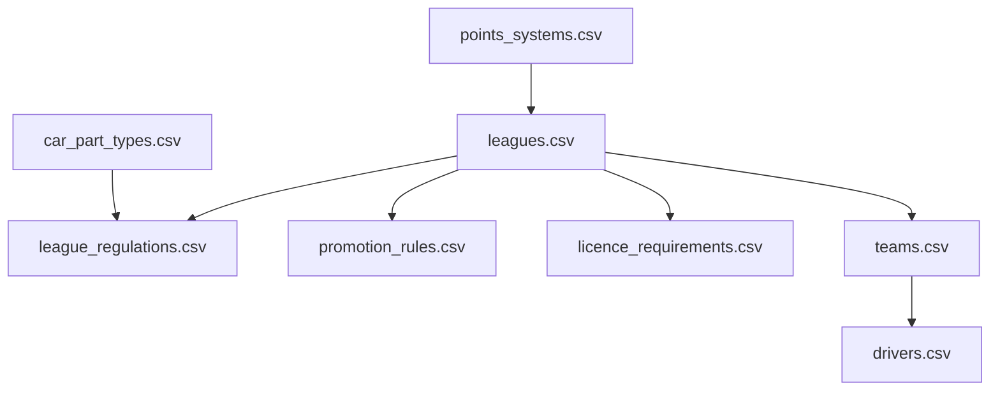

# APEX – Datenmodell M0

**Schema-Vorgabe für die CSV-Stammdaten und die daraus erzeugte `world_data.db`.**

> Bezugsdokument: [KONZEPT_MEHRLIGA_RENNMANAGER.md](KONZEPT_MEHRLIGA_RENNMANAGER.md)
> Status: Schema-Spezifikation. Noch keine Implementierung, noch keine Datenpflege.
> Umfang dieser Runde: die **8 Dateien**, die Meilenstein M0–M2 (Welt, Saison, Auf-/Abstieg) tragen.

---

## Inhalt

1. [Geltungsbereich](#1-geltungsbereich)
2. [Konventionen](#2-konventionen)
3. [ID-Vergabe](#3-id-vergabe)
4. [Dateiübersicht & Ladereihenfolge](#4-dateiübersicht--ladereihenfolge)
5. [`leagues.csv`](#5-leaguescsv)
6. [`league_regulations.csv`](#6-league_regulationscsv)
7. [`promotion_rules.csv`](#7-promotion_rulescsv)
8. [`points_systems.csv`](#8-points_systemscsv)
9. [`licence_requirements.csv`](#9-licence_requirementscsv)
10. [`car_part_types.csv`](#10-car_part_typescsv)
11. [`teams.csv`](#11-teamscsv)
12. [`drivers.csv`](#12-driverscsv)
13. [SQLite-Schema](#13-sqlite-schema)
14. [Bootstrapper & Validierung](#14-bootstrapper--validierung)
15. [Autorenleitfaden für die handgepflegten Bestände](#15-autorenleitfaden-für-die-handgepflegten-bestände)
16. [Offene Wert-Entscheidungen](#16-offene-wert-entscheidungen)

---

## 1. Geltungsbereich

### 1.1 Was in dieser Runde spezifiziert wird

Acht Dateien, ausgewählt nach einem Kriterium: Genau sie werden gebraucht, damit die zentrale Behauptung des Spiels – *zehn Ligen, jede Saison Auf- und Abstieg* – vollständig durchläuft. Alles, was erst die Rennsimulation (M4) oder den Markt (M5) betrifft, bleibt bewusst außen vor.

| Datei | Trägt |
| :--- | :--- |
| `leagues.csv` | Identität und Zuschnitt der zehn Ligen |
| `league_regulations.csv` | Reglement je Liga und Saison (Deckel, Gewicht, Kosten) |
| `promotion_rules.csv` | Auf-/Abstieg, Barrage |
| `points_systems.csv` | Punktevergabe |
| `licence_requirements.csv` | Lizenzhürden beim Aufstieg |
| `car_part_types.csv` | Die 9 Bauteilgruppen als Typdefinition |
| `teams.csv` | 167 Teams, handgepflegt |
| `drivers.csv` | ~450 Fahrer, handgepflegt |

### 1.2 Was ausdrücklich noch fehlt

`tracks.csv`, `track_sector_weights.csv`, `calendar.csv`, `race_weekend_formats.csv`, `tyre_compounds.csv`, `weather_profiles.csv`, `sponsors.csv`, `engine_suppliers.csv`, `staff.csv`, `staff_roles.csv`, `team_facilities.csv`, `team_finances.csv`, `driver_names.csv`, `newgen_presets.csv`, `game_state.csv`.

Drei Spalten der acht Dateien zeigen bereits auf diese noch nicht existierenden Dateien: `weekend_format_id`, `barrage_track_id`, `engine_supplier_id`. Sie werden als **Vorwärtsreferenz** geführt – der Bootstrapper prüft sie erst, wenn die Zieldatei vorliegt (siehe 14.3).

### 1.3 Grundprinzip

Wie bei Velo: **CSV ist die Wahrheit.** Der Bootstrapper liest die CSVs, validiert sie, erzeugt daraus `world_data.db`; beim Karrierestart wird diese Datei in ein Savegame kopiert und ab dann nur noch dort geschrieben. Die CSVs werden zur Laufzeit nie verändert.

Daraus folgt eine Regel, die den ganzen Aufbau prägt: **CSVs enthalten Startzustand, niemals Verlauf.** `teams.csv` sagt, in welcher Liga ein Team *beginnt* – nicht, in welcher es sich gerade befindet. Der Verlauf lebt ausschließlich in Savegame-Tabellen wie `team_seasons`.

---

## 2. Konventionen

| Thema | Festlegung |
| :--- | :--- |
| Kodierung | UTF-8 ohne BOM, Zeilenende LF |
| Trennzeichen | Komma. Werte mit Komma oder Anführungszeichen werden in `"` gesetzt, inneres `"` wird verdoppelt |
| Dezimaltrennzeichen | Punkt (`0.07`), niemals Komma |
| Kopfzeile | Pflicht, erste Nicht-Kommentarzeile, exakt die spezifizierten Spaltennamen |
| Kommentare | Zeilen, die mit `#` beginnen, werden ignoriert – für Abschnittsüberschriften in langen handgepflegten Dateien |
| Wahrheitswerte | `0` / `1`, nie `true`/`ja` |
| Leerwerte | Leeres Feld = NULL. Nie `NULL`, `-`, `n/a` oder `0` als Ersatz |
| Listen in einer Spalte | Pipe-getrennt ohne Leerzeichen: `technical_director\|chief_designer` |
| Geldbeträge | Ganzzahlig in Euro, ohne Tausendertrennzeichen und ohne Währungszeichen: `145000000` |
| Prozentwerte | Als Dezimalbruch `0.25`, nicht als `25` – außer die Spalte trägt das Suffix `_pct` |
| Bezeichner | Spaltennamen, Enum-Werte und Schlüssel englisch in `snake_case` |
| Freitext | Deutsch (`name`, `flavour`) – es ist Spielinhalt, kein Bezeichner |
| Sortierung | Aufsteigend nach Primärschlüssel. **Verbindlich**, damit Diffs in den handgepflegten 617 Zeilen lesbar bleiben |
| Farben | Hex mit Raute, sechsstellig, Großbuchstaben: `#E10600` |
| Länder | ISO-3166-1 alpha-3 (`DEU`, `GBR`, `JPN`) |

---

## 3. ID-Vergabe

IDs sind **stabil und werden nie neu vergeben**. Wird ein Team gestrichen, bleibt seine ID unbenutzt.

| Entität | Bereich | Bildungsregel |
| :--- | :--- | :--- |
| Team | `1001`–`10999` | `start_tier × 1000 + laufende Nummer`. Tier 1: `1001`–`1011`, Tier 10: `10001`–`10022` |
| Fahrer | `100001`–`100999` | Fortlaufend, ohne Bedeutung |
| Punktesystem | `1`–`99` | `1` = Tier 1–3, `2` = Tier 4–10 |
| Bauteilgruppe | Textschlüssel | `chassis`, `front_wing`, … – keine numerische ID |
| Hersteller, Strecke, Sponsor | ab `200001` bzw. `300001` | Reserviert, Vergabe in der nächsten Runde |

Die Team-ID kodiert das **Start**-Tier als Lesehilfe für die Handpflege – sie wird nach dem ersten Saisonwechsel semantisch falsch und darf deshalb nirgends im Code als Tier-Quelle benutzt werden. Der Validator warnt, wenn Code die ID zerlegt.

---

## 4. Dateiübersicht & Ladereihenfolge

Die Ladereihenfolge ergibt sich aus den Fremdschlüsseln:



| # | Datei | Zeilen | Schlüssel | Pflege |
| ---: | :--- | ---: | :--- | :--- |
| 1 | `points_systems.csv` | 20 | `points_system_id, position` | fest |
| 2 | `car_part_types.csv` | 9 | `part_key` | fest |
| 3 | `leagues.csv` | 10 | `tier` | fest |
| 4 | `league_regulations.csv` | 10 je Saison | `tier, season` | fest, wächst mit Reglementzyklen |
| 5 | `promotion_rules.csv` | 10 | `tier, valid_from_season` | fest |
| 6 | `licence_requirements.csv` | 10 | `tier` | fest |
| 7 | `teams.csv` | 167 | `team_id` | **handgepflegt** |
| 8 | `drivers.csv` | ~450 | `driver_id` | **handgepflegt** |

---

## 5. `leagues.csv`

Die zeitlose Identität einer Liga: was sie ist und wie groß sie ist. Alles, was sich pro Saison ändern kann – Deckel, Gewicht, Kosten – steht in `league_regulations.csv`.

| Spalte | Typ | Bereich | Pflicht | Bedeutung |
| :--- | :--- | :--- | :---: | :--- |
| `tier` | INT | 1–10 | ✓ | 1 = höchste Liga. Primärschlüssel |
| `name` | TEXT | | ✓ | Vollständiger Ligenname, weltweit eindeutig |
| `short_name` | TEXT | 2–4 Zeichen | ✓ | Kürzel für Tabellen und Timing-Screens, eindeutig |
| `team_count` | INT | 8–30 | ✓ | Sollstärke. Der Validator prüft `teams.csv` dagegen |
| `cars_per_team` | INT | 1–3 | ✓ | Durchgehend `2` (Entscheidung, Konzept 3.1) |
| `race_count` | INT | 4–24 | ✓ | Reguläre Rennwochenenden, ohne Barrage |
| `conference_count` | INT | 1–4 | ✓ | Durchgehend `1`. Feld bleibt für spätere Regionalisierung erhalten |
| `points_system_id` | INT | FK | ✓ | → `points_systems.csv` |
| `tyre_sets_per_weekend` | INT | 2–16 | ✓ | Kontingent pro Auto und Wochenende |
| `dnf_base_rate` | REAL | 0.0–0.5 | ✓ | Basis-Ausfallrate pro Auto und Rennen, Richtwert für die Light-Sim |
| `weekend_format_id` | INT | FK | | Vorwärtsreferenz → `race_weekend_formats.csv` |
| `flavour` | TEXT | | ✓ | Ein bis zwei Sätze Charakterisierung für die Ligenansicht |

### Vollständiger Inhalt

```csv
tier,name,short_name,team_count,cars_per_team,race_count,conference_count,points_system_id,tyre_sets_per_weekend,dnf_base_rate,weekend_format_id,flavour
1,APEX World Championship,AWC,11,2,22,1,1,13,0.07,1,"Die Weltmeisterschaft. Werksprogramme, Kostendeckel, aerodynamische Testrestriktion - hier entscheidet Effizienz, nicht Budgethoehe."
2,World Series,WS,12,2,18,1,1,11,0.09,2,"Das Wartezimmer der Weltmeisterschaft: Absteiger mit Fallschirmgeld treffen auf Aufsteiger, die alles auf eine Karte setzen."
3,Intercontinental Cup,ICC,14,2,16,1,1,10,0.11,2,"Erste Liga mit weltweitem Kalender. Ab hier werden Logistikkosten zu einem echten Posten in der Bilanz."
4,Continental Prime,CP,16,2,14,1,2,9,0.13,3,"Die Schwelle zum Profibetrieb: erstmals Superlizenz-Anforderungen an die Fahrer und verpflichtende Infrastruktur."
5,Continental Series,CS,16,2,12,1,2,8,0.15,3,"Halbprofessionell. Pay Driver finanzieren hier ganze Saisons - und blockieren Cockpits fuer schnellere Talente."
6,Challenger Series,CHS,18,2,12,1,2,7,0.17,3,"Sprungbrett-Liga: wer hier zwei Saisons dominiert, wird von oben abgeworben - Fahrer wie Ingenieure."
7,National Elite,NE,18,2,10,1,2,6,0.19,4,"Nationale Spitzenserie mit Doppelrennen. Startaufstellung des zweiten Laufs: Top 6 des ersten Laufs umgedreht."
8,National Series,NS,20,2,10,1,2,6,0.20,4,"Werkstattbetrieb statt Fabrik: Zuverlaessigkeit schlaegt Leistung, weil Ersatzteile schlicht fehlen."
9,Regional Cup,RC,20,2,8,1,2,5,0.21,5,"Zwei Autos, Mechaniker im Nebenberuf. Wer hier gut scoutet, verkauft in drei Jahren einen Weltmeister."
10,Rookie Cup,RK,22,2,8,1,2,4,0.22,5,"Der Einstieg. Kein Fallschirm, kein Fangnetz: Die letzten zwei Teams verlieren ihre Lizenz an Neugruendungen."
```

> Die Umlaute sind hier nur in der Codeblock-Darstellung umschrieben; in der echten CSV stehen sie als UTF-8-Zeichen (`Budgethöhe`, `Zuverlässigkeit`, `Neugründungen`).

**Validierung:** `team_count` summiert über alle Tiers = 167 · `cars_per_team` × `team_count` summiert = 334 Stammcockpits · `tier` lückenlos 1–10 · `dnf_base_rate` steigt monoton mit dem Tier.

---

## 6. `league_regulations.csv`

Das Reglement einer Liga in einer bestimmten Saison. Eine Zeile je `(tier, season)`. Reglementwechsel (Konzept 5.3) erzeugen neue Zeilen mit derselben `tier`, höherer `season`.

| Spalte | Typ | Bereich | Pflicht | Bedeutung |
| :--- | :--- | :--- | :---: | :--- |
| `tier` | INT | 1–10 | ✓ | FK → `leagues.csv` |
| `season` | INT | ≥ 1 | ✓ | Ab dieser Saison gültig |
| `regulation_label` | TEXT | | ✓ | Sprechender Name für Meldungen: `Grundformel`, `Ground Effect` |
| `cap_chassis` | INT | 0–1000 | ✓ | Reglement-Deckel auf der weltweiten 0–1000-Skala |
| `cap_front_wing` | INT | 0–1000 | ✓ | |
| `cap_rear_wing` | INT | 0–1000 | ✓ | |
| `cap_floor` | INT | 0–1000 | ✓ | |
| `cap_powertrain` | INT | 0–1000 | ✓ | Entspricht der Spalte „Motorleistung" in Konzept 3.1 |
| `cap_ers` | INT | 0–1000 | ✓ | |
| `cap_gearbox` | INT | 0–1000 | ✓ | |
| `cap_suspension` | INT | 0–1000 | ✓ | |
| `cap_brakes` | INT | 0–1000 | ✓ | |
| `min_weight_kg` | INT | 700–1100 | ✓ | Mindestgewicht inklusive Fahrer |
| `cost_cap` | INT | Euro | ✓ | Kostendeckel der Saison |
| `test_days` | INT | 0–30 | ✓ | Erlaubte Testtage (**offen**, siehe 16.2) |
| `tyre_supplier` | TEXT | | | Vorwärtsreferenz, in M0 leer |
| `atr_base` | REAL | 1.0–2.0 | ✓ | ATR-Formel, Konzept 5.4: `faktor = atr_base - atr_step × (platz - 1)` |
| `atr_step` | REAL | 0.0–0.2 | ✓ | `0` schaltet die ATR für diese Liga ab |

### Beispielzeilen (Saison 1)

Die neun Deckel tragen in Saison 1 **denselben Wert je Liga** – die Stufung der Ligen untereinander steht, die Differenzierung *zwischen* den Bauteilgruppen ist noch offen (siehe 16.1).

```csv
tier,season,regulation_label,cap_chassis,cap_front_wing,cap_rear_wing,cap_floor,cap_powertrain,cap_ers,cap_gearbox,cap_suspension,cap_brakes,min_weight_kg,cost_cap,test_days,tyre_supplier,atr_base,atr_step
1,1,Grundformel,1000,1000,1000,1000,1000,1000,1000,1000,1000,798,145000000,,,1.35,0.05
2,1,Grundformel,870,870,870,870,870,870,870,870,870,810,70000000,,,1.35,0.05
3,1,Grundformel,760,760,760,760,760,760,760,760,760,825,34000000,,,1.35,0.04
4,1,Grundformel,660,660,660,660,660,660,660,660,660,840,17000000,,,1.30,0.03
5,1,Grundformel,570,570,570,570,570,570,570,570,570,860,9000000,,,1.30,0.03
6,1,Grundformel,490,490,490,490,490,490,490,490,490,880,4500000,,,1.20,0.02
7,1,Grundformel,420,420,420,420,420,420,420,420,420,900,2200000,,,1.00,0.00
8,1,Grundformel,360,360,360,360,360,360,360,360,360,920,1100000,,,1.00,0.00
9,1,Grundformel,300,300,300,300,300,300,300,300,300,940,550000,,,1.00,0.00
10,1,Grundformel,250,250,250,250,250,250,250,250,250,960,260000,,,1.00,0.00
```

> `test_days` ist in diesen Zeilen absichtlich leer gelassen und wird nach der Entscheidung aus 16.2 befüllt. `atr_base`/`atr_step` unterhalb Tier 3 sind ebenfalls ein Vorschlag, kein beschlossener Wert.

**Validierung:** jeder Deckel ≤ 1000 · Deckel eines Tiers ≤ Deckel des nächsthöheren Tiers (kein Ausreißer nach oben) · `min_weight_kg` steigt monoton mit dem Tier · `cost_cap` fällt monoton mit dem Tier · für jedes `tier` existiert eine Zeile mit `season = 1`.

---

## 7. `promotion_rules.csv`

Wie viele Teams sich pro Saison an einer Ligengrenze bewegen. Eine Zeile je Tier; `valid_from_season` erlaubt spätere Regeländerungen ohne Migration.

| Spalte | Typ | Bereich | Pflicht | Bedeutung |
| :--- | :--- | :--- | :---: | :--- |
| `tier` | INT | 1–10 | ✓ | FK → `leagues.csv` |
| `valid_from_season` | INT | ≥ 1 | ✓ | Teil des Primärschlüssels |
| `direct_up` | INT | 0–4 | ✓ | Direkte Aufsteiger. Tier 1: `0` |
| `direct_down` | INT | 0–4 | ✓ | Direkte Absteiger |
| `promotion_barrage_slots` | INT | 0–2 | ✓ | Plätze für die Barrage nach oben. Tier 1: `0` |
| `relegation_barrage_slots` | INT | 0–2 | ✓ | Plätze für die Barrage nach unten. Tier 10: `0` |
| `relegation_mode` | TEXT | Enum | ✓ | `tier` = Abstieg in die nächste Liga · `licence_loss` = Lizenzverlust, Ersatz durch Newgen-Team |
| `barrage_track_id` | INT | FK | | Neutrale Strecke. Vorwärtsreferenz, in M0 leer = Zufallsauswahl |
| `barrage_leg_count` | INT | 1–3 | ✓ | Läufe mit gemeinsamer Wertung. Konzept 4.2: `2` |
| `barrage_regulation_tier` | INT | 1–10 | ✓ | Unter welchem Reglement die Barrage gefahren wird – stets die **untere** Liga |
| `tiebreak_rule` | TEXT | Enum | ✓ | `quali_average` · `best_finish` · `head_to_head` |
| `licence_fallback` | TEXT | Enum | ✓ | Was bei gescheiterter Lizenz passiert: `next_eligible` = nächstplatziertes lizenzfähiges Team rückt nach · `slot_stays_empty` |

### Vollständiger Inhalt

```csv
tier,valid_from_season,direct_up,direct_down,promotion_barrage_slots,relegation_barrage_slots,relegation_mode,barrage_track_id,barrage_leg_count,barrage_regulation_tier,tiebreak_rule,licence_fallback
1,1,0,2,0,1,tier,,2,2,quali_average,next_eligible
2,1,2,2,1,1,tier,,2,3,quali_average,next_eligible
3,1,2,2,1,1,tier,,2,4,quali_average,next_eligible
4,1,2,2,1,1,tier,,2,5,quali_average,next_eligible
5,1,2,2,1,1,tier,,2,6,quali_average,next_eligible
6,1,2,2,1,1,tier,,2,7,quali_average,next_eligible
7,1,2,2,1,1,tier,,2,8,quali_average,next_eligible
8,1,2,2,1,1,tier,,2,9,quali_average,next_eligible
9,1,2,2,1,1,tier,,2,10,quali_average,next_eligible
10,1,2,2,1,0,licence_loss,,2,10,quali_average,next_eligible
```

**Validierung – die wichtigste Prüfung des ganzen Schemas:** Die Bewegungen an jeder Ligengrenze müssen sich decken. Für jedes Tierpaar `(t, t+1)` gilt:

```
direct_down[t]              == direct_up[t+1]
relegation_barrage_slots[t] == promotion_barrage_slots[t+1]
barrage_regulation_tier[t]  == t + 1
```

Ist das verletzt, verändert sich die Ligagröße über die Saisons hinweg schleichend – ein Fehler, der erst nach zehn simulierten Saisons auffällt. Deshalb ist er als **harter Abbruch** ausgelegt, nicht als Warnung.

---

## 8. `points_systems.csv`

Langformat: eine Zeile je Punktesystem und Position. Die systemweiten Werte (`system_name`, Boni) wiederholen sich in jeder Zeile eines Systems – bewusst, um bei zwei Systemen keine zweite Datei zu erzwingen; der Validator erzwingt ihre Gleichheit.

| Spalte | Typ | Bereich | Pflicht | Bedeutung |
| :--- | :--- | :--- | :---: | :--- |
| `points_system_id` | INT | ≥ 1 | ✓ | Teil des Primärschlüssels |
| `system_name` | TEXT | | ✓ | Innerhalb eines Systems identisch |
| `position` | INT | ≥ 1 | ✓ | Zielposition. Nicht gelistete Positionen = 0 Punkte |
| `points` | INT | ≥ 0 | ✓ | |
| `bonus_pole` | INT | ≥ 0 | ✓ | Zusatzpunkt für die Pole. Innerhalb eines Systems identisch |
| `bonus_fastest_lap` | INT | ≥ 0 | ✓ | Zusatzpunkt für die schnellste Rennrunde |
| `fastest_lap_max_position` | INT | ≥ 1 | ✓ | Nur bis zu dieser Position wird der Bonus gewährt |
| `min_distance_pct` | REAL | 0.0–1.0 | ✓ | Mindestanteil der Renndistanz für eine Wertung |

### Vollständiger Inhalt

Die Punktwerte selbst sind entschieden (Tier 1–3 volle Skala, darunter flacher). Die drei Bonus-Spalten stehen auf `0` und sind offen (siehe 16.3).

```csv
points_system_id,system_name,position,points,bonus_pole,bonus_fastest_lap,fastest_lap_max_position,min_distance_pct
1,Volle Skala,1,25,0,0,10,0.75
1,Volle Skala,2,18,0,0,10,0.75
1,Volle Skala,3,15,0,0,10,0.75
1,Volle Skala,4,12,0,0,10,0.75
1,Volle Skala,5,10,0,0,10,0.75
1,Volle Skala,6,8,0,0,10,0.75
1,Volle Skala,7,6,0,0,10,0.75
1,Volle Skala,8,4,0,0,10,0.75
1,Volle Skala,9,2,0,0,10,0.75
1,Volle Skala,10,1,0,0,10,0.75
2,Flache Skala,1,20,0,0,10,0.75
2,Flache Skala,2,16,0,0,10,0.75
2,Flache Skala,3,13,0,0,10,0.75
2,Flache Skala,4,11,0,0,10,0.75
2,Flache Skala,5,9,0,0,10,0.75
2,Flache Skala,6,7,0,0,10,0.75
2,Flache Skala,7,5,0,0,10,0.75
2,Flache Skala,8,3,0,0,10,0.75
2,Flache Skala,9,2,0,0,10,0.75
2,Flache Skala,10,1,0,0,10,0.75
```

**Validierung:** `position` lückenlos ab 1 · `points` streng monoton fallend · systemweite Spalten innerhalb eines Systems identisch · jedes in `leagues.csv` referenzierte System existiert.

---

## 9. `licence_requirements.csv`

Die administrative Hürde vor dem sportlich erkämpften Aufstieg (Konzept 5.1). Geprüft wird gegen die Anforderungen der **Zielliga**.

| Spalte | Typ | Bereich | Pflicht | Bedeutung |
| :--- | :--- | :--- | :---: | :--- |
| `tier` | INT | 1–10 | ✓ | Primärschlüssel. Anforderungen, um in dieser Liga anzutreten |
| `min_liquidity_pct` | REAL | 0.0–1.0 | ✓ | Freies Kapital als Anteil des Kostendeckels dieser Liga. Konzept 5.1: `0.25` |
| `min_windtunnel_level` | INT | 0–5 | ✓ | |
| `min_dyno_level` | INT | 0–5 | ✓ | Motorenprüfstand |
| `min_simulator_level` | INT | 0–5 | ✓ | |
| `min_factory_level` | INT | 0–5 | ✓ | Fertigung / Ersatzteil-Durchsatz |
| `min_staff_count` | INT | ≥ 0 | ✓ | Mitarbeiterzahl |
| `required_roles` | TEXT | Pipe-Liste | | Zwingend besetzte Rollen, z. B. `technical_director\|chief_designer` |
| `needs_engine_contract` | INT | 0/1 | ✓ | Gültiger Liefervertrag für diese Liga nötig |
| `min_licence_points` | INT | | ✓ | Lizenzpunktekonto. Konzept 5.2: `0` |
| `min_superlicence_points` | INT | ≥ 0 | ✓ | Mindestpunkte je Fahrer. Konzept 7.3: relevant ab Tier 4 aufwärts |
| `grace_period_seasons` | INT | 0–3 | ✓ | Frist zur Nachrüstung nach dem Aufstieg. Konzept 4.3: `1` |

### Beispielzeile

Vollständig belegt ist bisher nur Tier 2 – das ist die im Konzept 5.1 ausformulierte Beispielprüfung „Tier 3 → Tier 2". Die Leiter über alle zehn Stufen ist eine Balancing-Entscheidung und offen (siehe 16.4).

```csv
tier,min_liquidity_pct,min_windtunnel_level,min_dyno_level,min_simulator_level,min_factory_level,min_staff_count,required_roles,needs_engine_contract,min_licence_points,min_superlicence_points,grace_period_seasons
2,0.25,2,2,1,2,30,technical_director|chief_designer,1,0,25,1
```

**Validierung:** alle Mindestanforderungen fallen monoton mit steigendem Tier (Tier 1 am strengsten) · Tier 10 hat keine Infrastruktur-Mindestanforderung · `required_roles` enthält nur Rollen aus `staff_roles.csv`, sobald diese existiert.

---

## 10. `car_part_types.csv`

Die neun Bauteilgruppen als Typdefinition (Konzept 6.1). Kein Teambestand – der entsteht erst zur Laufzeit in `car_parts`.

| Spalte | Typ | Bereich | Pflicht | Bedeutung |
| :--- | :--- | :--- | :---: | :--- |
| `part_key` | TEXT | Enum | ✓ | Primärschlüssel, auch Suffix der `cap_*`-Spalten |
| `name` | TEXT | | ✓ | Anzeigename |
| `sort_order` | INT | 1–9 | ✓ | Reihenfolge in der Fabrik-Ansicht |
| `primary_effect` | TEXT | | ✓ | Wirkt primär auf – Anzeigetext |
| `conflict` | TEXT | | ✓ | Zielkonflikt – Anzeigetext |
| `dev_constant_k` | REAL | > 0 | ✓ | `k_gruppe` der Entwicklungsformel (Konzept 6.3) |
| `base_failure_rate` | REAL | 0.0–1.0 | ✓ | Anteil dieser Gruppe an der Gesamt-Ausfallrate |
| `damage_prone` | REAL | 0.0–1.0 | ✓ | Anfälligkeit für Kollisionsschäden – Frontflügel hoch, Chassis niedrig |
| `weight_reference_kg` | REAL | > 0 | ✓ | Referenzgewicht, gegen das `weight_delta` gerechnet wird |
| `carry_over_default` | REAL | 0.0–1.0 | ✓ | Werterhalt bei Reglementwechsel (Konzept 5.3: Aero ~0.3, Bremsen ~0.9) |
| `supplied_by_engine` | INT | 0/1 | ✓ | `1` für `powertrain` und `ers` – kommt vom Hersteller, nicht aus der eigenen Entwicklung (Konzept 6.6) |

### Inhalt – qualitative Spalten belegt, numerische offen

```csv
part_key,name,sort_order,primary_effect,conflict,dev_constant_k,base_failure_rate,damage_prone,weight_reference_kg,carry_over_default,supplied_by_engine
chassis,Monocoque / Chassis,1,"Gesamtsteifigkeit, Gewicht, Crash-Sicherheit",Steifigkeit vs. Gewicht,,,,,,0
front_wing,Frontfluegel & Nase,2,"Frontgrip, Balance",Abtrieb vs. Empfindlichkeit,,,,,,0
rear_wing,Heckfluegel,3,Topspeed vs. Kurvenabtrieb,direkt im Setup einstellbar,,,,,,0
floor,Unterboden / Diffusor,4,Abtrieb ohne Luftwiderstand,Performance vs. Fahrbarkeit,,,,,,0
powertrain,Antriebseinheit,5,"Leistung, Verbrauch, Standfestigkeit, Hitze",Leistung vs. Zuverlaessigkeit,,,,,,1
ers,Energierueckgewinnung,6,"Beschleunigung, Ueberholhilfe",Effizienz vs. Gewicht,,,,,,1
gearbox,Getriebe,7,"Beschleunigung, Schaltverluste",Uebersetzung vs. Topspeed,,,,,,0
suspension,Fahrwerk & Aufhaengung,8,"Mechanischer Grip, Reifenverschleiss",Haerte vs. Reifenschonung,,,,,,0
brakes,Bremsen & Kuehlung,9,"Bremspunkte, Hitzemanagement",Kuehlung vs. Luftwiderstand,,,,,,0
```

**Validierung:** genau 9 Zeilen · `part_key` deckungsgleich mit den `cap_*`-Spalten in `league_regulations.csv` · Summe `base_failure_rate` = 1.0 · genau zwei Zeilen mit `supplied_by_engine = 1`.

---

## 11. `teams.csv`

**Handgepflegt, 167 Zeilen.** Die Entscheidung gegen prozedurale Erzeugung heißt: Jedes Team hat eine bewusst gesetzte Identität – Name, Farben, Heimat, Ruf, Spielweise – bis hinunter in den Rookie Cup.

| Spalte | Typ | Bereich | Pflicht | Bedeutung |
| :--- | :--- | :--- | :---: | :--- |
| `team_id` | INT | 1001–10999 | ✓ | Primärschlüssel, siehe 3 |
| `name` | TEXT | | ✓ | **Weltweit eindeutig** – nicht nur je Liga |
| `short_name` | TEXT | ≤ 16 Zeichen | ✓ | Für Tabellen |
| `code` | TEXT | 3 Großbuchstaben | ✓ | Timing-Kürzel, weltweit eindeutig: `ABT`, `NRD` |
| `country` | TEXT | ISO-3 | ✓ | Heimatland – bestimmt das Heimrennen und Nationalitätsboni |
| `city` | TEXT | | ✓ | Standort der Fabrik |
| `founded_year` | INT | 1900–Start | ✓ | Speist Tradition und Prestige-Erzählung |
| `start_tier` | INT | 1–10 | ✓ | Liga zum Karrierestart. **Startzustand, kein Verlauf** |
| `colour_primary` | TEXT | Hex | ✓ | |
| `colour_secondary` | TEXT | Hex | ✓ | Muss sich von `colour_primary` unterscheiden |
| `ai_archetype` | TEXT | Enum | ✓ | `works_team` · `climber` · `academy` · `traditional` · `privateer` · `tech_startup` (Konzept 14.1) |
| `prestige` | INT | 0–100 | ✓ | Wirkt auf Sponsorenwert, Fahrer- und Personalgewinnung |
| `start_capital` | INT | Euro | ✓ | Liquidität zum Karrierestart |
| `engine_supplier_id` | INT | FK | | Vorwärtsreferenz → `engine_suppliers.csv` |
| `is_works_team` | INT | 0/1 | ✓ | Werksteam seines Herstellers (Konzept 6.6) |
| `history_titles` | INT | ≥ 0 | ✓ | Titel vor Spielbeginn – speist Hall of Fame und Prestige |
| `history_best_tier` | INT | 1–10 | ✓ | Höchste je erreichte Liga. Erzeugt „gefallene Riesen" in unteren Ligen |
| `flavour` | TEXT | | | Ein Satz Teamcharakter |

### Beispielzeilen

```csv
team_id,name,short_name,code,country,city,founded_year,start_tier,colour_primary,colour_secondary,ai_archetype,prestige,start_capital,engine_supplier_id,is_works_team,history_titles,history_best_tier,flavour
1001,Scuderia Aurelia,Aurelia,AUR,ITA,Maranello,1929,1,#B30000,#F2C200,works_team,96,42000000,,1,14,1,"Der Maßstab. Vierzehn Titel, und jede Saison ohne einen davon gilt als Krise."
1002,Northgate Racing,Northgate,NRD,GBR,Brackley,1968,1,#0B3D2E,#C9F224,works_team,88,31000000,,1,6,1,"Ingenieursgetrieben, unaufgeregt, seit dreißig Jahren nie schlechter als Rang sechs."
6042,Kessler Motorsport,Kessler,KSL,DEU,Ingolstadt,1994,6,#1A1A1A,#E8541F,traditional,34,780000,,0,0,3,"Stand einmal in Tier 3. Die Fabrik von damals kostet noch heute mehr, als die Liga einbringt."
10015,Silvertown Junior Team,Silvertown,SVT,GBR,Silverstone,2019,10,#005BBB,#FFFFFF,academy,9,95000,,0,0,10,"Zwei Transporter, ein Zelt, sechs Mechaniker im Nebenberuf - und die beste Talentquote der Liga."
```

**Validierung:** genau 167 Zeilen · Zeilenzahl je `start_tier` = `team_count` aus `leagues.csv` · `name`, `short_name` und `code` global eindeutig · `history_best_tier` ≤ `start_tier` ist **nicht** gefordert (gefallene Riesen sind erwünscht), aber der Validator meldet sie als Hinweis · `founded_year` ≤ Startjahr · Farbpaar mit ausreichendem Kontrast (Warnung).

---

## 12. `drivers.csv`

**Handgepflegt, ~450 Zeilen.** 334 Stammcockpits plus Test-, Nachwuchs- und vertragslose Fahrer.

### 12.1 Stammdaten

| Spalte | Typ | Bereich | Pflicht | Bedeutung |
| :--- | :--- | :--- | :---: | :--- |
| `driver_id` | INT | 100001+ | ✓ | Primärschlüssel |
| `first_name` | TEXT | | ✓ | |
| `last_name` | TEXT | | ✓ | |
| `country` | TEXT | ISO-3 | ✓ | |
| `birth_year` | INT | | ✓ | **Nicht `age`** – das Alter ergibt sich aus der laufenden Saison und altert dadurch automatisch mit |

### 12.2 Die 16 Attribute (je 0–100)

| Kategorie | Spalten |
| :--- | :--- |
| Speed | `pace`, `qualifying`, `braking`, `cornering` |
| Racecraft | `overtaking`, `defending`, `starts`, `racecraft_traffic` |
| Kopf | `consistency`, `pressure`, `aggression` |
| Technik | `feedback`, `tyre_management`, `fuel_saving` |
| Kondition | `fitness`, `wet_skill` |

`aggression` ist ausdrücklich **kein Gütewert**, sondern eine Charaktereigenschaft: hoch bedeutet mehr Zeitgewinn *und* mehr Fehler. Der Validator prüft deshalb nicht auf eine „gute" Ausprägung.

### 12.3 Entwicklung, Charakter, Vertrag

| Spalte | Typ | Bereich | Pflicht | Bedeutung |
| :--- | :--- | :--- | :---: | :--- |
| `potential` | INT | 0–100 | ✓ | Zielniveau der Kernwerte am Karrierehöhepunkt |
| `ego` | INT | 0–100 | ✓ | Ablehnung des Nr.-2-Status, Reaktion auf Stallorder |
| `adaptability` | INT | 0–100 | ✓ | Anpassung an neues Auto / neue Liga |
| `marketability` | INT | 0–100 | ✓ | Sponsorenwert |
| `morale` | INT | 0–100 | ✓ | Startwert |
| `superlicence_points` | INT | ≥ 0 | ✓ | Zugangsvoraussetzung für Tier 1–4 (Konzept 7.3) |
| `start_team_id` | INT | FK | | Leer = vertragsloser Free Agent |
| `start_role` | TEXT | Enum | ✓ | `race` · `reserve` · `junior` · `free_agent` |
| `start_seat` | INT | 1–2 | | Nur bei `start_role = race`: welches der beiden Cockpits |
| `contract_until_season` | INT | ≥ 1 | | Leer bei Free Agents |
| `salary` | INT | Euro/Saison | ✓ | `0` bei Free Agents |
| `pay_driver_budget` | INT | Euro/Saison | ✓ | Mitgift. `0` bei allen außer Pay Drivern |

### Beispielzeilen

Zur Lesbarkeit hier nur die Kopf- und Vertragsspalten sowie vier der 16 Attribute; die echte Datei führt alle Spalten in der oben festgelegten Reihenfolge.

```csv
driver_id,first_name,last_name,country,birth_year,pace,qualifying,consistency,tyre_management,...,potential,ego,start_team_id,start_role,start_seat,contract_until_season,salary,pay_driver_budget
100001,Matteo,Ferrante,ITA,1997,94,95,89,86,...,96,88,1001,race,1,3,18000000,0
100002,Lars,Bergstroem,SWE,2001,88,86,84,90,...,95,61,1001,race,2,2,4200000,0
100288,Yuki,Harada,JPN,2006,52,55,47,58,...,88,44,10015,race,1,1,0,140000
100401,Colin,Whitaker,GBR,1989,71,68,79,74,...,71,52,,free_agent,,,0,0
```

**Validierung:**

* Je Team mit `start_role = race` **genau `cars_per_team` Fahrer**, jeder `start_seat` je Team genau einmal – die Prüfung, die garantiert, dass keine Liga mit unbesetzten Startplätzen anfängt.
* Summe aller `race`-Fahrer = 334.
* `potential` ≥ höchster Attributwert (ein Fahrer kann sein Potenzial nicht bereits überschritten haben) – **Warnung**, kein Fehler, denn Spätentwickler mit erreichtem Potenzial sind legitim.
* `superlicence_points` erfüllt `min_superlicence_points` der Liga des `start_team_id`.
* Alter zum Startjahr zwischen 16 und 45.
* `pay_driver_budget > 0` nur bei `salary = 0` (ein Fahrer bringt Geld mit *oder* bekommt welches, nicht beides).

---

## 13. SQLite-Schema

Der Bootstrapper erzeugt aus den acht Dateien diese Tabellen. Sie sind **schreibgeschützt gedacht**: Nach dem Kopieren ins Savegame wird nur noch in die Verlaufstabellen (`team_seasons`, `car_parts`, …) geschrieben.

```sql
CREATE TABLE leagues (
  tier                  INTEGER PRIMARY KEY CHECK (tier BETWEEN 1 AND 10),
  name                  TEXT    NOT NULL UNIQUE,
  short_name            TEXT    NOT NULL UNIQUE,
  team_count            INTEGER NOT NULL,
  cars_per_team         INTEGER NOT NULL,
  race_count            INTEGER NOT NULL,
  conference_count      INTEGER NOT NULL DEFAULT 1,
  points_system_id      INTEGER NOT NULL REFERENCES points_systems_meta(points_system_id),
  tyre_sets_per_weekend INTEGER NOT NULL,
  dnf_base_rate         REAL    NOT NULL,
  weekend_format_id     INTEGER,
  flavour               TEXT    NOT NULL
);

CREATE TABLE league_regulations (
  tier             INTEGER NOT NULL REFERENCES leagues(tier),
  season           INTEGER NOT NULL,
  regulation_label TEXT    NOT NULL,
  cap_chassis      INTEGER NOT NULL CHECK (cap_chassis    BETWEEN 0 AND 1000),
  cap_front_wing   INTEGER NOT NULL CHECK (cap_front_wing BETWEEN 0 AND 1000),
  cap_rear_wing    INTEGER NOT NULL,
  cap_floor        INTEGER NOT NULL,
  cap_powertrain   INTEGER NOT NULL,
  cap_ers          INTEGER NOT NULL,
  cap_gearbox      INTEGER NOT NULL,
  cap_suspension   INTEGER NOT NULL,
  cap_brakes       INTEGER NOT NULL,
  min_weight_kg    INTEGER NOT NULL,
  cost_cap         INTEGER NOT NULL,
  test_days        INTEGER,
  tyre_supplier    TEXT,
  atr_base         REAL    NOT NULL,
  atr_step         REAL    NOT NULL,
  PRIMARY KEY (tier, season)
);

CREATE TABLE promotion_rules (
  tier                     INTEGER NOT NULL REFERENCES leagues(tier),
  valid_from_season        INTEGER NOT NULL,
  direct_up                INTEGER NOT NULL,
  direct_down              INTEGER NOT NULL,
  promotion_barrage_slots  INTEGER NOT NULL,
  relegation_barrage_slots INTEGER NOT NULL,
  relegation_mode          TEXT    NOT NULL CHECK (relegation_mode IN ('tier','licence_loss')),
  barrage_track_id         INTEGER,
  barrage_leg_count        INTEGER NOT NULL,
  barrage_regulation_tier  INTEGER NOT NULL,
  tiebreak_rule            TEXT    NOT NULL,
  licence_fallback         TEXT    NOT NULL,
  PRIMARY KEY (tier, valid_from_season)
);

-- Das CSV-Langformat wird beim Import in zwei Tabellen normalisiert.
CREATE TABLE points_systems_meta (
  points_system_id         INTEGER PRIMARY KEY,
  system_name              TEXT    NOT NULL,
  bonus_pole               INTEGER NOT NULL,
  bonus_fastest_lap        INTEGER NOT NULL,
  fastest_lap_max_position INTEGER NOT NULL,
  min_distance_pct         REAL    NOT NULL
);

CREATE TABLE points_systems (
  points_system_id INTEGER NOT NULL REFERENCES points_systems_meta(points_system_id),
  position         INTEGER NOT NULL,
  points           INTEGER NOT NULL,
  PRIMARY KEY (points_system_id, position)
);

CREATE TABLE licence_requirements (
  tier                    INTEGER PRIMARY KEY REFERENCES leagues(tier),
  min_liquidity_pct       REAL    NOT NULL,
  min_windtunnel_level    INTEGER NOT NULL,
  min_dyno_level          INTEGER NOT NULL,
  min_simulator_level     INTEGER NOT NULL,
  min_factory_level       INTEGER NOT NULL,
  min_staff_count         INTEGER NOT NULL,
  required_roles          TEXT,
  needs_engine_contract   INTEGER NOT NULL,
  min_licence_points      INTEGER NOT NULL,
  min_superlicence_points INTEGER NOT NULL,
  grace_period_seasons    INTEGER NOT NULL
);

CREATE TABLE car_part_types (
  part_key            TEXT    PRIMARY KEY,
  name                TEXT    NOT NULL,
  sort_order          INTEGER NOT NULL UNIQUE,
  primary_effect      TEXT    NOT NULL,
  conflict            TEXT    NOT NULL,
  dev_constant_k      REAL,
  base_failure_rate   REAL,
  damage_prone        REAL,
  weight_reference_kg REAL,
  carry_over_default  REAL,
  supplied_by_engine  INTEGER NOT NULL DEFAULT 0
);

CREATE TABLE teams (
  team_id           INTEGER PRIMARY KEY,
  name              TEXT    NOT NULL UNIQUE,
  short_name        TEXT    NOT NULL UNIQUE,
  code              TEXT    NOT NULL UNIQUE CHECK (length(code) = 3),
  country           TEXT    NOT NULL,
  city              TEXT    NOT NULL,
  founded_year      INTEGER NOT NULL,
  start_tier        INTEGER NOT NULL REFERENCES leagues(tier),
  colour_primary    TEXT    NOT NULL,
  colour_secondary  TEXT    NOT NULL,
  ai_archetype      TEXT    NOT NULL,
  prestige          INTEGER NOT NULL CHECK (prestige BETWEEN 0 AND 100),
  start_capital     INTEGER NOT NULL,
  engine_supplier_id INTEGER,
  is_works_team     INTEGER NOT NULL DEFAULT 0,
  history_titles    INTEGER NOT NULL DEFAULT 0,
  history_best_tier INTEGER NOT NULL,
  flavour           TEXT
);

CREATE TABLE drivers (
  driver_id            INTEGER PRIMARY KEY,
  first_name           TEXT    NOT NULL,
  last_name            TEXT    NOT NULL,
  country              TEXT    NOT NULL,
  birth_year           INTEGER NOT NULL,
  pace                 INTEGER NOT NULL CHECK (pace BETWEEN 0 AND 100),
  qualifying           INTEGER NOT NULL,
  braking              INTEGER NOT NULL,
  cornering            INTEGER NOT NULL,
  overtaking           INTEGER NOT NULL,
  defending            INTEGER NOT NULL,
  starts               INTEGER NOT NULL,
  racecraft_traffic    INTEGER NOT NULL,
  consistency          INTEGER NOT NULL,
  pressure             INTEGER NOT NULL,
  aggression           INTEGER NOT NULL,
  feedback             INTEGER NOT NULL,
  tyre_management      INTEGER NOT NULL,
  fuel_saving          INTEGER NOT NULL,
  fitness              INTEGER NOT NULL,
  wet_skill            INTEGER NOT NULL,
  potential            INTEGER NOT NULL,
  ego                  INTEGER NOT NULL,
  adaptability         INTEGER NOT NULL,
  marketability        INTEGER NOT NULL,
  morale               INTEGER NOT NULL,
  superlicence_points  INTEGER NOT NULL DEFAULT 0,
  start_team_id        INTEGER REFERENCES teams(team_id),
  start_role           TEXT    NOT NULL CHECK (start_role IN ('race','reserve','junior','free_agent')),
  start_seat           INTEGER,
  contract_until_season INTEGER,
  salary               INTEGER NOT NULL DEFAULT 0,
  pay_driver_budget    INTEGER NOT NULL DEFAULT 0
);

CREATE INDEX idx_teams_tier    ON teams(start_tier);
CREATE INDEX idx_drivers_team  ON drivers(start_team_id);
CREATE UNIQUE INDEX idx_driver_seat ON drivers(start_team_id, start_seat)
  WHERE start_seat IS NOT NULL;
```

Der letzte Index ist die datenbankseitige Absicherung der wichtigsten Fahrer-Regel: Ein Cockpit kann nicht doppelt besetzt sein.

---

## 14. Bootstrapper & Validierung

### 14.1 Ablauf


Alle Schritte laufen **vollständig durch**, bevor abgebrochen wird: Der Report listet sämtliche Befunde auf einmal. Bei 617 handgepflegten Zeilen ist ein Validator, der beim ersten Fehler stehen bleibt, praktisch unbenutzbar.

### 14.2 Zwei Schweregrade

| Grad | Verhalten | Beispiele |
| :--- | :--- | :--- |
| **Fehler** | Kein DB-Schreiben | Unbekannter Fremdschlüssel · Cockpit doppelt besetzt · asymmetrische Auf-/Abstiegsregel · Teamzahl weicht von `team_count` ab |
| **Warnung** | DB wird geschrieben, Report meldet | Attributwert über `potential` · geringer Farbkontrast · Liga ohne Pay Driver · Nationalität ohne einziges Team |

### 14.3 Vorwärtsreferenzen

`weekend_format_id`, `barrage_track_id`, `engine_supplier_id` und `tyre_supplier` zeigen auf Dateien, die es in M0 noch nicht gibt. Regel: **Ist die Zieldatei nicht vorhanden, wird die Spalte nicht geprüft.** Sobald sie existiert, wird die Prüfung automatisch scharf – ohne Schemaänderung. Ein leerer Wert bleibt in beiden Fällen zulässig und bedeutet „Standardverhalten" (Zufallsstrecke, Standardformat, kein Herstellervertrag).

### 14.4 Determinismus

Der Bootstrapper enthält **keinen Zufall**. Gleiche CSVs erzeugen eine byteweise identische `world_data.db`. Das macht den Datenbestand diffbar und Balancing-Änderungen nachvollziehbar – und ist der eigentliche Gewinn der Entscheidung für Handpflege gegenüber prozeduraler Erzeugung.

---

## 15. Autorenleitfaden für die handgepflegten Bestände

167 Teams und 450 Fahrer von Hand zu setzen, ist die größte Einzelaufgabe in M0. Ohne Leitplanken entsteht dabei ein Bestand, in dem Tier 7 stärker ist als Tier 5. Die folgenden Vorgaben sind **Vorschläge und noch nicht beschlossen** (siehe 16.5), aber sie zeigen, welche Art von Vorgabe die Handpflege braucht.

### 15.1 Fahrer-Kontingent

| Rolle | Anzahl | Verteilung |
| :--- | ---: | :--- |
| Stammfahrer (`race`) | 334 | 2 je Team, alle Ligen |
| Testfahrer (`reserve`) | 53 | 1 je Team in Tier 1–4 |
| Nachwuchs (`junior`) | 35 | Teams mit Archetyp `academy` in Tier 5–8 |
| Free Agents | 28 | Über alle Leistungsniveaus, als Puffer für Verletzungen |
| **Summe** | **450** | |

### 15.2 Leistungsbänder je Liga

Damit die Pyramide von oben nach unten trägt, braucht jede Liga ein Band für den Durchschnitt der vier Kernattribute (`pace`, `qualifying`, `braking`, `cornering`) – mit **bewusster Überlappung** zur Nachbarliga, denn ein Tier-3-Spitzenfahrer muss besser sein als ein Tier-2-Hinterbänkler. Sonst wäre der Fahrermarkt zwischen den Ligen tot.

### 15.3 Altersstruktur

Die Kurve aus Konzept 7.2 muss sich im Startbestand wiederfinden: Schwerpunkt bei 24–29, dazu genug 17–21-Jährige mit hohem `potential` in den unteren Ligen, damit das Scouting-Geschäftsmodell (Konzept 7.3) vom ersten Tag an funktioniert.

### 15.4 Verteilungen, die zusätzlich gesetzt werden müssen

Archetyp-Mischung je Liga · Pay-Driver-Anteil je Liga · Prestige-Bänder je Liga · Nationalitätenverteilung · Anteil „gefallener Riesen" (`history_best_tier` deutlich über `start_tier`).

### 15.5 Praktischer Hinweis zur Pflege

Die verbindliche Sortierung nach Primärschlüssel plus `#`-Kommentarzeilen als Ligentrenner machen `drivers.csv` überhaupt erst pflegbar. Empfohlene Reihenfolge in der Datei: erst alle Stammfahrer nach Team-ID, dann Reserve und Nachwuchs, dann Free Agents.

---

## 16. Offene Wert-Entscheidungen

Das Schema oben ist vollständig. Was fehlt, sind Zahlen – und zwar solche, die Balancing sind und deshalb nicht nebenbei gesetzt werden. Jede der folgenden Fragen blockiert das Befüllen der jeweiligen Datei, keine blockiert die Implementierung des Bootstrappers.

**16.1 Bauteil-Deckel je Gruppe.** Aktuell trägt jede der neun Gruppen denselben Ligadeckel. Alternative: gruppenspezifische Faktoren, sodass etwa Aerodynamik in Tier 1 weiter gedeckelt ist als Bremsen. Das ist der Hebel, mit dem sich Ligen technisch unterschiedlich *anfühlen*.

**16.2 Testtage je Liga** (`test_days`).

**16.3 Bonuspunkte** für Pole und schnellste Runde – und ob sie in allen Ligen gelten.

**16.4 Lizenzleiter über alle zehn Stufen.** Belegt ist nur Tier 2 aus dem Konzept.

**16.5 Verteilungsvorgaben aus Abschnitt 15** – Leistungsbänder, Prestige-Bänder, Pay-Driver-Anteile, Archetyp-Mischung.

**16.6 Numerische Spalten in `car_part_types.csv`** – `dev_constant_k`, `base_failure_rate`, `damage_prone`, `carry_over_default`.

**16.7 Ein 17. Fahrerattribut `car_control`?** Konzept 10 nennt es beim Streckenarchetyp „Bumpy Street" als dominanten Fahrerwert, Konzept 7.1 führt es nicht in der Attributliste. Entweder wird es aufgenommen, oder der Streckenarchetyp bildet auf `cornering`/`consistency` ab. Die Entscheidung wird erst mit `track_sector_weights.csv` bindend, ändert aber `drivers.csv` – und damit 450 handgepflegte Zeilen. Sie sollte deshalb **vor** dem Befüllen fallen.
