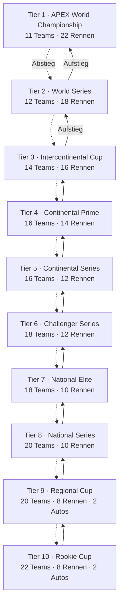
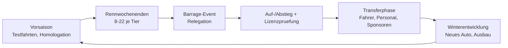

# APEX – Racing Director

**Konzept für einen Motorsport-Manager in der Tradition von *Grand Prix Manager* (MicroProse, 1995/1996) – deutlich tiefer, mit einer 10-stufigen Ligenpyramide und saisonalem Auf- und Abstieg.**

> Arbeitstitel: **APEX – Racing Director**
> Status: Konzeptdokument (Design-Vorgabe, noch keine Implementierung)
> Sprache/Stack-Vorbild: Velo – Radsport Director (siehe [../README.md](../README.md))

---

## Inhalt

1. [Vision & Design-Säulen](#1-vision--design-säulen)
2. [Was GPM konnte – und was APEX besser macht](#2-was-gpm-konnte--und-was-apex-besser-macht)
3. [Die Ligenpyramide (10 Stufen)](#3-die-ligenpyramide-10-stufen)
4. [Auf- und Abstieg](#4-auf--und-abstieg)
5. [Lizenz- & Reglementsystem](#5-lizenz--reglementsystem)
6. [Das Auto: Bauteile, Entwicklung, Zuverlässigkeit](#6-das-auto-bauteile-entwicklung-zuverlässigkeit)
7. [Fahrer: Attribute, Karriere, Markt](#7-fahrer-attribute-karriere-markt)
8. [Personal & Infrastruktur](#8-personal--infrastruktur)
9. [Wirtschaft: Budget, Sponsoren, Preisgelder](#9-wirtschaft-budget-sponsoren-preisgelder)
10. [Strecken & Streckenarchetypen](#10-strecken--streckenarchetypen)
11. [Das Rennwochenende](#11-das-rennwochenende)
12. [Die Rennsimulation im Detail](#12-die-rennsimulation-im-detail)
13. [Saisonzyklus & Spielschleife](#13-saisonzyklus--spielschleife)
14. [KI-Teams & Spielerkarriere](#14-ki-teams--spielerkarriere)
15. [Datenmodell (CSV + SQLite)](#15-datenmodell-csv--sqlite)
16. [Technische Architektur](#16-technische-architektur)
17. [UI-Screens](#17-ui-screens)
18. [Balancing-Leitplanken](#18-balancing-leitplanken)
19. [Roadmap & MVP-Schnitt](#19-roadmap--mvp-schnitt)
20. [Offene Fragen](#20-offene-fragen)

---

## 1. Vision & Design-Säulen

APEX ist ein rundenbasierter Motorsport-Manager. Der Spieler führt ein Rennteam – nicht nur sportlich, sondern technisch, personell und wirtschaftlich – durch eine Karriere, die theoretisch von der zehnten Liga (Amateur-Clubsport) bis zur ersten Liga (Weltmeisterschaft) führen kann.

**Fünf Design-Säulen:**

| Säule | Bedeutung |
| :--- | :--- |
| **Aufstieg als Kernfantasie** | Der Weg nach oben ist der eigentliche Spielinhalt, nicht ein Nebenmodus. Jede Liga fühlt sich anders an: andere Autos, andere Budgets, andere Reglements, andere Gegner. |
| **Technik ist entscheidbar** | Das Auto ist kein einzelner „Performance"-Balken, sondern 9 Bauteilgruppen mit Zielkonflikten (Speed vs. Zuverlässigkeit vs. Gewicht vs. Kosten). |
| **Transparente Simulation** | Jede Rundenzeit ist herleitbar. Der Spieler bekommt Post-Race-Analysen, die zeigen, *warum* er 0,4 s verloren hat (Auto? Fahrer? Setup? Reifen?). |
| **Lebende Rennwelt** | 167 Teams und ~450 Fahrer altern, entwickeln sich, wechseln, gehen pleite und werden neu gegründet – über alle 10 Ligen hinweg, auch wenn der Spieler nur eine davon sieht. |
| **Zeit-Respekt** | Ein Rennwochenende dauert 5–15 Minuten (Instant-Sim: 20 Sekunden). Eine Saison ist an einem Abend spielbar. |

---

## 2. Was GPM konnte – und was APEX besser macht

| Thema | Grand Prix Manager (1995) | APEX |
| :--- | :--- | :--- |
| Ligen | 1 (F1) | **10 mit Auf-/Abstieg** |
| Auto | ~6 Bauteile, linearer Ausbau | 9 Bauteilgruppen, je Performance/Zuverlässigkeit/Gewicht/Reife, Reglement-Deckel pro Liga |
| Entwicklung | Geld → Prozent | Ressourcen-Modell: Budget × Personal × Windkanalzeit, abnehmender Grenzertrag, Kinderkrankheiten, Fahrer-Feedback |
| Setup | Trial & Error auf 4 Achsen | 6 Setup-Achsen mit strecken- *und* fahrerabhängigem Optimum, Ingenieur-Qualität bestimmt die Trefferwahrscheinlichkeit |
| Rennen | 2D-Balken-Sim | Sektorbasierte Tick-Simulation mit Reifenverschleiß, Spritmasse, Dirty Air, Safety Car, Wetterfenstern, Boxenstopp-Fehlern |
| Fahrer | Wenige Werte | 14 Attribute + Potenzial, Altersverlauf, Moral, Ego, Feedback-Qualität, Superlizenzpunkte |
| Personal | Rudimentär | 8 Rollen mit eigenen Karrieren und einem Personalmarkt |
| Wirtschaft | Sponsoren + Preisgeld | Kostendeckel, TV-Geld nach Liga, Fallschirmzahlungen, Motoren-Kundenverträge, Insolvenz & Neugründung |
| Weltsimulation | Nur die eigene Serie | Alle 10 Ligen werden simuliert (Light-Sim), inkl. Fahrerkarrieren von unten nach oben |
| Nachvollziehbarkeit | Blackbox | Vollständige Post-Race-Zeitanalyse, Rekord- und Statistikarchiv, Hall of Fame |

---

## 3. Die Ligenpyramide (10 Stufen)



### 3.1 Kennzahlen je Liga

| Tier | Name | Teams | Autos/Team | Rennen | Kostendeckel | Ø Budget | Motorleistung | Min.-Gewicht | Reifensätze/WE |
| ---: | :--- | ---: | ---: | ---: | ---: | ---: | ---: | ---: | ---: |
| 1 | APEX World Championship | 11 | 2 | 22 | 145 M | 130 M | 1000 | 798 kg | 13 |
| 2 | World Series | 12 | 2 | 18 | 70 M | 58 M | 870 | 810 kg | 11 |
| 3 | Intercontinental Cup | 14 | 2 | 16 | 34 M | 28 M | 760 | 825 kg | 10 |
| 4 | Continental Prime | 16 | 2 | 14 | 17 M | 14 M | 660 | 840 kg | 9 |
| 5 | Continental Series | 16 | 2 | 12 | 9 M | 7,5 M | 570 | 860 kg | 8 |
| 6 | Challenger Series | 18 | 2 | 12 | 4,5 M | 3,8 M | 490 | 880 kg | 7 |
| 7 | National Elite | 18 | 2 | 10 | 2,2 M | 1,9 M | 420 | 900 kg | 6 |
| 8 | National Series | 20 | 2 | 10 | 1,1 M | 0,9 M | 360 | 920 kg | 6 |
| 9 | Regional Cup | 20 | 1 | 8 | 550 k | 450 k | 300 | 940 kg | 5 |
| 10 | Rookie Cup | 22 | 1 | 8 | 260 k | 210 k | 250 | 960 kg | 4 |

Gesamt: **167 Teams**, **292 Stammcockpits**, dazu Test- und Nachwuchsfahrer → ca. **450 aktive Fahrer** in der Welt.

### 3.2 Regionale Konferenzen (ab Tier 7, optional)

Tier 7–10 sind national/regional geprägt. Zwei Ausbaustufen:

* **Ausbaustufe A (MVP): Linear.** Jede Liga ist eine einzige Tabelle. Einfach zu balancieren, einfach zu erklären.
* **Ausbaustufe B: Konferenzen.** Tier 7–10 sind je in 2–4 geographische Konferenzen (Europa, Amerika, Asien-Pazifik) geteilt. Aufstieg erfolgt aus jeder Konferenz; der Abstieg aus Tier 6 wird nach Nationalität des Teams in die passende Konferenz zugewiesen. Das erzeugt regional gefärbte Fahrerlaufbahnen (ein japanischer Fahrer arbeitet sich über die Asien-Pazifik-Konferenzen hoch), erhöht aber die Balancing-Komplexität deutlich.

Empfehlung: Ausbaustufe A implementieren, das Schema (Feld `conference_id`) aber von Anfang an vorsehen.

---

## 4. Auf- und Abstieg

### 4.1 Grundregel je Saisonende

| Bewegung | Regel |
| :--- | :--- |
| **Direkter Aufstieg** | Platz 1 und 2 einer Liga steigen auf (Tier 2–10). |
| **Direkter Abstieg** | Die letzten 2 Teams einer Liga steigen ab (Tier 1–9). |
| **Barrage (Relegation)** | Platz 3 der unteren Liga trifft auf den Drittletzten der oberen Liga. Entschieden wird in einem **Barrage-Event**: zwei Läufe auf einer neutralen Strecke, gemeinsame Wertung, Punktgleichheit → besserer Quali-Schnitt entscheidet. |
| **Tier 10 unten** | Die letzten 2 verlieren die Lizenz und werden durch Newgen-Teams (oder rückkehrende Insolvenzteams) ersetzt. |

Damit bewegen sich pro Ligengrenze **2–3 Teams pro Saison**. Über 10 Jahre wird die Pyramide dadurch spürbar durchmischt, ohne dass die Spitzenteams jede Saison wechseln.

### 4.2 Die Barrage als Showcase-Feature

Die Barrage ist bewusst als eigenes, spannungsgeladenes Event designt:

* Findet nach dem letzten regulären Rennwochenende statt (Kalenderwoche 46).
* Beide Teams treten mit ihrem **aktuellen Auto** an – das Auto des höherklassigen Teams ist meist überlegen, aber es fährt unter dem Reglement der **unteren** Liga (Leistungsdrossel, Mindestgewicht), was den Vorteil auf ca. 0,3–0,6 s/Runde reduziert.
* Verliert das obere Team, steigt es ab **und** behält seine Bauteile (siehe Homologation, 6.5).
* Für den Spieler gibt es hier eine eigene Vorbereitungswoche mit Setup- und Strategieentscheidungen.

### 4.3 Was nach dem Auf-/Abstieg passiert

| Effekt | Aufsteiger | Absteiger |
| :--- | :--- | :--- |
| Reglement | Neuer, höherer Bauteil-Deckel → das eigene Auto liegt plötzlich am unteren Ende der Skala | Niedrigerer Deckel → Bauteile werden gekappt (Wert bleibt gespeichert) |
| Budget | Sprung auf das Preisgeld-/TV-Niveau der neuen Liga (Faktor 2–3) | Absturz, **abgefedert durch Fallschirmzahlungen**: 60 % / 30 % der Differenz in Saison 1 / 2 |
| Personal | Bessere Bewerber werden verfügbar; eigene Leistungsträger werden umworben | Abwerbegefahr für Top-Personal (Ausstiegsklauseln greifen) |
| Sponsoren | Verträge mit Aufstiegsbonus werden ausgezahlt, Verhandlungsstärke steigt | Verträge mit Abstiegsklausel verlieren 40–70 % Wert |
| Fahrer | Superlizenz-Anforderung der neuen Liga kann Fahrer disqualifizieren → Zwangswechsel | Top-Fahrer haben Ausstiegsklauseln bei Abstieg |
| Infrastruktur | Mindestanforderungen müssen binnen 1 Saison erfüllt werden, sonst Lizenzentzug | Überdimensionierte Fabrik verursacht weiter Fixkosten → Verkaufsentscheidung |

Der Aufstieg ist damit **kein reiner Gewinn**: Ein zu früh aufgestiegenes Team kann sich an Infrastrukturkosten verheben und in eine Abwärtsspirale geraten – das klassische „Yo-Yo-Team". Die Fallschirmzahlungen sorgen dafür, dass Abstieg schmerzt, aber nicht automatisch tödlich ist.

---

## 5. Lizenz- & Reglementsystem

### 5.1 Lizenzstufen

Jede Liga verlangt eine Lizenz. Der Aufstieg ist **sportlich erkämpft, aber administrativ genehmigungspflichtig**:

| Kriterium | Beispiel Tier 3 → Tier 2 |
| :--- | :--- |
| Liquidität | ≥ 25 % des Kostendeckels der Zielliga als freies Kapital |
| Infrastruktur | Windkanal-Level ≥ 2, Prüfstand ≥ 2, Simulator ≥ 1 |
| Personal | Technical Director und Chief Designer besetzt, ≥ 30 Mitarbeiter |
| Motorenvertrag | Gültiger Liefervertrag für die Zielliga |
| Lizenzpunkte | Konto ≥ 0 (siehe unten) |

**Scheitert die Lizenz**, rückt das nächstplatzierte lizenzfähige Team nach; das gescheiterte Team bleibt eine Saison in seiner Liga und erhält einen Vermerk („Lizenzauflagen"). Das ist eine der ehrlichsten Spannungsquellen im Spiel: Der Spieler muss *vor* dem Titelkampf entscheiden, ob er in die Fabrik investiert oder ins Auto.

### 5.2 Lizenzpunkte-Konto

Startwert 12 Punkte pro Saison. Abzüge für technische Regelverstöße (untergewichtiges Auto, Kostendeckelüberschreitung), unsichere Boxenstopps, wiederholte Fahrerstrafen. Bei < 0: Rennsperre für ein Wochenende; bei < −6: Lizenzentzug und Zwangsabstieg.

### 5.3 Technische Reglements

Pro Liga und Saison existiert ein Reglement-Datensatz mit Deckeln (Aero, Motor, Gewicht, Bauteil-Maximalwert), erlaubten Testtagen, Reifenlieferant und Kostendeckel. **Reglementwechsel** sind ein Kernereignis: Alle 4–6 Saisons ändert sich in Tier 1–3 die Formel (z. B. „Ground Effect ab Saison 5"), was Bauteilwerte teilweise entwertet (`carry_over_factor` je Bauteilgruppe, z. B. 0,3 für Aerodynamik, 0,9 für Bremsen). Reglementwechsel sind die eingebaute Chance für Aufsteiger, das Feld aufzumischen — und der Grund, warum Dominanz nicht ewig hält.

### 5.4 Aerodynamische Testrestriktion (ATR)

Windkanal- und CFD-Zeit wird **umgekehrt zur Platzierung** zugeteilt:

```
ATR-Faktor = 1.35 - 0.05 × (Vorjahresplatz - 1)      // Tier 1, Plätze 1..11 → 1.35 .. 0.85
```

Der Meister entwickelt langsamer als der Letzte. Das ist der wichtigste Anti-Dominanz-Regler im Spiel und lässt sich in den Spieloptionen abschalten („Sandbox-Reglement").

---

## 6. Das Auto: Bauteile, Entwicklung, Zuverlässigkeit

### 6.1 Die 9 Bauteilgruppen

| # | Gruppe | Wirkt primär auf | Zielkonflikt |
| ---: | :--- | :--- | :--- |
| 1 | Monocoque / Chassis | Gesamtsteifigkeit, Gewicht, Crash-Sicherheit | Steifigkeit ↔ Gewicht |
| 2 | Frontflügel & Nase | Frontgrip, Balance, Anfälligkeit für Schäden | Abtrieb ↔ Empfindlichkeit |
| 3 | Heckflügel | Topspeed ↔ Kurvenabtrieb | direkt einstellbar im Setup |
| 4 | Unterboden / Diffusor | Abtrieb ohne Luftwiderstand, Bodenwelleneffekt | Performance ↔ Fahrbarkeit |
| 5 | Antriebseinheit | Leistung, Verbrauch, Standfestigkeit, Hitze | Leistung ↔ Zuverlässigkeit |
| 6 | Energierückgewinnung | Beschleunigung aus langsamen Kurven, Überholhilfe | Effizienz ↔ Gewicht |
| 7 | Getriebe | Beschleunigung, Schaltverluste | Übersetzung ↔ Topspeed |
| 8 | Fahrwerk & Aufhängung | Mechanischer Grip, Reifenverschleiß, Kurbelkurse | Härte ↔ Reifenschonung |
| 9 | Bremsen & Kühlung | Bremspunkte, Hitzemanagement, Fading | Kühlung ↔ Luftwiderstand |

### 6.2 Bauteil-Datensatz

Jedes Bauteil eines Teams hat:

| Feld | Bedeutung |
| :--- | :--- |
| `performance` | 0–1000 (weltweit einheitliche Skala über alle Ligen) |
| `reliability` | 0–100 (Ausfallwahrscheinlichkeit pro Renndistanz) |
| `weight` | kg über/unter Referenz |
| `maturity` | 0–100, steigt mit gefahrenen Kilometern (Kinderkrankheiten verschwinden) |
| `cost_per_race` | Betriebs-/Ersatzteilkosten |
| `spec_version` | Ausbaustufe (für Historie & Vergleich mit KI) |

Die **einheitliche 0–1000-Skala** ist die Klammer über alle Ligen: Ein Tier-4-Frontflügel mit Wert 300 ist objektiv schlechter als ein Tier-1-Flügel mit 900. Der Ligadeckel kappt nur, was *einsetzbar* ist:

```
effektiver_Wert = min(performance, reglement_deckel[tier][gruppe])
```

Genau deshalb ist ein Aufsteiger sofort konkurrenzfähig *innerhalb* seiner alten Werte, aber weit vom neuen Deckel entfernt.

### 6.3 Entwicklungsformel

Pro Entwicklungswoche und Bauteilgruppe, mit zugewiesenen Ressourcenpunkten `R` (Anteil des R&D-Budgets), Personalwert `P` (0–100, gewichtet aus Chief Designer / Aerodynamiker / Ingenieuren), ATR-Faktor `A` und Fahrer-Feedbackqualität `F` (0,9–1,15):

```
Δperformance = k_gruppe
             × (R / R_ref)^0.7            // abnehmender Grenzertrag beim Geld
             × (0.4 + 0.6 × P/100)        // Personal ist Multiplikator, nicht Ersatz
             × A × F
             × (1 - performance / deckel)^1.3    // Sättigung nahe am Reglementdeckel
             × zufall(0.80 … 1.25)
```

* Der Exponent 0.7 verhindert, dass reines Geld linear gewinnt.
* Der Sättigungsterm sorgt dafür, dass Nachzügler schneller aufholen als Spitzenteams zulegen.
* **Durchbruch (3 % pro Woche):** Δ wird verdreifacht, Meldung „Durchbruch im Windkanal".
* **Sackgasse (5 %):** Δ = 0, Ressourcen verpuffen, optionale Entscheidung „Konzept verwerfen" (Verlust der letzten 3 Wochen, dafür +15 % auf die nächsten 6).

### 6.4 Neue Teile einführen (Upgrade-Zyklen)

Der Spieler entwickelt nicht kontinuierlich am eingesetzten Auto, sondern bringt **Upgrade-Pakete** zu bestimmten Rennen:

* Ein Paket bündelt 1–3 Bauteilgruppen und wird für ein Zielrennen terminiert.
* Frühzeitiges Bringen: `maturity = 0` → Zuverlässigkeitsmalus von bis zu −25 für 2–4 Rennen.
* Verspätetes Bringen: Performance-Vorteil verpufft anteilig, weil die KI nachzieht.
* Entscheidung am Saisonende: **„Wann steige ich auf das Auto der nächsten Saison um?"** – Ressourcen, die ab Juli ins nächste Jahr fließen, fehlen im aktuellen Titelkampf. Für Auf- und Abstiegskandidaten ist das die härteste Entscheidung der Saison.

### 6.5 Homologation bei Ligawechsel

Beim Aufstieg wird das Auto neu homologiert:

* Alle Bauteile behalten ihren `performance`-Wert, der Deckel steigt.
* Der Aufsteiger erhält eine **einmalige Homologationshilfe**: +8 % auf alle Bauteile (Anpassung an das neue Reglement) und 2 zusätzliche Testtage.
* Bauteile, die im neuen Reglement verboten sind, werden auf `carry_over_factor` reduziert.
* Beim Abstieg bleiben die Werte erhalten; der Absteiger ist im ersten Jahr unten regelmäßig Titelfavorit („Fallschirm-Favorit") – ein bewusst gewollter, aus dem Fußball bekannter Effekt.

---

## 7. Fahrer: Attribute, Karriere, Markt

### 7.1 Attribute (0–100)

| Kategorie | Attribute |
| :--- | :--- |
| **Speed** | `pace` (Grundtempo), `qualifying` (eine schnelle Runde), `braking`, `cornering` |
| **Racecraft** | `overtaking`, `defending`, `starts`, `racecraft_traffic` (Verkehr/Dirty Air) |
| **Kopf** | `consistency` (Streuung der Rundenzeiten), `pressure` (Verhalten in Führung/Schlussphase), `aggression` (Risiko → Chance auf Zeitgewinn und Fehler) |
| **Technik** | `feedback` (Setup-Qualität und Entwicklungsrichtung), `tyre_management`, `fuel_saving` |
| **Kondition** | `fitness` (Formabfall über die Distanz und über die Saison), `wet_skill` |

Dazu: `potential` (Zielwerte), `age`, `morale`, `ego`, `adaptability` (Anpassung an neues Auto/neue Liga), `marketability` (Sponsorenwert), `superlicence_points`.

### 7.2 Alters- und Entwicklungskurve

```
17–21  Newgen-Phase: hohe Streuung, +3 bis +7 Punkte/Saison auf Kernwerte
22–26  Aufbau: +1 bis +4, Konsistenz und Racecraft wachsen am schnellsten
27–31  Peak: ±1, Erfahrungsboni auf pressure/feedback
32–35  Erosion: pace/qualifying −1 bis −3, racecraft/feedback halten
36+    Abbau: −2 bis −5, Rücktrittswahrscheinlichkeit steigt mit fehlendem Cockpit
```

Der Entwicklungsfortschritt hängt von Renneinsätzen, Ligastufe (härtere Liga = schnelleres Wachstum), Ingenieursqualität und Mentoring durch einen erfahrenen Teamkollegen ab – analog zum Mentorensystem in Velo.

### 7.3 Superlizenz & Ligendurchlässigkeit

Fahrer sammeln in jeder Liga Superlizenzpunkte (Tier 1 Meister: 40, Tier 10 Meister: 2). Für ein Cockpit in Tier 1–4 sind Mindestpunktzahlen nötig. Effekt: Ein Spieler in Tier 8 kann keinen Weltmeister verpflichten, aber er kann ein 19-jähriges Talent entdecken, entwickeln und mit Gewinn nach oben verkaufen. **Fahrerverkauf mit Ablöse** ist damit ein eigenständiges Geschäftsmodell für kleine Teams.

### 7.4 Fahrermarkt

* **Vertragslaufzeiten** 1–4 Jahre, mit Klauseln: Aufstiegsprämie, Abstiegsausstieg, Leistungsbonus je Punkt/Podium, Rückkaufrecht, Leihe (Nachwuchsfahrer in tiefere Liga).
* **Verhandlung** auf 5 Achsen: Gehalt, Laufzeit, Status (Nr. 1 / gleichberechtigt / Nr. 2), Boni, Ausstiegsklausel.
* **Entscheidungsmodell des Fahrers:** gewichteter Score aus erwarteter Auto-Performance, Ligastufe, Gehalt, Status, Verhältnis zum Teamchef, Nationalität/Heimbonus, Ego. Ein Fahrer mit hohem Ego lehnt Nr.-2-Status ab, selbst bei mehr Geld.
* **Marktfenster**: Hauptfenster nach Rennen 60 % der Saison; Notfallverpflichtungen (Verletzung) jederzeit aus dem Free-Agent-Pool.

---

## 8. Personal & Infrastruktur

### 8.1 Rollen

| Rolle | Wirkung |
| :--- | :--- |
| Technical Director | Gesamtrichtung der Entwicklung, +Effizienz auf alle Bauteilgruppen |
| Chief Designer | Chassis, Unterboden, Fahrwerk |
| Head of Aerodynamics | Front-/Heckflügel, Unterboden, Nutzung der Windkanalzeit |
| Powertrain-Chef | Antrieb, ERS, Kühlung, Zuverlässigkeit |
| Renningenieur (je Auto) | Setup-Trefferquote, Fahrer-Moral, Feedback-Verwertung |
| Chefstratege | Qualität der Boxenstopp- und Reifenentscheidungen in der Live-Sim |
| Mechaniker-Crew | Boxenstoppzeit (Mittelwert **und** Fehlerrate), Reparaturgeschwindigkeit |
| Scout / Nachwuchsleiter | Sichtbarkeit von Talenten, Genauigkeit der Potenzialschätzung |

Personal hat eigene Werte, Verträge, Gehälter, Loyalität und Karriereambitionen. Erfolgreiche Ingenieure werden von höherklassigen Teams abgeworben – ein Grund, warum Aufstiegsteams gerade dann zerbrechen, wenn es gut läuft.

### 8.2 Infrastruktur (Level 0–5)

Windkanal, CFD-Cluster, Motorenprüfstand, Fahrsimulator, Fertigung (Ersatzteil-Durchsatz), Akademie (Newgen-Qualität), Marketing/Hospitality (Sponsorenwert), Medizin/Fitness.

Jeder Ausbau kostet Investition + laufende Fixkosten pro Saison. Die Fixkostenfalle ist Absicht: Wer auf Tier-2-Niveau ausbaut und dann in Tier 5 abstürzt, muss verkaufen (mit 40 % Verlust) oder verblutet finanziell.

---

## 9. Wirtschaft: Budget, Sponsoren, Preisgelder

### 9.1 Einnahmen

| Quelle | Modell |
| :--- | :--- |
| **TV-/Serienausschüttung** | Fixanteil pro Liga + variabler Anteil nach Vorjahresplatz |
| **Preisgeld** | Pro Rennen nach Platzierung, Skalierung je Liga |
| **Titelsponsor** | Ein Hauptvertrag, 1–3 Jahre, Wert = f(Liga, Vorjahresplatz, Marketing-Level, `marketability` der Fahrer) |
| **Nebensponsoren** | 4–6 Slots mit individuellen Zielvorgaben (z. B. „mind. 3 Podien", „Sieg im Heimrennen") und Bonus-/Malus-Auszahlung |
| **Fahrer mit Mitgift** | „Pay Driver": schwächerer Fahrer bringt Budget mit – für Tier 5–10 oft überlebensnotwendig |
| **Fahrerverkauf** | Ablöse bei laufendem Vertrag |
| **Fallschirmzahlungen** | 60 %/30 % der Ausschüttungsdifferenz in den 2 Saisons nach dem Abstieg |

### 9.2 Ausgaben

Gehälter (Fahrer + Personal), Entwicklung, Fertigung/Ersatzteile, Logistik pro Rennen (entfernungsabhängig!), Infrastruktur-Fixkosten, Motorenleasing (Kundenteam) oder Werksprogramm, Strafen.

### 9.3 Kostendeckel

Pro Liga gilt ein Kostendeckel. Überschreitung → Lizenzpunktabzug und Windkanal-Kürzung. Nicht deckelrelevant: Fahrergehälter (bis zu einem Freibetrag), Marketing. Der Deckel ist der zweite Anti-Dominanz-Regler und macht kluges Wirtschaften wichtiger als reines Geldverbrennen.

### 9.4 Insolvenz

Negative Liquidität über 3 Monate → Zwangsverkauf von Personal/Infrastruktur; hält es an: Insolvenz. Das Team verschwindet, ein Newgen-Team rückt in Tier 10 nach. Der Spieler wird in diesem Fall entlassen (Karriereende oder Jobsuche, siehe 14.2).

---

## 10. Strecken & Streckenarchetypen

Analog zu Velos `skill_weights.csv` je Terrain bekommt jede Strecke ein **Gewichtsprofil**, das bestimmt, welche Bauteilgruppen und Fahrerattribute wie stark auf die Rundenzeit wirken.

| Archetyp | Dominante Bauteile | Dominante Fahrerwerte | Beispielcharakter |
| :--- | :--- | :--- | :--- |
| Highspeed | Antrieb, Heckflügel (wenig), Getriebe | `pace`, `slipstream`-Nutzung | Lange Geraden, wenige Kurven |
| Abtrieb / Stadtkurs | Frontflügel, Fahrwerk, Bremsen | `qualifying`, `consistency`, `braking` | Enge Mauern, kaum Überholen |
| Ausgewogen | Alles gleichmäßig | ausgewogen | Klassische permanente Strecke |
| Stop-and-Go | Bremsen, ERS, Getriebe | `braking`, `starts` | Viele langsame Ecken |
| Bumpy Street | Fahrwerk, Monocoque | `bike_handling`-Äquivalent `car_control` | Bodenwellen, Randsteine |
| Höhenlage | Antrieb (Leistungsverlust), Kühlung | `fitness` | Dünne Luft |
| Reifenkiller | Fahrwerk, Unterboden | `tyre_management` | Hoher Abrieb |

Jede Strecke hat zusätzlich: 3 Sektoren mit eigenen Gewichten, Überholschwierigkeit (0–1), Boxengassen-Zeitverlust, Safety-Car-Wahrscheinlichkeit, Wetterprofil pro Kalenderwoche, Streckenrekorde.

---

## 11. Das Rennwochenende

### 11.1 Formate je Liga

| Tier | Format |
| :--- | :--- |
| 1 | 3× Training, Qualifying Q1/Q2/Q3, Rennen; 6 Sprintwochenenden pro Saison |
| 2–3 | 2× Training, Q1/Q2, Rennen |
| 4–6 | 1× Training, Einzelqualifying, Rennen |
| 7–8 | 1× Training, Qualifying, **2 Sprintrennen** (Startaufstellung Rennen 2 = Ziel Rennen 1, Top 6 umgedreht) |
| 9–10 | Kurzes Training, Qualifying, 2 kurze Rennen |

### 11.2 Ablauf einer Session

1. **Vorbereitung**: Reifenzuteilung, Trainingsprogramm (Setup-Arbeit / Longrun / Aero-Rake), Motorenkilometer-Management.
2. **Setup-Suche**: 6 Achsen – Frontflügel, Heckflügel, Federung vorn/hinten, Übersetzung, Bremsbalance, Reifendruck. Jede Strecke hat ein verborgenes Optimum, jeder Fahrer eine Präferenzverschiebung. Der Renningenieur liefert nach jedem Run eine Rückmeldung („Untersteuern in schnellen Kurven") mit einer Präzision, die von `feedback` (Fahrer) und Ingenieur-Rating abhängt. Ein Top-Duo findet das Optimum in 3 Runs, ein schwaches nie ganz.
3. **Qualifying**: Ein bis drei Segmente, Ausscheidungsprinzip, Reifen-/Spritmanagement, Windschatten-Chance, Fehlerrisiko nach `aggression`.
4. **Rennen**: siehe Abschnitt 12.

### 11.3 Live-Cockpit (Spielerinteraktion im Rennen)

Während des Rennens (Tick-basiert, pausierbar, 1×–16× Geschwindigkeit) steuert der Spieler:

* **Fahrmodus** je Auto: Schonen / Normal / Pushen / Attacke (Verbrauch, Reifen, Motorbelastung, Fehlerrisiko)
* **Reifenstrategie**: Stopp jetzt / bei Runde X / Reagieren auf Regen
* **Boxenstopp-Art**: Standard / schnell (höhere Fehlerrate) / Reparatur
* **Stallorder**: Positionen tauschen, Freigabe zum Angriff, Teamkollegen nicht angreifen
* **Funksprüche**: Fahrer melden Probleme, bitten um Freigabe, beschweren sich über Reifen – mit Moraleffekt je nach Reaktion des Spielers

---

## 12. Die Rennsimulation im Detail

### 12.1 Grundmodell

Simuliert wird **rundenweise, sektorweise**. Für Auto *i*, Runde *r*, Sektor *s*:

```
t[i,r,s] = t_ref[s]
         − 0.0009 × Sektorlänge_Anteil × Σ_g ( w[s,g] × effektiver_Wert[i,g] )   // Auto
         − 0.0060 × Sektorlänge_Anteil × Σ_a ( v[s,a] × fahrerwert[i,a] )        // Fahrer
         + setup_malus[i,s]                                                       // 0 … 0.45 s
         + reifen_malus(compound, alter, verschleiß[i], temperatur)
         + 0.030 × sprit_masse[i,r]            // s pro kg
         + wetter_malus × (1 − wet_skill[i]/100)
         + dirty_air_malus(abstand_vorn, überholschwierigkeit)
         + traffic_malus(überrundungsverkehr)
         + ε,  ε ~ N(0, σ),  σ = 0.35 × (1 − consistency[i]/100) + 0.05
```

Die Gewichte `w[s,g]` (Bauteilgruppe je Sektor) und `v[s,a]` (Fahrerattribut je Sektor) kommen aus der Streckentabelle – exakt das Muster, das Velo bereits mit `skill_weights.csv` und `rules.csv` fährt.

### 12.2 Reifen

4 Trocken-Mischungen (C1–C4) + Intermediate + Regen. Je Mischung: Grundgrip (s/Runde), Verschleißrate, Aufwärmfenster, Temperaturfenster, Klippe (`cliff`).

```
reifen_malus = grundgrip
             + verschleiß^1.8 × klippen_faktor
             + |reifentemp − optimal| × 0.012
verschleiß  += basisrate × strecken_abrieb × (1 + 0.5×fahrmodus) × (1 − tyre_management/150) × fahrwerk_faktor
```

Die Klippe (überproportionaler Einbruch ab ~85 % Verschleiß) ist das, was Strategie überhaupt erst interessant macht: Undercut, Overcut, Einstopp gegen Zweistopp.

### 12.3 Überholen

Ein Überholversuch wird geprüft, wenn der Rückstand am Sektorende < 0,8 s ist:

```
P(Überholen) = clamp(
      0.12
    + 0.010 × (überholskill_verfolger − verteidigung_vorn)
    + 0.35  × (delta_pace_pro_runde)          // Sekunden pro Runde schneller
    + 0.20  × überholbarkeit_strecke
    + 0.15  × (topspeed_delta / 10)
    − 0.10  × (reifenalter_verfolger_vorteil < 0 ? 1 : 0)
  , 0.02, 0.85)
```

Fehlgeschlagene Versuche kosten Zeit und erhöhen Reifenverschleiß; bei hoher `aggression` beider Beteiligter besteht Kollisionsrisiko.

### 12.4 Zuverlässigkeit & Zwischenfälle

Pro Runde und Bauteilgruppe:

```
P(Ausfall) = basis[g] × (1 − reliability[i,g]/100)
           × (1 + 0.6 × belastung_fahrmodus)
           × (1 + 0.4 × hitze_faktor(strecke, wetter))
           × (2 − maturity[i,g]/100)
           / renndistanz_runden
```

Zwischenfälle: Fahrfehler (nach `consistency` und Streckentücke), Dreher, Kollision, Reifenschaden, Frontflügelschaden nach Kontakt (Performance-Verlust bis zum Stopp), Safety Car / Virtual Safety Car (mit dem berüchtigten „Gratis-Boxenstopp"-Effekt), rote Flagge, Strafen (Boxengassentempo, Track Limits, Kollisionsverschulden).

### 12.5 Wetter

Wetter ist eine Zeitreihe über die Session (Prognose mit Unsicherheit!). Der Spieler sieht eine Vorhersage mit Konfidenzband; die Chefstrategen-Qualität verringert die Unsicherheit. Regen verändert: Grundrundenzeit (+8 bis +25 %), Wichtigkeit von `wet_skill`, Reifenwahl, Safety-Car-Wahrscheinlichkeit, Auswirkung von Auto-Abtrieb.

### 12.6 Post-Race-Analyse

Nach jedem Rennen erhält der Spieler eine **Zeitzerlegung** gegenüber dem Sieger:

```
Rückstand 14,8 s = Auto 6,1 s  |  Fahrer 3,2 s  |  Setup 1,9 s
                 + Reifenstrategie 2,4 s  |  Boxenstopps 0,8 s  |  Verkehr 0,4 s
```

Das ist das wichtigste Lern-Werkzeug des Spiels: Es macht die Simulation überprüfbar und lenkt die Entwicklungsentscheidungen der nächsten Woche.

### 12.7 Light-Sim für die anderen 9 Ligen

Ligen, in denen der Spieler nicht antritt, werden ohne Tick-Simulation gerechnet: pro Auto ein Stärkewert (Auto + Fahrer + Zufall), Monte-Carlo mit Ausfallwahrscheinlichkeit, daraus Ergebnis, Punkte, Fahrerentwicklung und Finanzen. Kosten: wenige Millisekunden pro Rennwochenende bei 167 Teams. Ergebnisse sind vollständig einsehbar (Tabellen, Fahrerwertungen, Transfers).

---

## 13. Saisonzyklus & Spielschleife



### 13.1 Wochen-Tick

Die Spielwelt läuft in **Kalenderwochen** (52 pro Saison, Rennkalender Woche 8–46). Ein `advanceWeek()` verarbeitet in dieser Reihenfolge:

1. Entwicklungsfortschritt aller Teams (Spieler + KI, alle Ligen)
2. Finanzbuchungen (Gehälter, Fixkosten, Sponsorenraten)
3. Personal- und Fahrermarkt-Aktionen der KI
4. Rennwochenenden dieser Woche: Spielerrennen interaktiv, alle anderen Light-Sim
5. Tabellen, Statistiken, Rekorde, Nachrichten-Feed
6. Vorstandsbewertung / Jobsicherheit des Spielers

### 13.2 Saisonwechsel

Reihenfolge am Saisonende: Barrage → Auf-/Abstieg → Lizenzprüfung → Reglementanpassung → Fahreralterung & Rücktritte → Newgen-Generierung → Transferfenster → Sponsorenverhandlung → Budgetplanung → Wintertests.

---

## 14. KI-Teams & Spielerkarriere

### 14.1 KI-Archetypen

Jedes KI-Team hat eine Strategie-Signatur (analog zu `ai_focus_1..3` in Velo):

| Archetyp | Verhalten |
| :--- | :--- |
| Werksteam | Hohe Investition in Antrieb, langfristig, geduldig |
| Aufsteiger | Aggressiv, überinvestiert, insolvenzgefährdet |
| Nachwuchsschmiede | Junge Fahrer, Verkauf mit Gewinn, mittelmäßige Autos |
| Traditionsteam | Ausgeglichen, treue Sponsoren, langsam bei Reglementwechseln |
| Privatier | Kundenmotoren, Pay Driver, Fokus auf Zuverlässigkeit |
| Tech-Startup | Extreme Aero-Konzepte, hohe Varianz, Kinderkrankheiten |

### 14.2 Karrieremodus des Spielers

Der Spieler ist **Teamchef**, nicht Teambesitzer. Zwei Bewegungsrichtungen:

* **Mit dem Team aufsteigen**: klassischer Weg, Tier 10 → oben.
* **Abgeworben werden**: Bei Übererfüllung der Vorstandsziele erreichen den Spieler Jobangebote höherklassiger Teams. Er kann mitten in der Karriere springen – und dort scheitern.

**Vorstandsziele** werden pro Saison gesetzt (Tabellenplatz, Finanzen, Nachwuchs, Sponsorenzufriedenheit). Erfüllung → Vertrauen, Budgeterhöhung, Vertragsverlängerung. Verfehlung → Warnung, dann Entlassung. Nach der Entlassung: Jobsuche in einer Liga, die zum Ruf des Spielers passt (Reputation 0–100, gespeist aus Titeln, Aufstiegen, Finanzführung).

**Startoptionen:** „Von unten" (zufälliges Tier-9/10-Team, minimal Budget), „Etabliert" (Tier 4–6), „Direkt oben" (Tier 1–2, sofort unter Erfolgsdruck), „Eigenes Team gründen" (Neueinstieg in Tier 10 mit Startkapital und selbst gewähltem Namen/Design).

---

## 15. Datenmodell (CSV + SQLite)

Analog zu Velo: **CSV = Stammdaten**, daraus wird per Bootstrapper eine `world_data.db` erzeugt, die beim Karrierestart in ein Savegame kopiert wird.

### 15.1 CSV-Stammdaten

| Datei | Inhalt |
| :--- | :--- |
| `leagues.csv` | tier, name, teams, cars_per_team, races, conference_count |
| `league_regulations.csv` | tier, season, deckel je Bauteilgruppe, min_weight, cost_cap, test_days, tyre_supplier, points_system_id |
| `promotion_rules.csv` | tier, direct_up, direct_down, playoff_slots, barrage_track_id |
| `licence_requirements.csv` | tier, min_liquidity, min_facility_levels, min_staff, required_roles |
| `points_systems.csv` | id, platz, punkte, bonus_pole, bonus_fastest_lap |
| `teams.csv` | team_id, name, kürzel, land, tier_start, farben, ai_archetype, prestige |
| `team_facilities.csv` | team_id, facility_type, level |
| `team_finances.csv` | team_id, kapital, sponsor_ids, motorenvertrag |
| `drivers.csv` | driver_id, name, land, alter, 14 Attribute, potential, ego, marketability |
| `driver_names.csv` | Namenspools je Land für Newgens |
| `staff.csv` / `staff_roles.csv` | Personal, Rollen, Werte |
| `car_part_types.csv` | 9 Bauteilgruppen, Basiskosten, Ausfall-Basisrate |
| `tracks.csv` | track_id, name, land, länge, runden, archetyp, überholbarkeit, pit_loss, safety_car_rate |
| `track_sector_weights.csv` | track_id, sektor, gewicht je Bauteilgruppe und Fahrerattribut |
| `tyre_compounds.csv` | Mischungen, Grip, Verschleiß, Temperaturfenster, Klippe |
| `weather_profiles.csv` | track_id, kalenderwoche, Wahrscheinlichkeiten |
| `calendar.csv` | season, tier, runde, week, track_id, format_id |
| `race_weekend_formats.csv` | Sessions je Format |
| `sponsors.csv` | Sponsor, Branche, Zielvorgaben, Wertformel |
| `engine_suppliers.csv` | Hersteller, Werks-/Kundenkonditionen je Tier |
| `newgen_presets.csv` | Verteilungen für Fahrer- und Personal-Newgens |
| `game_state.csv` | Startdatum, Startsaison, Startliga |

### 15.2 SQLite-Kerntabellen (Auszug)

```sql
CREATE TABLE leagues (
  tier            INTEGER PRIMARY KEY,
  name            TEXT NOT NULL,
  team_count      INTEGER NOT NULL,
  cars_per_team   INTEGER NOT NULL,
  race_count      INTEGER NOT NULL
);

CREATE TABLE league_regulations (
  tier            INTEGER NOT NULL,
  season          INTEGER NOT NULL,
  cap_chassis     INTEGER NOT NULL,
  cap_front_wing  INTEGER NOT NULL,
  cap_rear_wing   INTEGER NOT NULL,
  cap_floor       INTEGER NOT NULL,
  cap_powertrain  INTEGER NOT NULL,
  cap_ers         INTEGER NOT NULL,
  cap_gearbox     INTEGER NOT NULL,
  cap_suspension  INTEGER NOT NULL,
  cap_brakes      INTEGER NOT NULL,
  min_weight_kg   INTEGER NOT NULL,
  cost_cap        INTEGER NOT NULL,
  PRIMARY KEY (tier, season)
);

CREATE TABLE team_seasons (
  team_id         INTEGER NOT NULL,
  season          INTEGER NOT NULL,
  tier            INTEGER NOT NULL,
  points          INTEGER NOT NULL DEFAULT 0,
  final_rank      INTEGER,
  movement        TEXT,           -- 'promoted' | 'relegated' | 'stay' | 'barrage_won' | ...
  licence_ok      INTEGER NOT NULL DEFAULT 1,
  PRIMARY KEY (team_id, season)
);

CREATE TABLE car_parts (
  team_id         INTEGER NOT NULL,
  season          INTEGER NOT NULL,
  part_type       TEXT NOT NULL,  -- 'front_wing', 'powertrain', ...
  performance     INTEGER NOT NULL,
  reliability     INTEGER NOT NULL,
  weight_delta    REAL NOT NULL DEFAULT 0,
  maturity        INTEGER NOT NULL DEFAULT 100,
  spec_version    INTEGER NOT NULL DEFAULT 1,
  PRIMARY KEY (team_id, season, part_type)
);

CREATE TABLE lap_records (
  race_id         INTEGER NOT NULL,
  lap             INTEGER NOT NULL,
  car_id          INTEGER NOT NULL,
  position        INTEGER NOT NULL,
  lap_time_ms     INTEGER NOT NULL,
  gap_to_leader_ms INTEGER NOT NULL,
  tyre_compound   TEXT NOT NULL,
  tyre_wear       REAL NOT NULL,
  fuel_kg         REAL NOT NULL,
  event           TEXT,           -- 'pit', 'overtake', 'spin', 'dnf_powertrain', ...
  PRIMARY KEY (race_id, lap, car_id)
);
```

`lap_records` ist bewusst vollständig: Sie speist die Live-Ansicht, die Post-Race-Analyse, Rekorde und die Statistikseiten – dasselbe Prinzip wie Velos Etappen-/Ergebnistabellen.

---

## 16. Technische Architektur

Der Stack von Velo passt eins zu eins und sollte übernommen werden:

| Schicht | Umsetzung |
| :--- | :--- |
| Backend | Node.js + Express + TypeScript, `better-sqlite3`, Savegame = eigene DB-Datei |
| Frontend | Vite + TypeScript, modulare Views, Live-Rennen als Tick-Renderer |
| Shared | `shared/types.ts`, Reglement-Konstanten, Gewichtstabellen, Punktesysteme |
| Daten | CSV → Bootstrapper → `world_data.db` → Savegame-Kopie |

**Neue Backend-Module:**

```
backend/src/
├── league/
│   ├── LeagueService.ts          # Tabellen, Punkte, Ligenzustand
│   ├── PromotionService.ts       # Auf-/Abstieg, Barrage-Auslosung, Nachrücker
│   ├── LicenceService.ts         # Lizenzprüfung, Lizenzpunkte, Sanktionen
│   └── RegulationService.ts      # Deckel, Reglementwechsel, Homologation
├── car/
│   ├── DevelopmentService.ts     # Entwicklungsformel, Upgrade-Pakete
│   ├── ReliabilityService.ts     # Reife, Ausfallwahrscheinlichkeiten
│   └── SetupService.ts           # Setup-Optimum, Feedback-Qualität
├── simulation/
│   ├── SessionSimulator.ts       # Training/Qualifying
│   ├── RaceSimulator.ts          # Tick-Sim, Sektoren, Ereignisse
│   ├── StrategyEngine.ts         # KI-Boxenstopplogik
│   ├── LightSimulator.ts         # Schnellsimulation der übrigen 9 Ligen
│   └── RaceAnalysisService.ts    # Zeitzerlegung nach dem Rennen
├── market/
│   ├── DriverMarketService.ts
│   ├── StaffMarketService.ts
│   └── SponsorService.ts
└── economy/
    ├── FinanceService.ts         # Buchungen, Kostendeckel, Insolvenz
    └── PayoutService.ts          # TV-Geld, Preisgeld, Fallschirmzahlungen
```

**Performance-Ziel:** Ein voller Saisondurchlauf aller 10 Ligen im Light-Sim (167 Teams × bis zu 22 Rennen) unter 3 Sekunden. Erreichbar, wenn die Light-Sim rein numerisch arbeitet und Schreibvorgänge in Transaktionen gebündelt werden.

---

## 17. UI-Screens

| Screen | Inhalt |
| :--- | :--- |
| **Dashboard** | Nächstes Rennen, Vorstandsziele, Finanzampel, Entwicklungsstand, Nachrichten |
| **Ligenpyramide** | Alle 10 Ligen als navigierbare Pyramide; eigene Liga hervorgehoben, Auf-/Abstiegszonen farblich markiert |
| **Tabelle & Kalender** | Team- und Fahrerwertung, Restprogramm, Auf-/Abstiegsprognose („Aufstiegschance 42 %") |
| **Fabrik / Entwicklung** | 9 Bauteilgruppen als Balken mit Ligadeckel-Markierung, Ressourcen-Slider, Upgrade-Paket-Planer, Vergleich mit geschätzter Konkurrenz |
| **Auto & Setup** | Setup-Achsen, Ingenieur-Feedback, Streckenprofil |
| **Team & Fahrer** | Kader, Attribut-Radar (wie Velos Skills-Radar), Moral, Verträge |
| **Markt** | Fahrer-, Personal-, Sponsoren- und Motorenmarkt mit Filtern und Scouting-Unschärfe |
| **Finanzen** | GuV, Kostendeckel-Auslastung, Prognose, Fallschirm-Restlaufzeit |
| **Rennwochenende** | Session-Ablauf, Boxenfunk, Live-Timing, Streckengrafik, Strategie-Panel |
| **Post-Race** | Zeitzerlegung, Rundenzeit-Diagramm, Reifenstints, Ereignis-Log |
| **Statistik & Rekorde** | Ligahistorie, Aufstiegs-/Abstiegschronik, Streckenrekorde, Hall of Fame, „Von Tier 10 nach Tier 1"-Auszeichnungen |
| **Editor** | Teams, Fahrer, Strecken, Reglements bearbeiten (wie Velos Editor-Modul) |

---

## 18. Balancing-Leitplanken

| Ziel | Regler |
| :--- | :--- |
| Keine ewige Dominanz | ATR-Sliding-Scale, Kostendeckel, Reglementwechsel alle 4–6 Saisons |
| Aufstieg soll schwer, aber schaffbar sein | Ziel: ein gut geführtes Team schafft ~1 Aufstieg alle 3–4 Saisons; von Tier 10 nach Tier 1 in ≥ 20 Saisons |
| Abstieg darf nicht töten | Fallschirmzahlungen, Werterhalt der Bauteile, Verkaufsoption für Infrastruktur |
| Zufall spürbar, aber nicht bestimmend | σ der Rundenzeit ≤ 0,4 s; Ausfallquote Tier 1 ~7 %, Tier 10 ~22 % pro Auto und Rennen |
| Ligen sollen sich unterschiedlich anfühlen | Formatunterschiede, Ausfallquoten, Pay-Driver-Anteil, Personalqualität, Wetterrisiko |
| Fairness der KI | KI nutzt exakt dieselben Formeln und Deckel wie der Spieler; keine versteckten Boni. Schwierigkeit wird über KI-Entscheidungsqualität geregelt, nicht über Zahlen-Cheats. |

---

## 19. Roadmap & MVP-Schnitt

| Meilenstein | Inhalt | Ergebnis |
| :--- | :--- | :--- |
| **M0 – Fundament** | Monorepo, Schema, Bootstrapper, CSV-Stammdaten für 10 Ligen, 167 Teams, 450 Fahrer | Welt existiert und ist abfragbar |
| **M1 – Ligen & Saison** | LeagueService, Kalender, Punktesysteme, Light-Sim aller Ligen, Saisonwechsel | Eine Saison läuft komplett durch, Tabellen stimmen |
| **M2 – Auf-/Abstieg** | PromotionService, Barrage, LicenceService, Fallschirmzahlungen | **Kernfeature steht**: 10 Saisons am Stück lassen die Pyramide plausibel rotieren |
| **M3 – Auto & Entwicklung** | Bauteile, Entwicklungsformel, Deckel, Homologation, Upgrade-Pakete | Technische Managementschleife spielbar |
| **M4 – Rennsimulation** | Sektor-Tick-Sim, Reifen, Sprit, Boxenstopps, Ausfälle, Post-Race-Analyse | Rennwochenende interaktiv |
| **M5 – Menschen** | Fahrermarkt, Personal, Verträge, Moral, Newgens, Superlizenz | Die Welt lebt über Saisons hinweg |
| **M6 – Wirtschaft** | Sponsoren, Kostendeckel, Insolvenz, Vorstandsziele, Jobwechsel | Vollständige Karriere |
| **M7 – Feinschliff** | Wetterfenster, Safety Car, Sprintformate, Statistik/Rekorde/HoF, Editor | Release-Kandidat |
| **M8 – Tiefe** | Konferenzen (Tier 7–10), Reglementzyklen, Nachwuchsakademien, Leihgeschäfte | Langzeitmotivation |

**MVP = M0 + M1 + M2 + eine vereinfachte M4.** Damit ist die zentrale Behauptung des Spiels – „10 Ligen, jede Saison Auf- und Abstieg" – vollständig erlebbar, bevor die Simulationstiefe ausgebaut wird.

---

## 20. Offene Fragen

1. **Konferenzen ja/nein?** ✓ **ENTSCHIEDEN: Nein.** Schlanker halten, kein separates Konferenz-Subsystem.
2. **Ein oder zwei Autos in Tier 9–10?** ✓ **ENTSCHIEDEN: Zwei Autos.** Volle Teamdynamik von unten auf, Mentoring und Stallorder sind in der Nachwuchsschmiede zentral.
3. **Motorenhersteller als eigene Entität** mit eigener Entwicklung – oder als reiner Vertragsparameter? ✓ **ENTSCHIEDEN: Unabhängige Entität mit Tuning für Teams.** Werksteam-Verträge und Kundenverträge sind spielerisch relevant, mit je eigenem Entwicklungstracking. Teams können aber innerhalb ihres Budgets Motorenspecs für ihre Autos anpassen.
4. **Reglementwechsel in unteren Ligen?** Vorschlag: nur Tier 1–4 haben echte Formelwechsel; darunter sind die Reglements stabil und abgeleitet.
5. **Wie sichtbar ist die Konkurrenz-Entwicklung?** Vorschlag: Schätzwerte mit Unschärfe, die vom Scouting-Level abhängt – nie exakte Zahlen.
6. **Fahrer-Ablösesummen** in unteren Ligen: realistisch (fast keine) oder spielerisch (relevantes Geschäftsmodell)? Zweiteres macht Tier 7–10 wirtschaftlich überhaupt erst spielbar.

---

## Anhang: Verhältnis zu Velo

APEX ist ein eigenständiges Spiel, aber technisch und konzeptionell ein Geschwisterprojekt zu **Velo – Radsport Director**. Direkt übertragbar sind:

| Velo | APEX |
| :--- | :--- |
| `division_teams.csv` (WorldTour/ProTour) | `leagues.csv` mit 10 Tiers und Auf-/Abstiegsregeln |
| `skill_weights.csv` je Terrain | `track_sector_weights.csv` je Streckenarchetyp |
| `rules.csv` (Marker-Gewichte) | Bauteil-/Attributgewichte pro Sektor |
| Live-Renn-Tick (`frontend/src/race-sim/`) | Rennwochenende-Tick mit Boxenfunk |
| `RiderDevelopmentService` / `RiderNewgenService` | `DriverDevelopmentService` / Newgen-Fahrer und -Personal |
| `ContractService` | Fahrer-, Personal- und Sponsorenverträge |
| `GameStateService.advanceDay()` | `advanceWeek()` über alle 10 Ligen |
| Statistiken, Rekorde, Hall of Fame | Ligahistorie, Aufstiegschronik, Streckenrekorde |

Das Auf-/Abstiegssystem aus diesem Konzept (Abschnitt 4 und 5) ließe sich zudem **rückportieren**: Velo hat mit WorldTour/ProTour bereits zwei Divisionen – eine Erweiterung auf eine mehrstufige Radsport-Pyramide mit Lizenz-, Barrage- und Fallschirmlogik wäre ein direkter Übertrag desselben Regelwerks.
